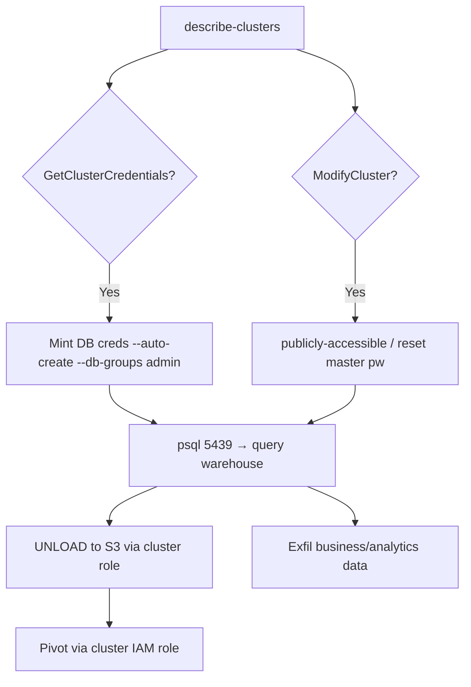

# 23 - AWS Redshift Exploitation

## 1. Executive Summary

Redshift is AWS's data warehouse — terabytes of the org's analytics/business data in one place, prime exfil target. The IAM-native abuse: **`redshift:GetClusterCredentials`** (and `GetClusterCredentialsWithIAM`) mints temporary DB credentials for a cluster — often **auto-creating the requested DB user with broad rights** — so an IAM principal with that action logs straight into the warehouse without knowing a password. `ModifyCluster` can flip a cluster **publicly accessible** or reset the master password. Cluster also has an attached IAM role for COPY/UNLOAD to S3 → pivot.

## 2. Service Overview & Architecture

A **cluster** runs PostgreSQL-compatible Redshift on port **5439**. Auth: native DB users **or** IAM via `GetClusterCredentials` (temporary user/password, optionally auto-created and added to groups). Clusters have **attached IAM roles** used by `COPY`/`UNLOAD` to read/write S3. Network access governed by VPC SG + `PubliclyAccessible`. (Network-layer note: [[73 - Amazon Redshift (Port 5439) Pentesting]].)

## 3. Enumeration

```bash
aws redshift describe-clusters
aws redshift describe-cluster-security-groups
aws redshift describe-logging-status --cluster-identifier <c>
aws redshift-serverless list-workgroups
```

## 4. Privilege Escalation / Abuse Vectors

- **`redshift:GetClusterCredentials`** — request creds for a DB user (`--auto-create --db-groups`) → log in with attacker-chosen, often-privileged user; no password needed.
  ```bash
  aws redshift get-cluster-credentials --cluster-identifier <c> \
    --db-user pwn --auto-create --db-groups pg_group_admins
  ```
- **`redshift:GetClusterCredentialsWithIAM`** — maps your IAM identity to a DB role directly.
- **`redshift:ModifyCluster`** — set `--publicly-accessible`, reset `--master-user-password` → take the master account, expose cluster to internet.
- **Cluster IAM role** — via SQL `UNLOAD`/`COPY` read/write the cluster role's S3 buckets; if that role is over-permissioned, pivot.
- **Network reach** — if SG allows, connect with `psql -h <ep> -p 5439` using minted creds.

## 5. Mermaid Attack Flow



## 6. Persistence
- Auto-created DB admin user left in place.
- Public accessibility + known master password.

## 7. Post-Exploitation / Data Access
- Entire warehouse (PII, financials, aggregated app data).
- Cluster role S3 access → broader account data.

## 8. Detection & Hardening
1. Restrict `GetClusterCredentials*` (scope db-user/db-groups); avoid broad `--auto-create` groups.
2. Lock `ModifyCluster`; keep clusters private (no `PubliclyAccessible`); tight SGs.
3. Least-priv cluster IAM role; enable audit logging; alert on credential minting, modify, public-access changes.

## 9. Chaining / Related Notes
- Network-layer: **[[73 - Amazon Redshift (Port 5439) Pentesting]]**. S3 via role: **[[03 - S3 Exploitation]]**.
- IAM mapping: **[[01 - IAM Exploitation]]**.

## 10. Tools
`aws redshift`, `psql`, `pacu`, `ScoutSuite`.
