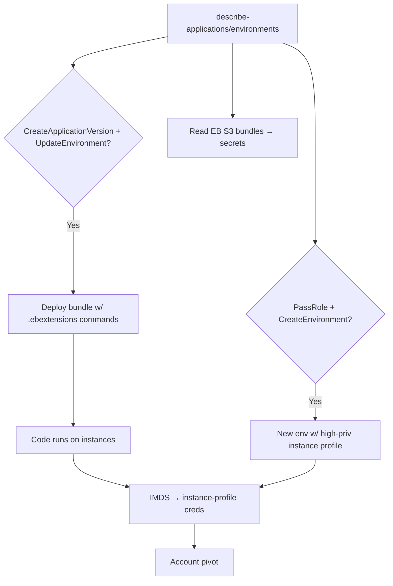

# 24 - AWS Elastic Beanstalk Exploitation

## 1. Executive Summary

Elastic Beanstalk (EB) is PaaS that provisions EC2/ASG/ELB and runs your app bundle — under **two roles**: a **service role** and an **EC2 instance profile** attached to the workers. Privesc: `elasticbeanstalk:CreateApplicationVersion`+`UpdateEnvironment` deploys an **app bundle with arbitrary code** (`.ebextensions` commands run on instances) that executes on hosts carrying the instance profile → steal those creds via IMDS. Pairing EB actions with `iam:PassRole` lets you choose a high-priv instance profile. Source bundles land in an EB **S3 bucket** that often leaks app secrets.

## 2. Service Overview & Architecture

An **application** has **environments**; each environment provisions EC2 (with an **instance profile**), ELB, ASG via CloudFormation, and runs the deployed **application version** (a zip in the EB S3 bucket). `.ebextensions/*.config` can run `commands`/`container_commands` at deploy = code exec on instances. EB itself acts via a **service role**.

## 3. Enumeration

```bash
aws elasticbeanstalk describe-applications
aws elasticbeanstalk describe-environments
aws elasticbeanstalk describe-environment-resources --environment-name <e>
aws elasticbeanstalk describe-configuration-settings --application-name <a> --environment-name <e>
aws s3 ls s3://elasticbeanstalk-<region>-<acct>/      # source bundles
```

## 4. Privilege Escalation / Abuse Vectors

- **Deploy malicious bundle** — `CreateApplicationVersion` (zip with `.ebextensions` running your commands) + `UpdateEnvironment --version-label` → code runs on instances; curl IMDS for the **instance-profile creds**.
- **`iam:PassRole` + Create/UpdateEnvironment** — launch an environment whose instance profile / service role is high-priv → privesc.
- **`RebuildEnvironment` / `UpdateEnvironment`** — alter option settings (env vars often hold secrets; can set new instance profile).
- **EB S3 bucket** — read existing source bundles for hardcoded secrets; if writable, poison the next deploy artifact.
- **Instance-profile pivot** — those creds frequently allow S3/other access far beyond the app.

```bash
# .ebextensions/pwn.config inside the bundle
commands:
  01_creds:
    command: "TOKEN=$(curl -s -X PUT http://169.254.169.254/latest/api/token -H 'X-aws-ec2-metadata-token-ttl-seconds: 60'); curl -s -H \"X-aws-ec2-metadata-token: $TOKEN\" http://169.254.169.254/latest/meta-data/iam/security-credentials/"
```

## 5. Mermaid Attack Flow



## 6. Persistence
- Keep a malicious application version / `.ebextensions` redeployed each rebuild.
- Backdoor the S3 source bundle so future deploys re-infect.

## 7. Post-Exploitation / Data Access
- Instance-profile + service-role creds → account pivot.
- App env-var + bundle secrets; DB/backend reachable from the app tier.

## 8. Detection & Hardening
1. Least-priv instance profile + service role; never pair EB actions with broad `iam:PassRole`.
2. Lock down EB S3 bucket (no public/over-broad write); no secrets in env vars (use Secrets Manager).
3. Alert on new application versions, environment updates, instance-profile changes; enforce IMDSv2.

## 9. Chaining / Related Notes
- IMDS cred theft: **[[04 - EC2 Exploitation]]**. Underlying IaC: **[[17 - CloudFormation Exploitation]]**.
- Artifact bucket: **[[03 - S3 Exploitation]]**. PassRole: **[[01 - IAM Exploitation]]**.

## 10. Tools
`aws elasticbeanstalk`, `eb` CLI, `pacu`, `ScoutSuite`.
