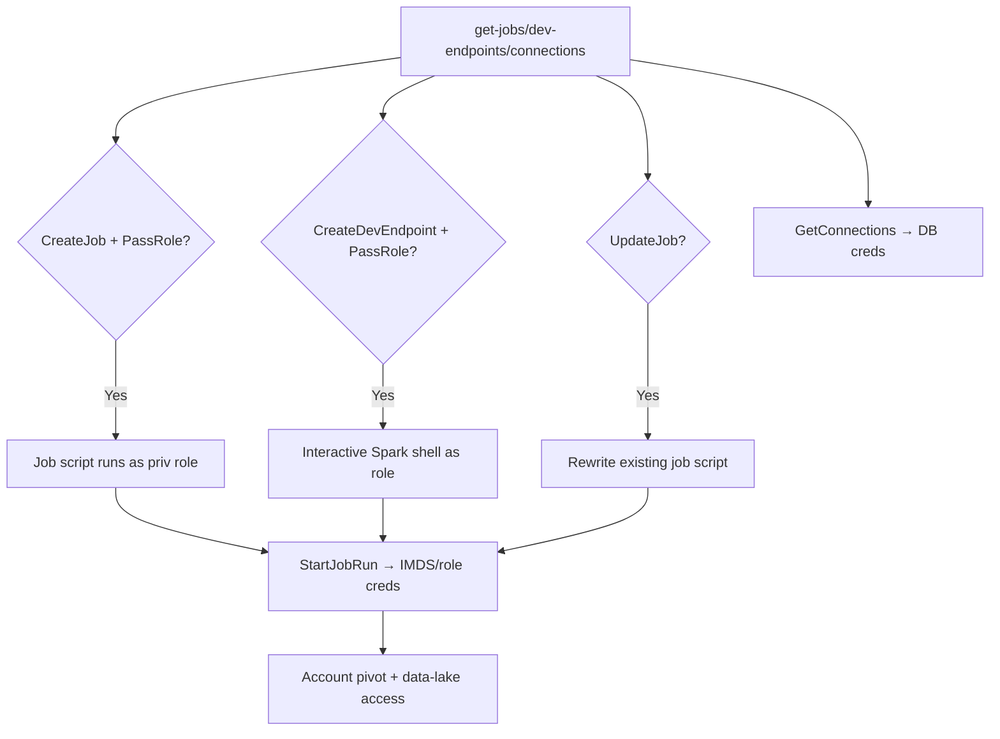

# 26 - AWS Glue Exploitation

## 1. Executive Summary

Glue is serverless ETL — it runs jobs and dev endpoints **as an IAM role** with access to the data lake, the Data Catalog, and connection credentials. Classic privesc: `glue:CreateJob`/`CreateDevEndpoint` **+ `iam:PassRole`** runs attacker code (PySpark / a notebook shell) under a chosen high-priv Glue role → steal its creds and pivot. `UpdateJob`/`UpdateDevEndpoint` re-targets existing resources to reuse their roles. Glue **connections** store DB/JDBC credentials, and the Data Catalog maps the whole data estate.

## 2. Service Overview & Architecture

A **Glue job** (Python/Spark script) runs on managed workers under a **service role**. A **dev endpoint** / **interactive session** gives a live Spark shell (notebook) under that role. **Connections** hold credentials (RDS/JDBC/Kafka). The **Data Catalog** (databases/tables) describes S3/data-lake locations. Roles typically have wide S3 + catalog access.

## 3. Enumeration

```bash
aws glue get-jobs
aws glue get-dev-endpoints
aws glue get-connections                 # may expose connection props
aws glue get-databases
aws glue get-tables --database-name <db>
aws glue get-security-configurations
```

## 4. Privilege Escalation / Abuse Vectors

- **`glue:CreateJob` + `iam:PassRole`** — job script runs your code as a chosen role:
  ```python
  import subprocess
  print(subprocess.check_output(["curl","-s","http://169.254.169.254/latest/meta-data/iam/security-credentials/"]))
  ```
  then `glue:StartJobRun`.
- **`glue:CreateDevEndpoint`/`UpdateDevEndpoint` + `PassRole`** — interactive Spark shell as the role → run arbitrary code, grab creds.
- **`glue:UpdateJob`** — rewrite an existing job's script (reuses its role; PassRole sometimes unneeded).
- **`glue:GetConnections`** — read stored DB/JDBC credentials.
- **Data Catalog + role** — locate and read/write data-lake S3 via the Glue role.

## 5. Mermaid Attack Flow



## 6. Persistence
- Leave a malicious job/trigger that re-runs on schedule.
- Dev endpoint kept alive as a foothold.

## 7. Post-Exploitation / Data Access
- Glue role creds → pivot; connection-stored DB/JDBC credentials.
- Entire data-lake (S3 + catalog) read/write.

## 8. Detection & Hardening
1. Least-priv Glue service roles; restrict `CreateJob`/`CreateDevEndpoint`/`UpdateJob` + `iam:PassRole`.
2. Store connection secrets in Secrets Manager (scoped); enforce IMDSv2 on dev endpoints.
3. Alert on new/updated jobs, dev endpoints, job runs; monitor catalog/S3 access by Glue roles.

## 9. Chaining / Related Notes
- Connection/data secrets cousin: **[[12 - Secrets Manager Exploitation]]**. Data lake: **[[03 - S3 Exploitation]]**.
- PassRole: **[[01 - IAM Exploitation]]**. Big-data sibling: **[[25 - EMR Exploitation]]**.

## 10. Tools
`aws glue`, `pacu`, `ScoutSuite`.
