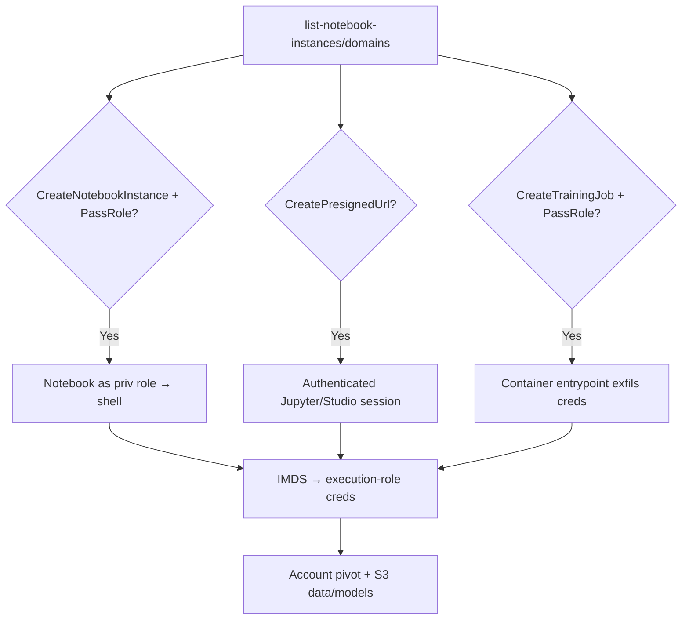

# 27 - AWS SageMaker Exploitation

## 1. Executive Summary

SageMaker is the ML platform — **notebook instances, training/processing jobs, and Studio apps all run code under an execution role**, frequently a powerful one (full S3, ECR, sometimes broad IAM). Privesc: `sagemaker:CreateNotebookInstance`/`CreateTrainingJob`/`CreateProcessingJob` **+ `iam:PassRole`** runs attacker code as a chosen role → steal creds. `CreatePresignedNotebookInstanceUrl`/`CreatePresignedDomainUrl` hands you an **authenticated browser session** into someone's notebook/Studio without their console login. Training data and models in S3 are the loot.

## 2. Service Overview & Architecture

**Notebook instances** = managed Jupyter on EC2 with an **execution role** (creds reachable via IMDS/role). **Training/Processing jobs** run containers under a passed role. **Studio** = multi-user IDE; **domains/user profiles** map to roles. **Presigned URLs** grant time-limited authenticated access to a notebook/Studio session.

## 3. Enumeration

```bash
aws sagemaker list-notebook-instances
aws sagemaker describe-notebook-instance --notebook-instance-name <n>   # role
aws sagemaker list-domains
aws sagemaker list-user-profiles
aws sagemaker list-training-jobs
aws sagemaker list-models
```

## 4. Privilege Escalation / Abuse Vectors

- **`CreateNotebookInstance` + `iam:PassRole`** — new notebook with a high-priv role; open it and run shell → IMDS creds.
- **`CreatePresignedNotebookInstanceUrl` / `CreatePresignedDomainUrl`** — get a signed URL → authenticated Jupyter/Studio session (as that role's user) without credentials; run code in a terminal.
  ```bash
  aws sagemaker create-presigned-notebook-instance-url --notebook-instance-name <n>
  ```
- **`CreateTrainingJob` / `CreateProcessingJob` + `PassRole`** — supply a container/entrypoint that exfils the role creds during the job.
- **`UpdateNotebookInstance`** — attach a malicious lifecycle config (runs on start) or swap the role.
- **`UpdateDomain` / `UpdateUserProfile`** — change default execution role for Studio users.
- **Execution-role pivot** — usually wide S3/ECR/IAM → account pivot; read training data + models.

## 5. Mermaid Attack Flow



## 6. Persistence
- Malicious lifecycle config re-running on notebook start.
- Backdoored training image in ECR ([[08 - ECR Exploitation]]).

## 7. Post-Exploitation / Data Access
- Execution-role creds (often broad) → pivot.
- Training datasets (PII), proprietary models, feature stores.

## 8. Detection & Hardening
1. Least-priv execution roles; restrict `Create*Job`/`CreateNotebookInstance`/`Update*` + `iam:PassRole`.
2. Lock `CreatePresigned*Url` (it's authenticated access); enforce IMDSv2; VPC-isolate notebooks (no direct internet).
3. Alert on presigned-URL generation, new notebooks/jobs, lifecycle-config changes, role swaps.

## 9. Chaining / Related Notes
- IMDS theft: **[[04 - EC2 Exploitation]]**. Training images: **[[08 - ECR Exploitation]]**.
- Data: **[[03 - S3 Exploitation]]**. PassRole: **[[01 - IAM Exploitation]]**. ML model abuse: **[[28 - Bedrock Exploitation]]**.

## 10. Tools
`aws sagemaker`, `pacu`, `ScoutSuite`.
