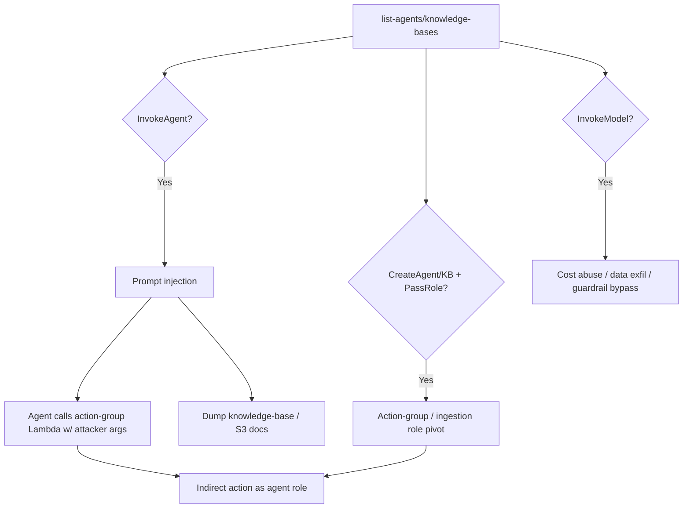

# 28 - AWS Bedrock Exploitation

## 1. Executive Summary

Bedrock is AWS's managed GenAI service (foundation models, **agents**, **knowledge bases**, guardrails). Security issues are both **AI-layer** and **IAM-layer**: `bedrock:InvokeModel`/`InvokeAgent` can be abused for **prompt injection** that makes an agent call its action-group Lambdas or read knowledge-base data it shouldn't; **knowledge bases** ingest sensitive S3 docs that an over-permissive model/agent can leak; and agents/customization jobs run **as a role** (`iam:PassRole`) — action-group Lambdas and ingestion roles become a pivot. Bedrock invoke rights also = uncontrolled **cost/exfil** of model access.

## 2. Service Overview & Architecture

**Foundation models** are invoked via `InvokeModel`. A **Bedrock Agent** uses an **agent resource role**, action groups (Lambda functions it can call), and attached **knowledge bases** (vector store backed by S3 docs ingested under a KB role). **Guardrails** filter I/O. Model **customization/fine-tuning** jobs run under a passed role and read training data from S3.

## 3. Enumeration

```bash
aws bedrock list-foundation-models
aws bedrock-agent list-agents
aws bedrock-agent list-knowledge-bases
aws bedrock-agent list-agent-action-groups --agent-id <id> --agent-version DRAFT
aws bedrock list-guardrails
aws bedrock list-model-customization-jobs
```

## 4. Privilege Escalation / Abuse Vectors

- **`bedrock:InvokeAgent` + prompt injection** — craft input that coerces the agent to invoke action-group Lambdas with attacker parameters, or dump retrieved knowledge-base context → data leak / indirect action as the agent's role.
- **Knowledge-base leak** — KBs ingest internal S3 docs; an agent/model with broad retrieval can be prompted to reveal them (sensitive data exfil).
- **`bedrock:InvokeModel`** — unmetered model use (cost abuse), and exfil of any data piped into prompts; bypass weak guardrails.
- **Agent/KB roles + `iam:PassRole`** — `CreateAgent`/`CreateKnowledgeBase`/customization jobs run under roles; if you can pass a high-priv role, the action-group Lambda or ingestion job becomes code-exec/cred pivot (see [[05 - Lambda Exploitation]]).
- **`UpdateAgent` / action-group tampering** — point an action group at attacker logic, or widen what the agent can do.

## 5. Mermaid Attack Flow



## 6. Persistence
- Tampered agent action group / instructions that re-trigger attacker logic.
- Malicious knowledge-base source doc (stored-prompt-injection seed).

## 7. Post-Exploitation / Data Access
- Knowledge-base / training S3 data (often internal docs).
- Agent-role + action-group Lambda creds → account pivot.

## 8. Detection & Hardening
1. Least-priv agent/KB/customization roles; restrict `Create*`/`Update*` + `iam:PassRole`; scope action-group Lambda perms.
2. Enforce guardrails; validate/sanitize agent inputs; least-privilege KB data sources; treat model output as untrusted.
3. Restrict `InvokeModel`/`InvokeAgent`; enable model-invocation logging; alert on agent/KB changes + invocation spikes (cost + exfil).

## 9. Chaining / Related Notes
- Action-group code: **[[05 - Lambda Exploitation]]**. KB/training data: **[[03 - S3 Exploitation]]**.
- ML platform sibling: **[[27 - SageMaker Exploitation]]**. PassRole: **[[01 - IAM Exploitation]]**.

## 10. Tools
`aws bedrock`, `aws bedrock-agent`, `pacu`, `ScoutSuite`.
