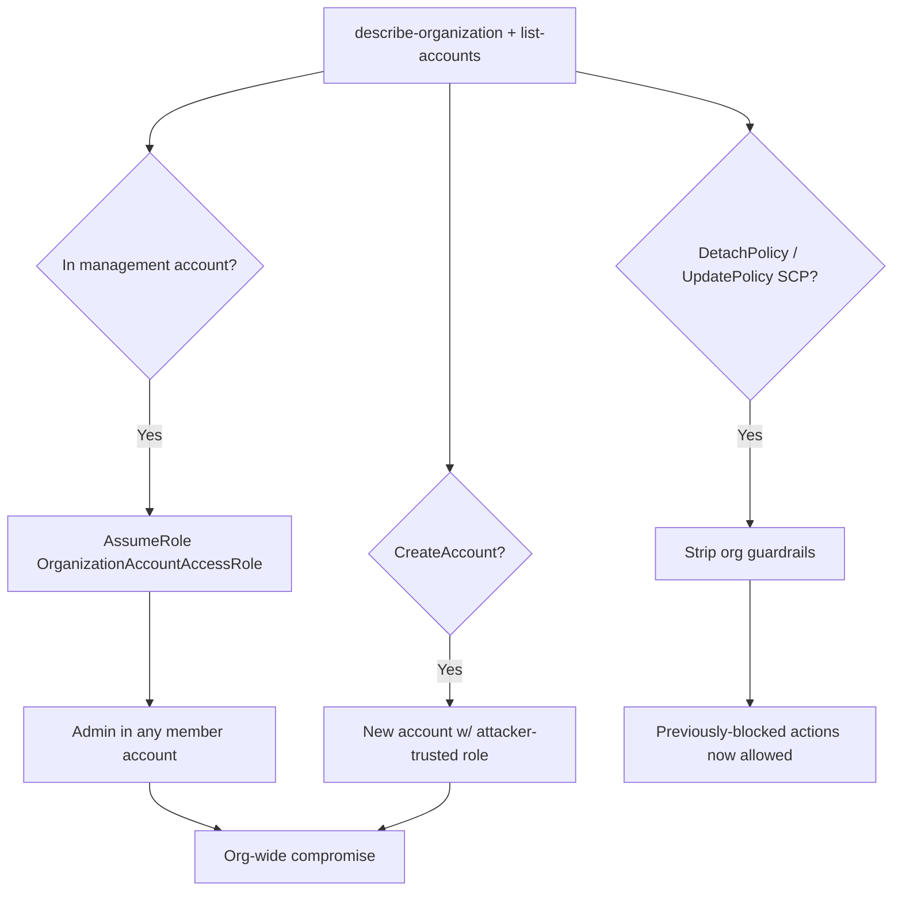

# 29 - AWS Organizations Exploitation

## 1. Executive Summary

Organizations is the **top of the multi-account hierarchy** — the management (payer) account governs every member account via SCPs and a default cross-account role. Compromise here is the highest blast radius in AWS: from the **management account** you can `AssumeRole` into the `OrganizationAccountAccessRole` (admin) of **any member account**; `organizations:CreateAccount` mints new accounts whose bootstrap role you control; and `DetachPolicy`/`UpdatePolicy` (SCPs) can **strip the org-wide guardrails** that constrain everyone. Even from a member account, reading org structure maps the whole estate.

## 2. Service Overview & Architecture

The **management account** owns the org; **member accounts** sit under **OUs**. **SCPs** (Service Control Policies) set the permission ceiling for member accounts. When an account is created/invited, a cross-account role (default `OrganizationAccountAccessRole`, trusting the management account, with `AdministratorAccess`) is created in the member. **Trusted access** + **delegated administrator** extend services (CloudFormation StackSets, GuardDuty, etc.) org-wide.

## 3. Enumeration

```bash
aws organizations describe-organization
aws organizations list-accounts
aws organizations list-roots
aws organizations list-organizational-units-for-parent --parent-id <root/ou>
aws organizations list-policies --filter SERVICE_CONTROL_POLICY
aws organizations list-delegated-administrators
```

## 4. Privilege Escalation / Abuse Vectors

- **Management account → member admin** — assume the member's `OrganizationAccountAccessRole`:
  ```bash
  aws sts assume-role --role-arn arn:aws:iam::<member-acct>:role/OrganizationAccountAccessRole --role-session-name x
  ```
  Instant admin in every member account. (See [[02 - STS Exploitation]].)
- **`organizations:CreateAccount`** — new account auto-gets the org access role trusting the mgmt account → attacker-controlled account inside the org.
- **`organizations:DetachPolicy` / `UpdatePolicy` / `DisablePolicyType`** — remove or weaken SCPs → lift guardrails that were blocking actions across member accounts.
- **`organizations:RegisterDelegatedAdministrator` / EnableAWSServiceAccess** — delegate a service (e.g. StackSets) to an account you hold → org-wide deploy/persistence.
- **`LeaveOrganization` / RemoveAccountFromOrganization** — detach an account from SCP control (escape guardrails) — disruptive; authorized scope only.

## 5. Mermaid Attack Flow



## 6. Persistence
- Backdoor account created via `CreateAccount` (hard to notice among many).
- Delegated-admin foothold + StackSet that redeploys persistence to all accounts.
- SCP edited to permanently allow attacker actions.

## 7. Post-Exploitation / Data Access
- Admin across the entire organization's accounts → all data, everywhere.
- Guardrail removal enables otherwise-denied exfil/persistence.

## 8. Detection & Hardening
1. Heavily protect the management account (no workloads in it, MFA, minimal principals); restrict `organizations:*`.
2. Monitor SCP changes, `CreateAccount`, delegated-admin registration, assumptions of `OrganizationAccountAccessRole`.
3. Use SCPs as guardrails + restrict/rename the default org access role; enable CloudTrail org trail.

## 9. Chaining / Related Notes
- Cross-account assume: **[[02 - STS Exploitation]]**. Org-wide deploy: **[[17 - CloudFormation Exploitation]]** (StackSets).
- Identity center cousin: **[[30 - SSO and Identity Store Exploitation]]**.

## 10. Tools
`aws organizations`, `pacu`, `ScoutSuite`, `awspx`.
