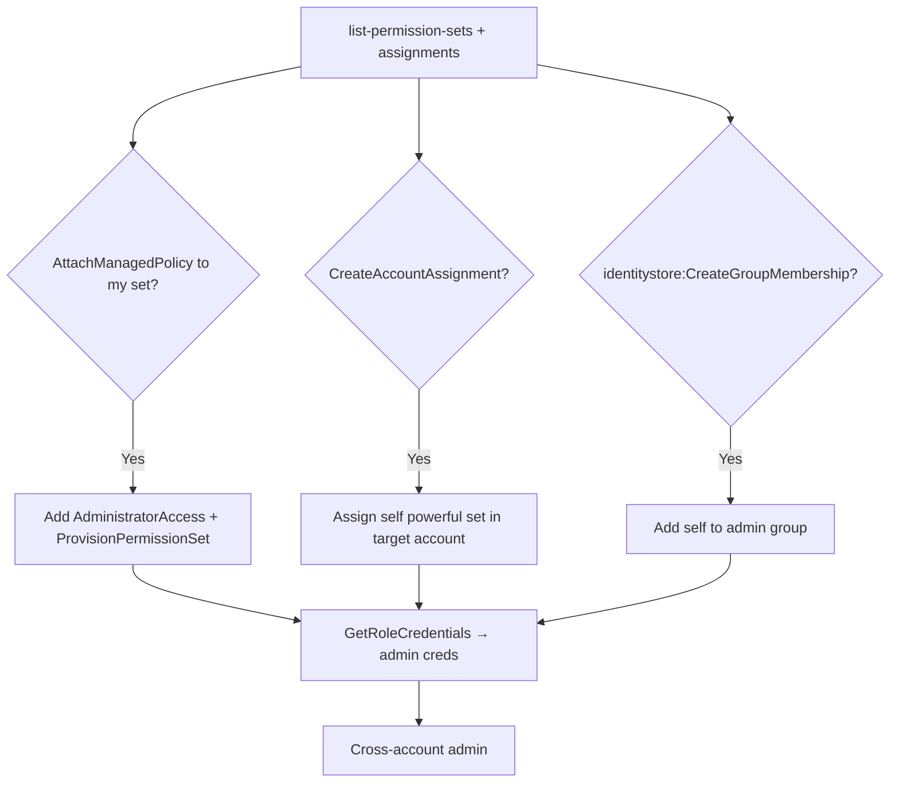

# 30 - AWS IAM Identity Center (SSO) and Identity Store Exploitation

## 1. Executive Summary

IAM Identity Center (formerly AWS SSO) is the **org-wide human access plane**: users/groups (in the Identity Store) get **permission sets** (= IAM roles provisioned into member accounts) via **account assignments**. Control of it = cross-account privesc without touching member-account IAM: `sso:CreateAccountAssignment` grants any user access to any account; `sso:AttachManagedPolicyToPermissionSet`/`PutInlinePolicyToPermissionSet` injects `AdministratorAccess` into a set you already have; `identitystore:CreateGroupMembership` adds you to a privileged group; and `sso:GetRoleCredentials` mints the actual role creds for an assigned account.

## 2. Service Overview & Architecture

The **Identity Store** holds users/groups (or syncs from an external IdP). A **permission set** is a template that materializes as an IAM role in each assigned account. An **account assignment** binds (principal, permission set, account). Users log in at the SSO portal, pick an account+role, and get temporary creds via `sso:GetRoleCredentials`. Managed in the **management or delegated-admin** account.

## 3. Enumeration

```bash
aws sso-admin list-instances
aws sso-admin list-permission-sets --instance-arn <arn>
aws sso-admin list-account-assignments --instance-arn <arn> --account-id <a> --permission-set-arn <ps>
aws sso-admin list-managed-policies-in-permission-set --instance-arn <arn> --permission-set-arn <ps>
aws identitystore list-users --identity-store-id <id>
aws identitystore list-groups --identity-store-id <id>
```

## 4. Privilege Escalation / Abuse Vectors

- **`sso:CreateAccountAssignment`** — assign yourself (or a group you're in) a powerful permission set in a target account → cross-account access.
- **`sso:AttachManagedPolicyToPermissionSet` / `PutInlinePolicyToPermissionSet`** — add `AdministratorAccess`/`*` to a permission set you already hold, then `ProvisionPermissionSet` → become admin everywhere it's assigned.
- **`sso:DeletePermissionBoundaryFromPermissionSet`** — strip a boundary limiting a set you have.
- **`identitystore:CreateGroupMembership`** — add your user to an admin group that maps to high-priv assignments.
- **`sso:GetRoleCredentials`** — directly mint temporary creds for an account/role assignment (the actual key-grab step).
- **`identitystore:CreateUser` + assignment** — backdoor SSO user with broad access.

```bash
aws sso-admin attach-managed-policy-to-permission-set --instance-arn <arn> \
  --permission-set-arn <ps> --managed-policy-arn arn:aws:iam::aws:policy/AdministratorAccess
aws sso-admin provision-permission-set --instance-arn <arn> --permission-set-arn <ps> --target-type ALL_PROVISIONED_ACCOUNTS
```

## 5. Mermaid Attack Flow



## 6. Persistence
- Backdoor Identity Store user/group membership + assignment.
- Permission set silently carrying extra policy.

## 7. Post-Exploitation / Data Access
- Admin/role creds across many member accounts → org-wide data.
- Human-identity foothold that survives IAM-role reviews in member accounts.

## 8. Detection & Hardening
1. Restrict `sso-admin:*` and `identitystore:Create*` to a tiny admin set; protect mgmt/delegated-admin account.
2. Alert on permission-set policy changes, new assignments, group-membership changes, `GetRoleCredentials` anomalies.
3. Enforce MFA at the IdP; review permission-set scope; use permission boundaries.

## 9. Chaining / Related Notes
- Org context: **[[29 - Organizations Exploitation]]**. Resulting creds: **[[02 - STS Exploitation]]** / **[[01 - IAM Exploitation]]**.

## 10. Tools
`aws sso-admin`, `aws identitystore`, `pacu`, `ScoutSuite`.
