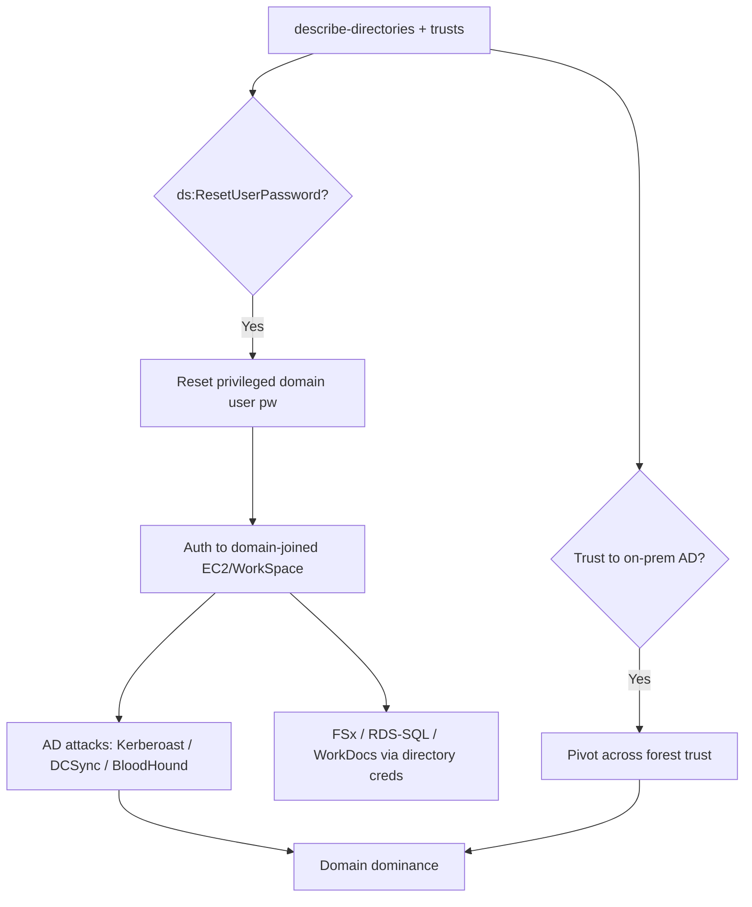

# 31 - AWS Directory Services Exploitation

## 1. Executive Summary

AWS Directory Service runs managed Microsoft AD (and AD Connector / Simple AD) — it bridges the **cloud IAM world and the on-prem/Windows AD world**, so compromising it bridges both. The key cloud-side primitive: **`ds:ResetUserPassword`** lets an IAM principal reset **any directory user's password** (including privileged domain accounts) without knowing the old one → log into domain-joined EC2/WorkSpaces/RDS-SQL and run full **Active Directory attacks** from there. Directory creds also seed seamless-join, FSx, WorkDocs, and RDS Windows auth.

## 2. Service Overview & Architecture

**AWS Managed Microsoft AD** is real domain controllers AWS operates for you; **AD Connector** proxies to on-prem AD; **Simple AD** is a Samba-based stand-in. Directories enable domain-join of EC2/WorkSpaces, LDAP, and Windows auth across services. There's an **Admin** account per managed directory. The directory is the trust anchor for everything joined to it.

## 3. Enumeration

```bash
aws ds describe-directories
aws ds describe-domain-controllers --directory-id <id>
aws ds describe-trusts --directory-id <id>          # forest trusts (on-prem bridge)
aws ds list-ip-routes --directory-id <id>
aws ds describe-shared-directories --owner-directory-id <id>
```

## 4. Privilege Escalation / Abuse Vectors

- **`ds:ResetUserPassword`** — reset any directory user's password (incl. high-priv accounts) → authenticate to the domain:
  ```bash
  aws ds reset-user-password --directory-id <id> --user-name Administrator --new-password '<Pw>'
  ```
- **Pivot into AD** — with directory creds, log into a domain-joined EC2/WorkSpace, then run Kerberoasting, DCSync (if admin), BloodHound, lateral movement — full on-prem-style AD compromise inside the managed domain.
- **`ds:CreateTrust` / trust abuse** — existing forest trust to on-prem AD = path to extend compromise into corporate AD.
- **`ds:EnableSso` / share directory** — broaden where directory auth is accepted.
- **Domain-joined service access** — directory creds unlock FSx shares, RDS SQL Server Windows auth, WorkSpaces.

## 5. Mermaid Attack Flow



## 6. Persistence
- Created/owned domain account; classic AD persistence (golden ticket, etc.) once domain-admin.
- Keep a reset privileged account.

## 7. Post-Exploitation / Data Access
- Full managed AD compromise → all joined hosts/services.
- Forest trust → on-prem corporate AD.

## 8. Detection & Hardening
1. Tightly restrict `ds:ResetUserPassword`, `ds:CreateTrust`, `ds:EnableSso` (these cross the IAM↔AD boundary).
2. Monitor directory password resets + trust changes; protect the directory Admin account; least-priv domain accounts.
3. Treat managed AD like prod AD: tiered admin, monitoring, restrict domain-joined host exposure.

## 9. Chaining / Related Notes
- Full AD attack tradecraft: the **Active Directory** category (Kerberos/DCSync). Network LDAP/Kerberos: **[[08 - LDAP (Ports 389-636) Pentesting]]**, **[[09 - Kerberos (Port 88) Pentesting]]**.
- Domain-joined hosts: **[[04 - EC2 Exploitation]]**.

## 10. Tools
`aws ds`, `bloodhound`, `impacket`, `crackmapexec`.
