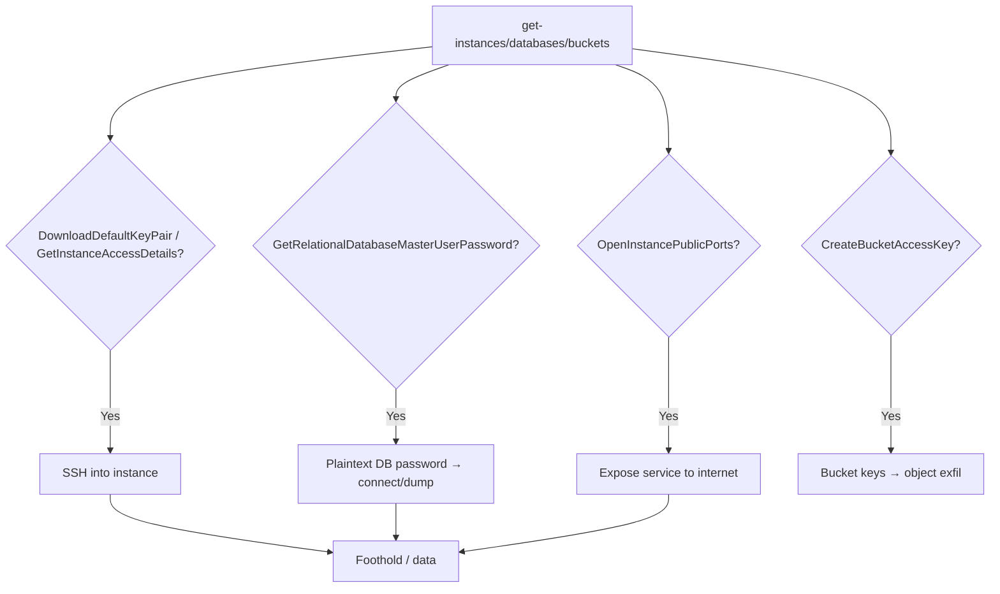

# 32 - AWS Lightsail Exploitation

## 1. Executive Summary

Lightsail is AWS's simplified VPS/PaaS (instances, managed DBs, buckets, container services) — and it's notorious because **Lightsail actions are often outside the IAM policies people scope carefully**, while exposing very direct primitives: `lightsail:DownloadDefaultKeyPair`/`GetInstanceAccessDetails` hand you **SSH access** to instances; `GetRelationalDatabaseMasterUserPassword` returns a **DB master password in plaintext**; `OpenInstancePublicPorts` exposes services to the internet; and `CreateBucketAccessKey`/`SetResourceAccessForBucket` opens object storage. No instance profile gymnastics — just read a key or password and log in.

## 2. Service Overview & Architecture

Lightsail bundles **instances** (with a default SSH key pair), **managed relational databases** (with a master user), **buckets** (object storage with access keys), and **container services**. It's a separate, simplified control plane over EC2/RDS/S3-like resources; access is largely gated by `lightsail:*` IAM actions that grant the underlying credential/exposure directly.

## 3. Enumeration

```bash
aws lightsail get-instances
aws lightsail get-relational-databases
aws lightsail get-buckets
aws lightsail get-container-services
aws lightsail get-instance-port-states --instance-name <n>
```

## 4. Privilege Escalation / Abuse Vectors

- **`lightsail:DownloadDefaultKeyPair`** — download the SSH private key → SSH into instances.
- **`lightsail:GetInstanceAccessDetails`** — get temporary SSH/RDP access details for an instance.
- **`lightsail:GetRelationalDatabaseMasterUserPassword`** — plaintext DB master password → connect and read/dump the DB.
- **`lightsail:OpenInstancePublicPorts` / `PutInstancePublicPorts`** — open ports (e.g. 22, DB, app) to `0.0.0.0/0` → expose for direct attack.
- **`lightsail:CreateBucketAccessKey` / `SetResourceAccessForBucket` / `UpdateBucket`** — mint bucket keys or make a bucket public → object exfil.
- **`lightsail:UpdateRelationalDatabase`** — flip DB to publicly accessible.
- **`lightsail:UpdateContainerService`** — deploy an attacker container image.

```bash
aws lightsail download-default-key-pair
aws lightsail get-relational-database-master-user-password --relational-database-name <db>
aws lightsail open-instance-public-ports --instance-name <n> \
  --port-info fromPort=22,toPort=22,protocol=TCP
```

## 5. Mermaid Attack Flow



## 6. Persistence
- Keep the downloaded SSH key + an open port.
- Long-lived bucket access key; attacker container deployment.

## 7. Post-Exploitation / Data Access
- Shell on instances; full DB dumps; bucket objects.
- Often hosts production sites/apps despite "simple" branding.

## 8. Detection & Hardening
1. Don't forget Lightsail in IAM scoping — explicitly restrict `lightsail:*` (treat `DownloadDefaultKeyPair`/`Get*Password`/`OpenInstancePublicPorts` as high-risk).
2. Keep ports closed; rotate keys; private DBs/buckets.
3. Alert on key-pair downloads, password reads, port-open changes, new bucket access keys.

## 9. Chaining / Related Notes
- SSH foothold: **[[01 - SSH (Port 22) Pentesting]]** (Network). DB attacks once connected: relevant DB note (e.g. **[[11 - MySQL (Port 3306) Pentesting]]**).
- Object storage cousin: **[[03 - S3 Exploitation]]**.

## 10. Tools
`aws lightsail`, `ssh`, `pacu`, `ScoutSuite`.
