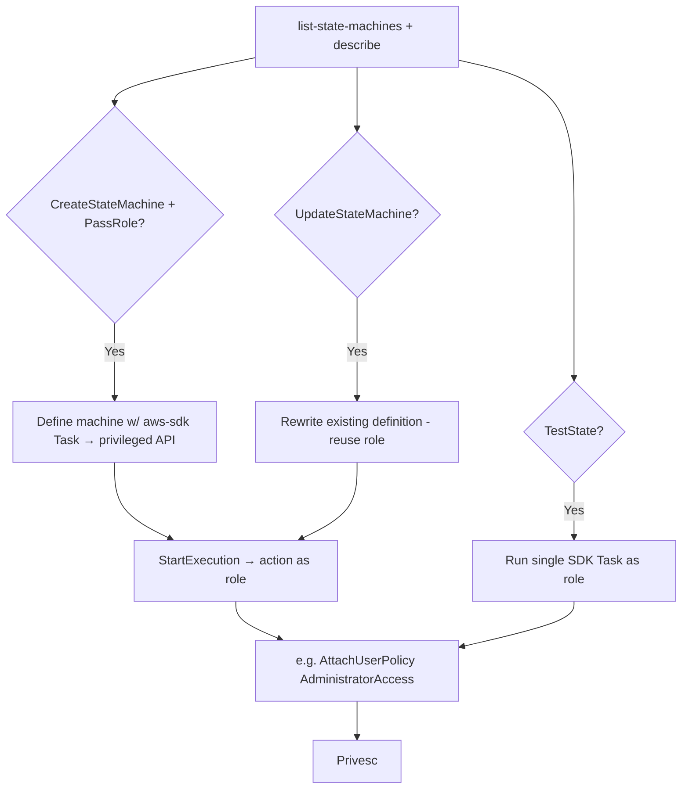

# 33 - AWS Step Functions Exploitation

## 1. Executive Summary

Step Functions orchestrates workflows ("state machines") that call other AWS services — and a state machine runs **as an IAM role** that, by design, can invoke Lambda, ECS, DynamoDB, SNS, even arbitrary AWS SDK actions. Privesc: `states:CreateStateMachine` **+ `iam:PassRole`** defines a workflow whose states perform attacker-chosen API calls (e.g. `iam:CreateAccessKey`, `iam:AttachRolePolicy`) under a high-priv role → direct escalation. `states:UpdateStateMachine` re-points an existing machine to reuse its role; `states:StartExecution`/`TestState` triggers/probes states. The role's reach is the blast radius.

## 2. Service Overview & Architecture

A **state machine** is a JSON/ASL definition of states (Task/Choice/Parallel/Map). **Task** states call integrations: Lambda, ECS RunTask, DynamoDB, SNS/SQS, or the generic **AWS SDK integration** (`arn:aws:states:::aws-sdk:<service>:<action>`) — meaning a state can call almost any AWS API as the **execution role**. `StartExecution` runs it; `TestState` runs a single state synchronously.

## 3. Enumeration

```bash
aws stepfunctions list-state-machines
aws stepfunctions describe-state-machine --state-machine-arn <arn>   # role + definition
aws stepfunctions list-executions --state-machine-arn <arn>
```

## 4. Privilege Escalation / Abuse Vectors

- **`states:CreateStateMachine` + `iam:PassRole`** — define a machine with an `aws-sdk` Task calling privileged APIs under the passed role:
  ```json
  {"StartAt":"P","States":{"P":{"Type":"Task",
   "Resource":"arn:aws:states:::aws-sdk:iam:attachUserPolicy",
   "Parameters":{"UserName":"me","PolicyArn":"arn:aws:iam::aws:policy/AdministratorAccess"},
   "End":true}}}
  ```
  then `StartExecution`.
- **`states:UpdateStateMachine`** — rewrite an existing machine's definition (reuses its role; PassRole may not be needed) to perform attacker actions.
- **`states:StartExecution` / `StartSyncExecution`** — trigger a machine you can influence with attacker input.
- **`states:TestState`** — execute a single Task state (incl. SDK call) synchronously as the role — quick privesc probe.
- **Integration pivot** — machines invoke Lambda/ECS; abuse those roles too.

## 5. Mermaid Attack Flow



## 6. Persistence
- Leave a state machine + EventBridge schedule re-running attacker actions.
- Backdoor an existing workflow's definition.

## 7. Post-Exploitation / Data Access
- Whatever the execution role allows (often broad: Lambda/ECS/DynamoDB/SNS, or full SDK).
- Workflow input/output history may contain sensitive data.

## 8. Detection & Hardening
1. Least-priv execution roles (no wildcard SDK/`iam:*`); restrict `CreateStateMachine`/`UpdateStateMachine` + `iam:PassRole`.
2. Alert on state-machine create/update, unusual executions, `TestState` usage.
3. Enable execution logging; review ASL definitions for over-broad SDK integrations.

## 9. Chaining / Related Notes
- PassRole: **[[01 - IAM Exploitation]]**. Integrations: **[[05 - Lambda Exploitation]]**, **[[09 - ECS Exploitation]]**, **[[19 - SNS and SQS Exploitation]]**.
- Trigger source: **[[43 - EventBridge Exploitation]]**.

## 10. Tools
`aws stepfunctions`, `pacu`, `ScoutSuite`.
