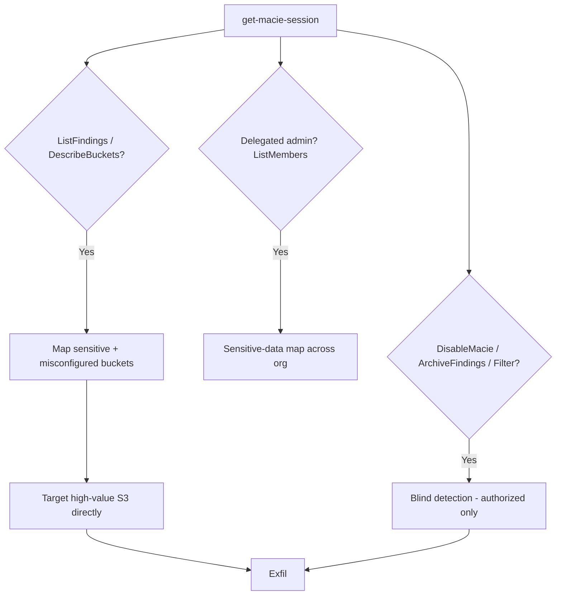

# 34 - AWS Macie Exploitation

## 1. Executive Summary

Macie is a data-security service that scans S3 and reports **where the sensitive data is** (PII, credentials, financial). For an attacker that's a gift: Macie **findings are a treasure map** — `macie2:ListFindings`/`GetFindings` and `DescribeBuckets` tell you exactly which buckets hold secrets/PII, skipping the hunt. The flip side is **evasion/blinding**: `macie2:DisableMacie`, `UpdateClassificationJob` (pause), `ArchiveFindings`, or `UpdateFindingsFilter` (suppress) let an attacker turn off the detector that would have flagged their exfil. So Macie is both recon source and a defense to neutralize.

## 2. Service Overview & Architecture

Macie runs **classification jobs** over S3, producing **findings** (sensitive-data + policy findings like public/unencrypted buckets). Results feed Security Hub/EventBridge. In an org, a **delegated administrator** account aggregates member findings. The data it surfaces (bucket names, object paths, sensitivity) is exactly what an attacker wants.

## 3. Enumeration

```bash
aws macie2 get-macie-session
aws macie2 describe-buckets                      # sensitivity, public/encrypted status
aws macie2 list-findings
aws macie2 get-findings --finding-ids <id>       # which objects hold PII/secrets
aws macie2 list-classification-jobs
aws macie2 list-members                          # org member accounts
```

## 4. Privilege Escalation / Abuse Vectors

- **Recon: `ListFindings`/`GetFindings`/`DescribeBuckets`** — map exactly where sensitive data and misconfigured (public/unencrypted) buckets are → go straight to high-value S3 ([[03 - S3 Exploitation]]).
- **Org member view: `ListMembers`** — in a delegated-admin account, read the sensitive-data map for every account.
- **Blinding (defense evasion):**
  - `macie2:DisableMacie` / `DisableOrganizationAdminAccount` — turn Macie off.
  - `macie2:UpdateClassificationJob --job-status PAUSED` / `Cancel... ` — stop scans.
  - `macie2:ArchiveFindings` — hide existing findings.
  - `macie2:CreateFindingsFilter`/`UpdateFindingsFilter` with archive action — auto-suppress future findings of your activity.
  > Disabling/suppressing detection on production = report it; do not blind a live monitoring control outside authorized scope.

## 5. Mermaid Attack Flow



## 6. Persistence
- Findings filter that permanently suppresses your activity's findings.
- Keep Macie disabled / jobs paused (until reviewed).

## 7. Post-Exploitation / Data Access
- Precise location of PII/secrets across all monitored buckets → efficient exfil.
- Reduced chance of detection after blinding.

## 8. Detection & Hardening
1. Restrict read of Macie findings (it's a sensitive-data index) and lock disable/archive/filter actions to admins.
2. Alert on `DisableMacie`, `ArchiveFindings`, classification-job pauses, new findings filters (classic anti-forensics).
3. Centralize findings to a protected delegated-admin/Security Hub account; back up findings.

## 9. Chaining / Related Notes
- Drives **[[03 - S3 Exploitation]]** target selection. Detector for activity from many other A-82 notes.
- Org view: **[[29 - Organizations Exploitation]]**.

## 10. Tools
`aws macie2`, `pacu`, `ScoutSuite`.
