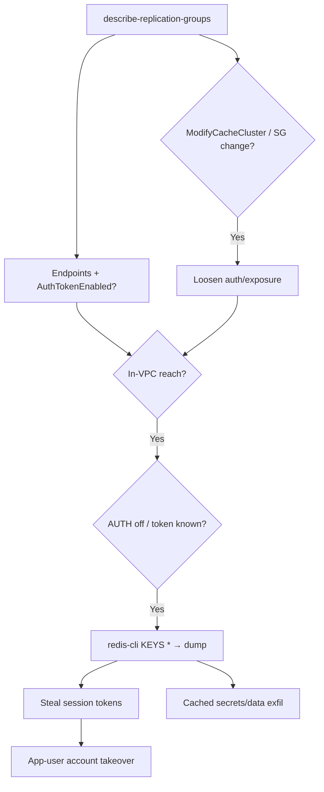

# 36 - AWS ElastiCache Exploitation

## 1. Executive Summary

ElastiCache is managed Redis/Memcached — caches that hold **sessions, tokens, query results, and sometimes secrets** in memory. ElastiCache has no public endpoint and no "give me the password" API, so attacks are **reach + weak auth**: get an in-VPC foothold, reach the cluster on 6379/11211, and (if AUTH is disabled or the token leaks) dump everything. `elasticache:ModifyReplicationGroup`/`ModifyCacheCluster` and SG changes can loosen exposure or alter auth; `DescribeReplicationGroups` reveals endpoints and whether encryption/AUTH is on. Stolen session tokens from a cache = instant account takeover of app users.

## 2. Service Overview & Architecture

A **cluster / replication group** runs Redis (6379) or Memcached (11211) inside a VPC, gated by a **subnet group + security group**. Redis may have **AUTH token** + in-transit/at-rest TLS (often off on older clusters). Memcached has **no auth at all** — network reach = full access. No master-password-reset API; the data lives in memory.

## 3. Enumeration

```bash
aws elasticache describe-cache-clusters --show-cache-node-info
aws elasticache describe-replication-groups        # endpoints, AuthTokenEnabled, encryption
aws elasticache describe-cache-security-groups
aws elasticache describe-users                      # Redis RBAC users (if used)
```

## 4. Privilege Escalation / Abuse Vectors

- **In-VPC reach + no/weak AUTH** — from a pivot host, connect and dump:
  ```bash
  redis-cli -h <endpoint> -p 6379       # add -a <token> if AUTH set
  KEYS *        # then GET/HGETALL/DUMP — sessions, tokens, cached secrets
  ```
  Memcached: `stats items` / `get <key>` — no auth.
- **`elasticache:ModifyReplicationGroup` / `ModifyCacheCluster`** — change settings; modify/disable AUTH token rotation, or apply a token you set.
- **SG loosening** (EC2 `AuthorizeSecurityGroupIngress` on the cache SG) — widen who can reach the cache.
- **Redis abuse** — on self-managed Redis, `CONFIG SET dir/dbfilename` writes files (RCE); managed ElastiCache disables `CONFIG`/dangerous commands, so focus on data theft + session hijack.
- **`elasticache:DescribeUsers` / ModifyUser** — Redis RBAC user takeover if RBAC enabled.

## 5. Mermaid Attack Flow



## 6. Persistence
- Keep the in-VPC foothold + SG opening.
- Continuously scrape session keys for fresh tokens.

## 7. Post-Exploitation / Data Access
- Session/auth tokens → impersonate app users.
- Cached PII, query results, sometimes credentials.

## 8. Detection & Hardening
1. Enable Redis AUTH + RBAC + TLS (in-transit & at-rest); never run Memcached reachable beyond app SG.
2. Tight subnet/SG (only app tier); restrict `elasticache:Modify*` + cache-SG ingress changes.
3. Don't cache long-lived secrets/tokens unencrypted; alert on cluster modify + SG ingress to cache ports.

## 9. Chaining / Related Notes
- Reach needs a pivot: **[[04 - EC2 Exploitation]]**. Network-layer tradecraft: **[[15 - Redis (Port 6379) Pentesting]]**, **[[19 - Memcache (Port 11211) Pentesting]]**.

## 10. Tools
`redis-cli`, `memcached` clients, `aws elasticache`, `pacu`, `ScoutSuite`.
