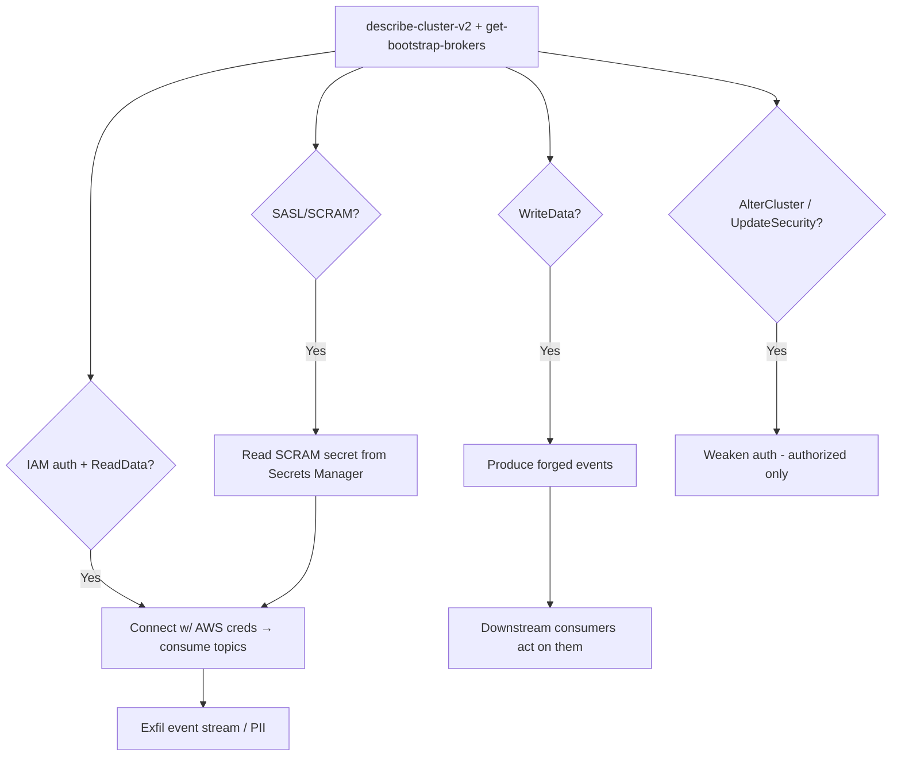

# 37 - AWS MSK (Managed Kafka) Exploitation

## 1. Executive Summary

MSK is managed Apache Kafka — a central **event/data bus** carrying app events, change-data-capture, logs, and often PII in transit. Attacks: **consume** topics to exfil the data stream; **produce** forged messages so downstream consumers act on attacker events; and **auth abuse** — MSK supports **IAM auth** (`kafka-cluster:*` actions like `Connect`, `ReadData`, `WriteData`, `AlterCluster`), so an over-broad IAM policy = full Kafka access, while older clusters with unauth/PLAINTEXT or SASL/SCRAM secrets (in Secrets Manager) widen entry. `kafka:UpdateSecurity`/`UpdateConfiguration` can weaken cluster auth.

## 2. Service Overview & Architecture

A **cluster** of broker nodes runs Kafka in a VPC (SG-gated). Client auth options: **IAM** (SASL/OAUTHBEARER mapped to `kafka-cluster:*` IAM actions), **SASL/SCRAM** (creds in Secrets Manager), **mTLS**, or (mis)configured **PLAINTEXT/unauth**. Producers/consumers exchange messages on **topics**; the data is the trust boundary for downstream systems.

## 3. Enumeration

```bash
aws kafka list-clusters-v2
aws kafka describe-cluster-v2 --cluster-arn <arn>      # auth modes, encryption
aws kafka get-bootstrap-brokers --cluster-arn <arn>
aws kafka list-scram-secrets --cluster-arn <arn>       # SASL/SCRAM secret ARNs
```

## 4. Privilege Escalation / Abuse Vectors

- **IAM auth (`kafka-cluster:Connect` + `ReadData`/`DescribeTopic`)** — connect with current AWS creds (no separate password) and consume every readable topic → stream exfil.
- **`kafka-cluster:WriteData`** — produce forged events into topics → drive downstream consumers (logic abuse / poisoning).
- **`kafka-cluster:AlterCluster` / `kafka:UpdateSecurity`** — change cluster auth (enable weaker mode) or config.
- **SASL/SCRAM secrets** — `list-scram-secrets` → read those Secrets Manager secrets ([[12 - Secrets Manager Exploitation]]) → broker creds.
- **In-VPC PLAINTEXT** — old clusters with unauth listener: connect directly with `kafka-console-consumer`.

```bash
kafka-console-consumer.sh --bootstrap-server <broker>:9098 \
  --consumer.config client-iam.properties --topic <t> --from-beginning
```

## 5. Mermaid Attack Flow



## 6. Persistence
- Long-running consumer siphoning topics.
- Backdoor SCRAM user / weakened auth config.

## 7. Post-Exploitation / Data Access
- Full event stream (CDC, app events, logs, PII).
- Control of event-driven workflows via produced messages.

## 8. Detection & Hardening
1. Least-priv `kafka-cluster:*` (scope topics/actions); prefer IAM/mTLS; disable PLAINTEXT/unauth.
2. Lock SCRAM secrets; restrict `kafka:UpdateSecurity`/`AlterCluster`; tight broker SGs.
3. Encrypt in-transit/at-rest; ACL topics; alert on new consumers/producers, auth/config changes.

## 9. Chaining / Related Notes
- SCRAM creds: **[[12 - Secrets Manager Exploitation]]**. Reach: **[[04 - EC2 Exploitation]]**.
- Messaging cousins: **[[19 - SNS and SQS Exploitation]]**, **[[40 - Kinesis Firehose Exploitation]]**.

## 10. Tools
`aws kafka`, `kafka-console-consumer/producer`, `pacu`, `ScoutSuite`.
