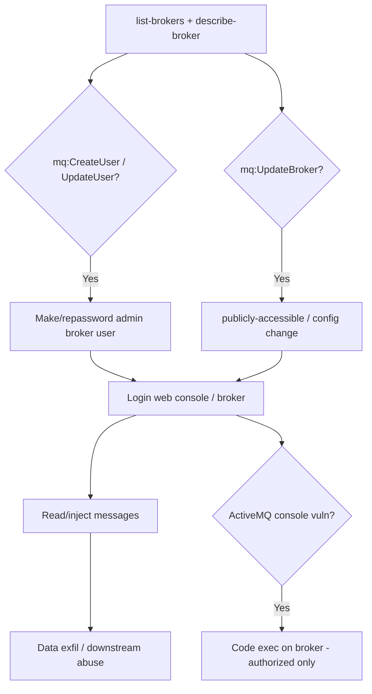

# 38 - AWS Amazon MQ Exploitation

## 1. Executive Summary

Amazon MQ is managed message broker (ActiveMQ / RabbitMQ) — application messages plus, in ActiveMQ's case, a **web console** that has historically been an RCE target. The standout cloud-side privesc: **`mq:CreateUser`/`UpdateUser`** lets an IAM principal **create or re-password a broker user** (optionally in the admin group) without knowing existing creds → log into the broker/console and read/inject messages. `mq:UpdateBroker` can flip the broker **publicly accessible** or change config. ActiveMQ console + known CVEs (e.g. deserialization) can turn console access into code execution.

## 2. Service Overview & Architecture

A **broker** runs ActiveMQ or RabbitMQ, single or active/standby, in a VPC (SG-gated), optionally **publicly accessible**. ActiveMQ exposes a **web console** (8162) + OpenWire/AMQP/STOMP/MQTT; RabbitMQ exposes its management UI (15671). Broker users (with groups, e.g. admins) are managed via the `mq:*User` APIs — that's the IAM→broker bridge.

## 3. Enumeration

```bash
aws mq list-brokers
aws mq describe-broker --broker-id <id>     # endpoints, PubliclyAccessible, engine
aws mq list-users --broker-id <id>
aws mq describe-broker-engine-types
```

## 4. Privilege Escalation / Abuse Vectors

- **`mq:CreateUser`** — create a broker user, put it in `--groups admins` → full console/broker login.
  ```bash
  aws mq create-user --broker-id <id> --username pwn --password '<Pw12+>' --groups admins
  aws mq reboot-broker --broker-id <id>     # apply
  ```
- **`mq:UpdateUser`** — re-password an existing (admin) user.
- **`mq:UpdateBroker`** — set `--publicly-accessible`, change config/security; broaden exposure.
- **Console RCE (ActiveMQ)** — with admin console access, abuse known ActiveMQ vulns (deserialization / fileserver upload on old versions) for code exec — authorized scope only.
- **Message read/inject** — consume queues (sensitive data) or publish forged messages driving downstream consumers.

## 5. Mermaid Attack Flow



## 6. Persistence
- Backdoor admin broker user.
- Public accessibility + known creds.

## 7. Post-Exploitation / Data Access
- Message contents (PII, business data); control of message-driven workflows.
- Potential code exec on the broker host (ActiveMQ).

## 8. Detection & Hardening
1. Restrict `mq:CreateUser`/`UpdateUser`/`UpdateBroker`; keep brokers private (no `PubliclyAccessible`); tight SGs.
2. Patch engine versions (ActiveMQ console CVEs); least-priv broker users; TLS only.
3. Alert on user create/update, broker config changes, console logins.

## 9. Chaining / Related Notes
- Network-layer broker tradecraft: **[[53 - RabbitMQ Management (Port 15672) Pentesting]]**, **[[54 - AMQP (Ports 5671-5672) Pentesting]]**.
- Reach: **[[04 - EC2 Exploitation]]**. Messaging cousins: **[[19 - SNS and SQS Exploitation]]**.

## 10. Tools
`aws mq`, broker web consoles, `pacu`, `ScoutSuite`.
