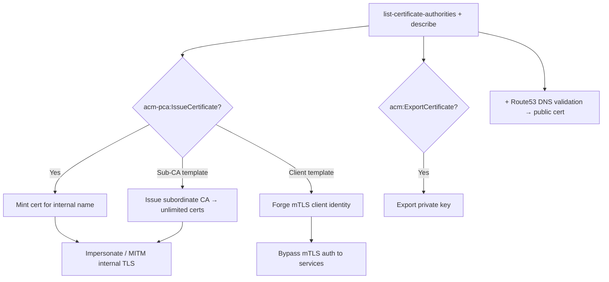

# 39 - AWS ACM and Private Certificate Authority Exploitation

## 1. Executive Summary

ACM issues/stores TLS certs; **ACM Private CA (PCA)** is a full internal certificate authority the org trusts. Control of a PCA is devastating: **`acm-pca:IssueCertificate`** lets you mint **valid certificates for any name in the CA's trust scope** — impersonate internal services, perform seamless MITM, or even **issue client/sub-CA certs** to forge identities, all trusted by everything that trusts the CA. Combined with DNS control ([[21 - Route53 Exploitation]]) you also complete **public** DNS-validated issuance. `acm:ExportCertificate` / `GetCertificate` can also leak private keys of exportable certs.

## 2. Service Overview & Architecture

**ACM** manages public/private certs for ELB/CloudFront/API GW (keys usually non-exportable). **ACM-PCA** is a hosted CA hierarchy (root + subordinate CAs) whose certs are trusted by internal clients/services that have the CA in their trust store. `IssueCertificate` signs a CSR with chosen subject/SANs and template (end-entity or **sub-CA**). DNS-based validation trusts whoever controls the validation record.

## 3. Enumeration

```bash
aws acm list-certificates
aws acm describe-certificate --certificate-arn <arn>
aws acm-pca list-certificate-authorities
aws acm-pca describe-certificate-authority --certificate-authority-arn <arn>
aws acm-pca get-certificate-authority-certificate --certificate-authority-arn <arn>
```

## 4. Privilege Escalation / Abuse Vectors

- **`acm-pca:IssueCertificate`** — sign a CSR for **any internal name** (e.g. `*.corp.internal`, `vault.internal`) → trusted cert for impersonation / MITM of internal TLS.
  ```bash
  aws acm-pca issue-certificate --certificate-authority-arn <arn> \
    --csr fileb://attacker.csr --signing-algorithm SHA256WITHRSA \
    --validity Value=365,Type=DAYS \
    --template-arn arn:aws:acm-pca:::template/EndEntityCertificate/V1
  ```
- **Sub-CA template** — issue a **subordinate CA** cert → mint unlimited trusted certs yourself (CA in your pocket).
- **Client-auth certs** — issue client certs to forge mTLS identities (auth bypass to services using PCA mTLS).
- **`acm-pca:UpdateCertificateAuthority` / PutPolicy** — change CA config / resource policy to grant issuance access (incl. cross-account).
- **`acm:ExportCertificate`** — export an exportable private cert's **private key**; `GetCertificate` reads the cert chain.
- **Public DNS-validated issuance** — with Route 53 control, request a public ACM cert for the victim domain.

## 5. Mermaid Attack Flow



## 6. Persistence
- Hold a long-validity sub-CA cert → durable, self-service trusted issuance.
- Issued client cert as a long-lived identity.

## 7. Post-Exploitation / Data Access
- MITM/impersonation of internal services → credential + data capture.
- mTLS auth bypass; trusted phishing with valid certs.

## 8. Detection & Hardening
1. Lock `acm-pca:IssueCertificate` (esp. sub-CA/client templates) and `UpdateCertificateAuthority`/PutPolicy to a tiny admin set.
2. Restrict `acm:ExportCertificate`; prefer non-exportable keys; scope CA resource policies.
3. Audit issued certs (PCA audit reports / CT for public), short validity, name constraints on the CA; alert on issuance + CA config changes.

## 9. Chaining / Related Notes
- Public issuance via DNS: **[[21 - Route53 Exploitation]]**. Email+web impersonation: **[[20 - SES Exploitation]]**.
- mTLS-protected services across the account become reachable post-issuance.

## 10. Tools
`aws acm`, `aws acm-pca`, `openssl`, `pacu`, `ScoutSuite`.
