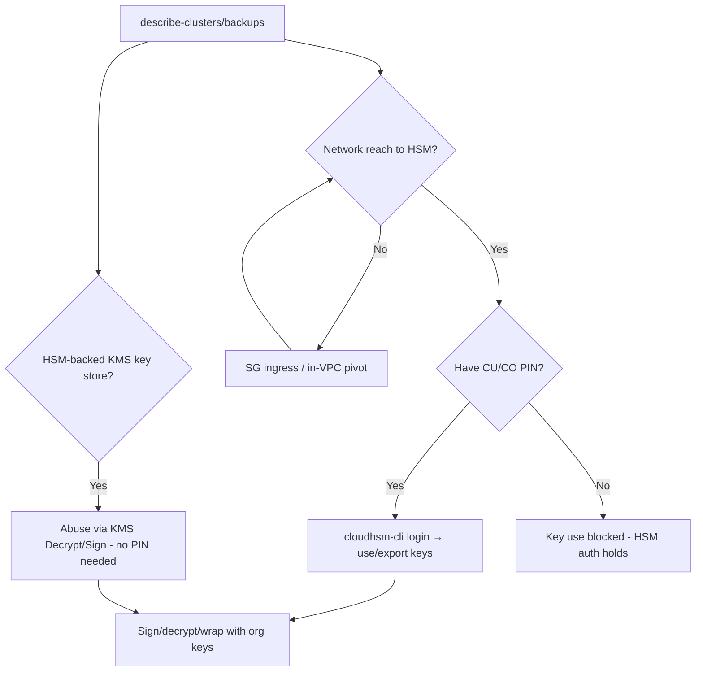

# 41 - AWS CloudHSM Exploitation

## 1. Executive Summary

CloudHSM is dedicated, FIPS-validated hardware security modules holding the org's **most sensitive keys** (signing keys, custom KMS key-store keys, CA keys, payment keys). Unlike KMS, the control plane (`cloudhsm:*`) only manages cluster lifecycle/network — the keys and crypto operations live **inside the HSM, gated by HSM-internal users (CO/CU) and PINs**, not IAM. So attacks split: **IAM/control-plane** abuse (modify SGs to reach the HSM, delete/backup clusters, read backups) vs **HSM-credential** abuse (stolen CU/CO PINs → use/exfil keys via the PKCS#11/JCE client). The real prize — key **use** — needs HSM creds + network reach, not just AWS perms.

## 2. Service Overview & Architecture

A **cluster** of HSMs lives in a VPC (ENIs in your subnets, SG-gated). Crypto ops go over the **CloudHSM client** (PKCS#11/JCE/OpenSSL) authenticated with HSM **users**: **CO** (crypto officer, manages users) and **CU** (crypto user, uses keys). PINs are set inside the HSM, **not** in IAM. **Backups** are encrypted cluster copies. CloudHSM can back a **KMS custom key store** (so KMS keys actually live in the HSM).

## 3. Enumeration

```bash
aws cloudhsmv2 describe-clusters         # cluster state, subnets, SG, backups
aws cloudhsmv2 describe-backups
aws kms describe-custom-key-stores        # HSM-backed KMS stores
# On a client host:
/opt/cloudhsm/bin/cloudhsm-cli cluster identify   # reach test
```

## 4. Privilege Escalation / Abuse Vectors

- **HSM credentials (CU/CO PIN) + network reach** — the actual key-abuse path: with stolen PINs and a client host in the VPC, use keys (sign, decrypt, wrap) or, with CO, create users / export wrapped keys.
  ```bash
  cloudhsm-cli login --username <CU> --role crypto-user
  cloudhsm-cli key list ; cloudhsm-cli crypto sign ...
  ```
- **Control-plane reach** — EC2 `AuthorizeSecurityGroupIngress` on the HSM SG / pivot host → get the client to the HSM (prerequisite for using stolen PINs).
- **`cloudhsmv2:DeleteCluster` / restore from backup** — destructive (key loss) or restore a `DescribeBackups` backup in a controlled environment (still needs HSM creds to use keys).
- **KMS custom key store** — if HSM-backed, `kms:Decrypt`/`Sign` via KMS uses the HSM keys without HSM PINs → pursue KMS-side abuse ([[13 - KMS Exploitation]]) instead.
- **Initialization-time CO** — clusters initialized by the attacker (or with leaked first-CO PIN) = full control.

## 5. Mermaid Attack Flow



## 6. Persistence
- Attacker-created CU/CO user inside the HSM.
- Wrapped-key export held outside; controlled backup copy.

## 7. Post-Exploitation / Data Access
- Use of root-of-trust keys: forge signatures, decrypt data, impersonate the CA/payment system.
- Via HSM-backed KMS store: decrypt everything those KMS keys protect.

## 8. Detection & Hardening
1. Protect HSM PINs as crown jewels (HSM auth is the real control, not IAM); strict CO/CU separation; M-of-N quorum where supported.
2. Tight cluster SGs/subnets (only sanctioned client hosts); restrict `cloudhsmv2:*` + HSM-SG ingress changes.
3. Monitor client logins, key ops, user creation, backup/cluster changes; protect KMS custom key store grants/policies.

## 9. Chaining / Related Notes
- HSM-backed KMS path: **[[13 - KMS Exploitation]]**. Reach/pivot: **[[04 - EC2 Exploitation]]**.
- Cert/CA keys may back **[[39 - ACM and Private CA Exploitation]]**.

## 10. Tools
`aws cloudhsmv2`, `cloudhsm-cli`, PKCS#11/`openssl` engine, `pacu`, `ScoutSuite`.
