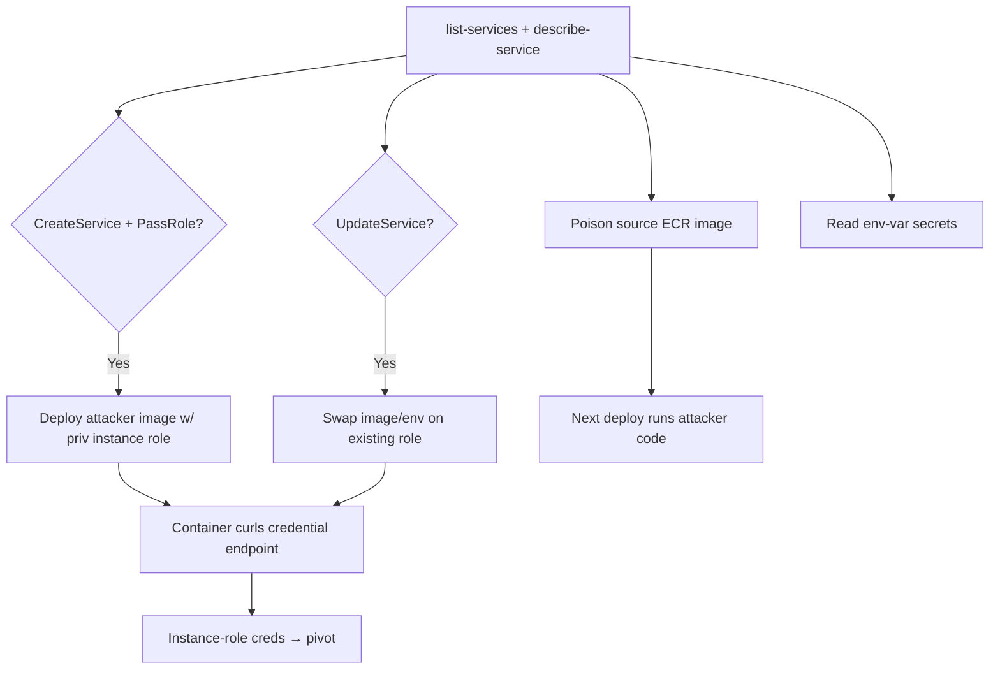

# 42 - AWS App Runner Exploitation

## 1. Executive Summary

App Runner is a managed container/web-app PaaS — point it at an ECR image or source repo and it runs the service with **two roles**: an **access role** (pulls the ECR image) and an **instance role** (the app's runtime AWS identity). Privesc: `apprunner:CreateService` (or `UpdateService`) **+ `iam:PassRole`** deploys an **attacker-controlled image** running with a chosen high-priv **instance role** → code exec that reads the instance-role creds from the container credential endpoint and pivots. Service config also exposes **env-var secrets** and the source ECR/repo (supply-chain angle).

## 2. Service Overview & Architecture

A **service** runs a container from an **ECR image** (or builds from source). The **access role** (ECR pull) and **instance role** (`InstanceConfiguration`, the app's AWS creds) are passed at create/update. Runtime creds reachable inside the container via `AWS_CONTAINER_CREDENTIALS_*` (the ECS-style endpoint). Env vars/secrets configured per service; optional VPC connector for private resources.

## 3. Enumeration

```bash
aws apprunner list-services
aws apprunner describe-service --service-arn <arn>     # roles, image, env
aws apprunner list-connections
aws apprunner describe-auto-scaling-configuration --auto-scaling-configuration-arn <arn>
```

## 4. Privilege Escalation / Abuse Vectors

- **`apprunner:CreateService` + `iam:PassRole`** — deploy an attacker image with a high-priv **instance role**; the running container curls the credential endpoint → role creds → pivot.
  ```bash
  # inside attacker image / entrypoint
  curl "$AWS_CONTAINER_CREDENTIALS_FULL_URI" -H "Authorization: $AWS_CONTAINER_AUTHORIZATION_TOKEN"
  ```
- **`apprunner:UpdateService`** — swap an existing service's image/env/instance role (reuses a role; PassRole sometimes unneeded) → run your code as it.
- **Access-role abuse** — service config reveals the source ECR repo; poison that image ([[08 - ECR Exploitation]]) → next deploy runs attacker code (supply-chain).
- **Env-var / secret exposure** — `describe-service` shows configured env vars (often secrets) and secret references.
- **VPC connector** — service can reach private resources; abuse instance role + network for lateral movement.

## 5. Mermaid Attack Flow



## 6. Persistence
- Service running a backdoored image.
- Poisoned ECR source image redeployed on update.

## 7. Post-Exploitation / Data Access
- Instance-role creds → account pivot; access-role ECR scope.
- Env-var/secret-reference secrets; private VPC resources via connector.

## 8. Detection & Hardening
1. Least-priv instance + access roles; restrict `CreateService`/`UpdateService` + `iam:PassRole`.
2. Trusted/signed ECR images only; no plaintext secret env vars (use secret references with scoped access).
3. Alert on service create/update, image/role/env changes; image scanning on ECR.

## 9. Chaining / Related Notes
- Container-cred theft pattern: **[[09 - ECS Exploitation]]**. Image supply-chain: **[[08 - ECR Exploitation]]**.
- PassRole: **[[01 - IAM Exploitation]]**. Secrets: **[[12 - Secrets Manager Exploitation]]**.

## 10. Tools
`aws apprunner`, `docker`, `pacu`, `ScoutSuite`.
