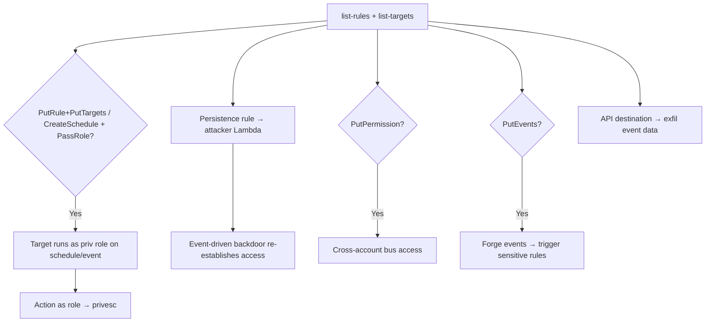

# 43 - AWS EventBridge Exploitation

## 1. Executive Summary

EventBridge is the account's **event router + scheduler** — rules match events (or cron schedules) and invoke **targets** (Lambda, Step Functions, ECS, SNS, API destinations, even cross-account buses) using an **IAM role**. Two big abuses: **privesc/code-trigger** — `events:PutRule`+`PutTargets` (or `scheduler:CreateSchedule`) **+ `iam:PassRole`** invokes a target as a high-priv role on your schedule, and **stealthy persistence** — a rule that triggers attacker Lambda on a cron or on a specific event (e.g. "new IAM user created") is a classic backdoor. **`events:PutPermission`/`PutEvents`** can open the bus cross-account or inject forged events that downstream rules trust.

## 2. Service Overview & Architecture

An **event bus** (default/custom/partner) receives events. **Rules** match by event pattern or **schedule** (rate/cron); EventBridge **Scheduler** is the dedicated cron service. Each rule **target** is invoked via a passed **role** (e.g. to start a Step Function or run an ECS task). **API destinations** call external HTTP endpoints. Resource-based **bus policy** controls who can put events / cross-account routing.

## 3. Enumeration

```bash
aws events list-rules
aws events list-targets-by-rule --rule <r>
aws events describe-event-bus --name <bus>     # resource policy
aws events list-event-buses
aws scheduler list-schedules
aws events list-api-destinations
```

## 4. Privilege Escalation / Abuse Vectors

- **`events:PutRule` + `PutTargets` + `iam:PassRole`** — rule whose target (Step Functions/ECS/Lambda) runs under a high-priv role on a schedule/event → action as that role.
- **`scheduler:CreateSchedule` / `UpdateSchedule` + `PassRole`** — cron that invokes a target as a passed role (same privesc, dedicated service).
- **Persistence rule** — schedule (rate(5 minutes)) or event-pattern rule (e.g. CloudTrail "ConsoleLogin" / "CreateUser") invoking attacker Lambda → durable, event-driven backdoor that re-establishes access.
- **`events:PutPermission`** — add cross-account permission to the bus → external account can put/route events.
- **`events:PutEvents`** — inject forged custom events to trigger rules whose targets perform sensitive actions (logic abuse).
- **API destinations** — point a target at an attacker HTTP endpoint to exfil event data + stored connection creds.

```bash
aws events put-rule --name pwn --schedule-expression "rate(5 minutes)"
aws events put-targets --rule pwn --targets "Id=1,Arn=<priv-lambda-arn>,RoleArn=<priv-role>"
```

## 5. Mermaid Attack Flow



## 6. Persistence
- Cron/event rule invoking attacker Lambda (re-creates access if removed elsewhere).
- Cross-account bus permission for ongoing event injection.

## 7. Post-Exploitation / Data Access
- Whatever target roles allow (Lambda/SFN/ECS) → privesc + account actions.
- Event data exfil via API destinations; trigger-driven workflow abuse.

## 8. Detection & Hardening
1. Restrict `events:PutRule`/`PutTargets`/`PutPermission`/`PutEvents` and `scheduler:*` + `iam:PassRole`; least-priv target roles.
2. Alert on new rules/schedules (esp. invoking Lambda/cross-account), bus-policy changes, API destinations — review for persistence.
3. Scope bus resource policies (no `*` principal); monitor for event-pattern rules keyed on security events (classic backdoor trigger).

## 9. Chaining / Related Notes
- Targets: **[[05 - Lambda Exploitation]]**, **[[33 - Step Functions Exploitation]]**, **[[09 - ECS Exploitation]]**.
- PassRole: **[[01 - IAM Exploitation]]**. General persistence theme across A-82.

## 10. Tools
`aws events`, `aws scheduler`, `pacu`, `ScoutSuite`.
