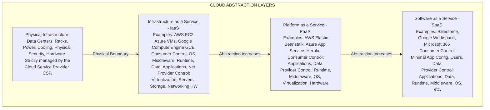

# 74.01 Introduction to Cloud Computing: IaaS, PaaS, and SaaS

## 1. Executive Summary
Cloud computing represents a fundamental paradigm shift in how computing resources are provisioned, managed, and consumed. For a Vulnerability Assessment and Penetration Testing (VAPT) professional, understanding the core characteristics and deployment models of cloud computing is critical. It shifts the traditional boundaries of network security, requiring a deep understanding of logical isolation, virtualization, API security, and identity-centric perimeter defense. This comprehensive document explores the NIST definitions, deployment architectures, and the primary service models (IaaS, PaaS, SaaS), emphasizing the unique attack surfaces introduced by each layer of abstraction.

## 2. The Evolution of Computing Architectures
Before diving into cloud models, it is essential to understand the historical context of infrastructure to grasp why cloud vulnerabilities exist today:

### 2.1 Bare Metal & On-Premises
Initially, organizations hosted their applications on physical servers within their own data centers. This required significant capital expenditure (CapEx), physical security controls, dedicated cooling, power management, and manual hardware provisioning.
- **Security Implication:** The perimeter was clearly defined by physical network boundaries. Firewalls and IDS/IPS systems sat at the edge. Internal networks were often implicitly trusted, leading to rapid lateral movement once the perimeter was breached.

### 2.2 The Virtualization Era
Hypervisors (like VMware ESXi, Microsoft Hyper-V, and KVM) allowed multiple operating systems (Virtual Machines) to run on a single physical host. This increased resource utilization and abstracted the hardware layer.
- **Security Implication:** Introduced VM escape vulnerabilities and virtual network misconfigurations (e.g., vSwitches). The hypervisor became a single point of failure and a high-value target for threat actors.

### 2.3 The Cloud Paradigm
Cloud computing takes virtualization further by wrapping it in a layer of orchestration, automation, and self-service APIs. Resources are instantly available over the internet, converting CapEx into Operational Expenditure (OpEx).
- **Security Implication:** The management plane (APIs) becomes a prime target. Identity completely replaces the physical network as the primary security boundary. An attacker no longer needs to cut wires; they just need to compromise a powerful IAM token.

## 3. The NIST Definition of Cloud Computing
The National Institute of Standards and Technology (NIST) defines cloud computing by five essential characteristics. A solid grasp of these characteristics helps penetration testers identify areas of potential abuse:

### 3.1 On-Demand Self-Service
Consumers can provision computing capabilities, such as server time and network storage, automatically without requiring human interaction with each service provider.
- **Attack Surface:** Self-service APIs can be targeted via stolen credentials, Server-Side Request Forgery (SSRF), or broken authentication. If an attacker gains access, they can instantly provision massive resources (e.g., GPU instances) for malicious purposes like cryptomining.

### 3.2 Broad Network Access
Capabilities are available over the network and accessed through standard mechanisms that promote use by heterogeneous thin or thick client platforms (e.g., mobile phones, tablets, laptops, and workstations).
- **Attack Surface:** Cloud management interfaces, consoles, and applications are inherently exposed to the internet, expanding the external attack surface dramatically. Weak authentication mechanisms (lack of MFA) on these endpoints are heavily exploited.

### 3.3 Resource Pooling
The provider’s computing resources are pooled to serve multiple consumers using a multi-tenant model, with different physical and virtual resources dynamically assigned and reassigned according to consumer demand.
- **Attack Surface:** Multi-tenancy introduces the risk of cross-tenant data leakage if isolation mechanisms (hypervisors, containers, namespaces) fail. Shared resources like CPUs can be susceptible to side-channel attacks (e.g., Meltdown/Spectre).

### 3.4 Rapid Elasticity
Capabilities can be elastically provisioned and released, in some cases automatically, to scale rapidly outward and inward commensurate with demand. To the consumer, the capabilities available for provisioning often appear to be unlimited.
- **Attack Surface:** Attackers can trigger Denial of Wallet (DoW) attacks. By intentionally driving up resource consumption via application-layer DDoS, they cause the auto-scaling mechanisms to provision more servers, resulting in massive, unexpected financial costs for the victim.

### 3.5 Measured Service
Cloud systems automatically control and optimize resource use by leveraging a metering capability at some level of abstraction appropriate to the type of service (e.g., storage, processing, bandwidth, and active user accounts).
- **Attack Surface:** Attackers may seek to exploit billing bypass vulnerabilities, finding ways to consume resources without triggering the provider's metering APIs, effectively stealing compute power.

## 4. Cloud Deployment Models
How the cloud is deployed dictates the level of control, isolation, and security the consumer retains:

1. **Public Cloud:** The infrastructure is provisioned for open use by the general public. It exists on the premises of the cloud provider (e.g., AWS, Azure, GCP). This model carries the highest risk of multi-tenant data exposure but benefits from the massive security investments made by the CSP.
2. **Private Cloud:** The cloud infrastructure is provisioned for exclusive use by a single organization comprising multiple consumers (e.g., business units). It may be owned, managed, and operated by the organization or a third party, and it may exist on or off-premises. Offers ultimate control but requires high internal security maturity.
3. **Hybrid Cloud:** A composition of two or more distinct cloud infrastructures (private, community, or public) that remain unique entities but are bound together by standardized or proprietary technology that enables data and application portability.
   - *Pentesting Focus:* Hybrid environments often have complex, fragile trust relationships (e.g., Active Directory federated to Azure AD). These junctions are prime targets for lateral movement.
4. **Community Cloud:** The infrastructure is provisioned for exclusive use by a specific community of consumers from organizations that have shared concerns (e.g., healthcare organizations sharing compliance requirements).

## 5. ASCII Diagram: Cloud Computing Stack & Abstraction Layers

## 6. Deep Dive: Cloud Service Models

### 6.1 Infrastructure as a Service (IaaS)
In IaaS, the provider offers basic compute, storage, and networking resources on demand. The consumer is essentially renting virtual servers. The consumer is responsible for configuring the operating system, installing applications, managing patches, and securing the virtual network routing and firewall rules.

- **VAPT Focus:** Testing IaaS closely mirrors traditional infrastructure testing. Scoping includes port scanning virtual machines, analyzing OS-level vulnerabilities, assessing network access control lists (NACLs) and security groups (SGs), and reviewing IAM roles attached to the compute instances.
- **Common Vulnerabilities:**
  - Unpatched Operating Systems and vulnerable installed software.
  - Overly permissive SSH (22) or RDP (3389) access exposed to `0.0.0.0/0`.
  - Exposed internal services (e.g., Redis, MongoDB, Elasticsearch) due to misconfigured virtual firewalls.
  - **Server-Side Request Forgery (SSRF):** Exploiting web applications to send HTTP requests to the cloud provider's Instance Metadata Service (IMDS) (e.g., `http://169.254.169.254/`) to steal temporary IAM credentials.

### 6.2 Platform as a Service (PaaS)
PaaS provides a framework that developers can build upon to create or deploy custom applications. The provider manages the servers, storage, networking, operating system, middleware, and database management systems. The consumer only focuses on writing code and managing data.

- **VAPT Focus:** Testing shifts almost entirely away from infrastructure and moves toward the application layer, authentication, and API security. Testers evaluate how the application handles input, manages sessions, and communicates with backend managed databases.
- **Common Vulnerabilities:**
  - Insecure Direct Object References (IDOR) and Broken Object Level Authorization (BOLA).
  - SQL Injection in managed database connections (e.g., Azure SQL, AWS RDS).
  - Broken authentication and session management.
  - Exposed API keys, secrets, or connection strings in source code or environment variables.
  - Misconfigured Cross-Origin Resource Sharing (CORS) policies.
  - Note: OS-level attacks (like exploiting a vulnerable SSH daemon) are usually out of scope and technically restricted by the provider.

### 6.3 Software as a Service (SaaS)
SaaS delivers complete, fully functional software applications over the internet. The provider manages everything, from the physical infrastructure up to the application code.

- **VAPT Focus:** Testing is highly restricted. It is generally limited to evaluating the tenant's specific configuration of the SaaS application. This involves SaaS Security Posture Management (SSPM), testing user roles and permissions, and analyzing the integration points (APIs, SAML/OAuth flows) between the SaaS and the organization's other systems.
- **Common Vulnerabilities:**
  - OAuth illicit consent grants (phishing users to grant a malicious app access to their Microsoft 365 data).
  - Misconfigured Role-Based Access Control (RBAC) allowing privilege escalation within the platform.
  - Excessive data sharing settings (e.g., publicly sharing a sensitive Google Drive link).
  - Weak MFA implementations or lack of Conditional Access policies.

## 7. Emerging Abstractions

### 7.1 Container as a Service (CaaS)
CaaS falls between IaaS and PaaS. It allows users to manage and deploy containers, applications, and clusters. The provider offers the framework (like managed Kubernetes - AWS EKS, Azure AKS, GCP GKE), while the user manages the container lifecycle and pod configurations.
- **Security Implication:** Vulnerabilities include container breakouts, misconfigured cluster role-bindings (RBAC), anonymous API access to the kubelet, and the use of vulnerable base images pulled from public registries.

### 7.2 Function as a Service (FaaS) / Serverless
FaaS allows developers to run individual snippets of code in response to events without managing the complex infrastructure typically associated with building and launching microservices applications (e.g., AWS Lambda, Azure Functions, Google Cloud Functions).
- **Security Implication:** Serverless applications are highly susceptible to event data injection (similar to traditional injection but via event triggers like an S3 file upload), insecure temporary storage (e.g., writing sensitive data to `/tmp` in an AWS Lambda function that gets reused in subsequent invocations), over-privileged execution roles, and third-party dependency vulnerabilities within the deployment package.

## 8. The Security Implications of the Cloud Paradigm
1. **The Demise of the Traditional Perimeter:** In the cloud, employees access resources from anywhere via the internet. The new perimeter is Identity. Consequently, Zero Trust Architecture (ZTA) principles—"never trust, always verify"—become mandatory.
2. **Complexity and Misconfiguration:** The primary cause of cloud data breaches is not sophisticated, zero-day malware. It is simple human error and misconfiguration. Leaving S3 buckets publicly readable, hardcoding AWS access keys in public GitHub repositories, or applying `*` (wildcard) administrative permissions in IAM policies are the most common vectors.
3. **Shadow IT and Sprawl:** The self-service nature of the cloud means developers can spin up unapproved, unmonitored infrastructure within minutes, completely bypassing traditional security gates and asset inventory controls.
4. **API-Driven Infrastructure:** Everything in the cloud is an API call. If an attacker gains access to the management APIs, they own the infrastructure. Security shifts from protecting network packets to securing API calls and validating identity tokens.

## 9. Penetration Testing Methodology in the Cloud
When conducting a VAPT engagement in a cloud environment, the methodology adapts significantly from traditional on-premise networks:

1. **Reconnaissance & OSINT:** Enumerating cloud assets involves looking at certificate transparency logs, performing advanced GitHub dorking to find leaked keys, analyzing DNS records pointing to cloud services, and checking for subdomain takeovers (e.g., abandoned Azure App Service endpoints).
2. **Initial Access:** Often achieved not through a missing patch, but by leveraging leaked credentials, exploiting web application vulnerabilities (like SSRF) to steal metadata tokens, or launching sophisticated phishing campaigns to capture OAuth grants or session cookies (bypassing MFA via AiTM attacks).
3. **Privilege Escalation:** Once initial access is achieved (e.g., code execution on an EC2 instance), the attacker enumerates the attached IAM role. Escalation involves exploiting misconfigured IAM trust policies, finding policy misconfigurations (e.g., having the `iam:PutUserPolicy` permission), or exploiting excessive instance profile permissions.
4. **Lateral Movement:** Attackers pivot between cloud services, abuse trust relationships between different AWS accounts or Azure subscriptions, or move laterally from the cloud environment back to the on-premises network via established VPNs or Direct Connect links.
5. **Data Exfiltration:** Exfiltration techniques are cloud-native. Instead of tunneling data over DNS, an attacker might simply create a snapshot of an EBS volume containing a database and share that snapshot with an AWS account they control, or sync an S3 bucket to an external location using legitimate cloud CLI tools.

## 10. Security Tooling and CSPM
Pentesting the cloud often involves leveraging specialized open-source tools designed to interact with cloud APIs, enumerate permissions, and identify misconfigurations rapidly:
- **CloudFox:** Automates situational awareness for cloud penetration tests.
- **Pacu:** An AWS exploitation framework for offensive security testing.
- **ScoutSuite:** A multi-cloud security-auditing tool that assesses the security posture of cloud environments.
- **Prowler:** A security tool for AWS, Azure, and GCP security best practices assessments.

## 11. Chaining Opportunities
- **[[02 - Cloud Shared Responsibility Model]]**: Understanding the deployment and service models (IaaS, PaaS, SaaS) directly informs the shared responsibility matrix. You cannot accurately define the scope of a penetration test without knowing which model the target application utilizes.
- **[[03 - Introduction to AWS Architecture and Services]]**: Applies these generic models to specific AWS services (e.g., EC2 as IaaS, Lambda as FaaS) and explores how to test them practically.

## 12. Related Notes
- [[04 - Introduction to Azure Architecture and Services]]
- [[05 - Introduction to GCP Architecture and Services]]
- SSRF (Server-Side Request Forgery) in Cloud Environments
- API Security Fundamentals
- Identity and Access Management (IAM) Attack Vectors
