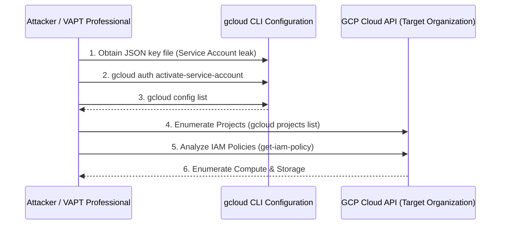

# Using GCP CLI gcloud for Reconnaissance

## 1. Introduction to GCP Reconnaissance

Google Cloud Platform (GCP) features a distinct resource hierarchy and identity model. Unlike AWS, which largely flattens resources under a single account, GCP utilizes a strict organizational structure: Organization -> Folders -> Projects -> Resources. 

Identity in GCP is primarily handled through Google Workspace (Cloud Identity) for human users and **Service Accounts** for applications and compute instances. The `gcloud` CLI tool is the central nervous system for managing and enumerating a GCP environment. For penetration testers, understanding how to navigate projects, enumerate service accounts, and analyze IAM policies via `gcloud` is essential for identifying misconfigurations and escalation paths.

## 2. Architecture and Attack Flow



## 3. The "How": Detailed Methodology with gcloud

### Step 1: Authentication and Configuration
Attackers often find GCP Service Account keys (JSON files) exposed in GitHub repos, S3 buckets, or local file systems.

```bash
# Authenticate using a leaked JSON key
$ gcloud auth activate-service-account --key-file=leaked-key.json

# View active configurations
$ gcloud config list
```

Example Output:
```ini
[core]
account = terraform-admin@my-project-123.iam.gserviceaccount.com
disable_usage_reporting = True
project = my-project-123
```
This tells us we are authenticated as a Service Account and our default project is `my-project-123`.

### Step 2: Project Enumeration
In GCP, all resources must belong to a project. Finding the projects you have access to is the first major step.
```bash
$ gcloud projects list
```
If you lack permissions to list all projects in the organization, you are restricted to the default project configured.

### Step 3: IAM Policy Enumeration
IAM in GCP is heavily policy-driven. You must pull the IAM policy for the project to see who has what roles.
```bash
$ gcloud projects get-iam-policy my-project-123 --format=json
```

Example Output:
```json
{
  "bindings": [
    {
      "members": [
        "user:admin@company.com",
        "serviceAccount:terraform-admin@my-project-123.iam.gserviceaccount.com"
      ],
      "role": "roles/owner"
    },
    {
      "members": [
        "serviceAccount:web-app@my-project-123.iam.gserviceaccount.com"
      ],
      "role": "roles/compute.instanceAdmin.v1"
    }
  ],
  "etag": "BwW1aXYZ123="
}
```
*Insight*: The service account we compromised (`terraform-admin`) has the `roles/owner` role, meaning we have full control over the project.

### Step 4: Enumerating Compute and Storage Resources

#### Compute Instances
```bash
# List all compute instances in the project
$ gcloud compute instances list --project my-project-123

# Describe a specific instance to extract metadata (which often contains secrets)
$ gcloud compute instances describe instance-1 --zone us-central1-a --format=json
```

#### Cloud Storage
```bash
# List buckets using the gsutil command (bundled with gcloud)
$ gsutil ls -p my-project-123

# List contents of a bucket
$ gsutil ls gs://my-company-confidential-data
```

## 4. Deep Dive: GCP Custom Roles and Privilege Escalation

GCP provides basic roles (Viewer, Editor, Owner) and predefined roles. Administrators can also create **Custom Roles**. A critical reconnaissance task is evaluating these custom roles for privilege escalation vectors.

For example, if a custom role contains the `iam.serviceAccounts.actAs` permission, an attacker can attach a highly privileged service account to a new compute instance and log into that instance to assume the privileges of the service account.

```bash
# List custom roles in the project
$ gcloud iam roles list --project my-project-123 --format=json
```

## 5. Tools of the Trade

- **`gcloud` and `gsutil`**: The native CLI tools are incredibly powerful and often all you need.
- **GCPBucketBrute**: A script to enumerate Google Storage buckets, determine access, and check for privilege escalation.
- **ScoutSuite**: Supports GCP, scanning the configuration via API to find misconfigurations in IAM, Compute, and Storage.
- **GCP IAM Privilege Escalation Checker**: Scripts designed specifically to parse `get-iam-policy` output and flag known privilege escalation paths (like `actAs` or `setIamPolicy`).

## 6. Case Studies / Examples

**Case Study: Metadata SSRF to GCP API Pivot**
An attacker finds a Server-Side Request Forgery vulnerability on a web app hosted on a GCP Compute Instance. They request `http://metadata.google.internal/computeMetadata/v1/instance/service-accounts/default/token` (bypassing the `Metadata-Flavor: Google` header requirement if possible). 

They retrieve the OAuth2 token. Instead of using `gcloud auth activate-service-account` (which requires a JSON key), they export the token locally:
```bash
$ export CLOUDSDK_AUTH_ACCESS_TOKEN="ya29.c.b0AXv0z..."
$ gcloud projects list
```
The attacker now queries the GCP infrastructure identically to an administrator, using the instance's underlying service account privileges.

## 7. Mitigation and Defense

### Restrict Service Account Usage
Do not embed Service Account JSON keys in source code. Use Workload Identity Federation when accessing GCP from outside the cloud, and attach Service Accounts directly to compute resources natively.

### Audit IAM Policies
Routinely review `gcloud projects get-iam-policy`. Ensure that basic roles (Editor/Owner) are not over-provisioned. Use IAM Recommender to identify over-permissioned accounts.

### VPC Service Controls
Implement VPC Service Controls to define a security perimeter around Google Cloud resources to mitigate data exfiltration risks even if credentials are compromised.

## 8. Chaining Opportunities
- **[[01 - OSINT for Cloud Assets Domain to Cloud IP]]**: Discovering external GCP IPs.
- **SSRF Exploitation**: Extracting the `CLOUDSDK_AUTH_ACCESS_TOKEN` via GCP metadata endpoint.
- **Privilege Escalation**: Using `iam.serviceAccounts.actAs` to pivot from a low-privilege service account to an Owner role.

## 9. Related Notes
- [[01 - OSINT for Cloud Assets Domain to Cloud IP]]
- [[03 - Using AWS CLI for Reconnaissance]]
- [[04 - Using Azure CLI and AzureHound for Recon]]
