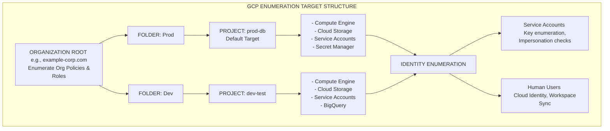

# Enumerating GCP Projects and Service Accounts

## 1. Introduction to Google Cloud Platform (GCP) Enumeration
Google Cloud Platform (GCP) utilizes a uniquely structured resource hierarchy and identity model compared to AWS and Azure. In GCP, everything revolves around **Projects** and **Service Accounts**. When an attacker gains initial access to a GCP environment—often through an exposed JSON key, a compromised web application, or Server-Side Request Forgery (SSRF) hitting the metadata server—the immediate objective is to enumerate the current context, identify the boundaries of the Project, map out associated Service Accounts, and discover paths for lateral movement across the broader Google Workspace (Cloud Identity) organization.

GCP enumeration is heavily reliant on the `gcloud` command-line interface and direct interaction with the Google Cloud REST APIs. Misunderstandings of Google's hierarchical IAM structure frequently lead to severe misconfigurations, allowing attackers to escalate privileges from a single isolated project up to the organization level.

## 2. Core Architectural Concepts of GCP
Before attempting enumeration, a VAPT professional must understand the GCP hierarchy and identity structures:

- **Organization Node**: The root node for a company's GCP hierarchy, directly tied to a Google Workspace or Cloud Identity domain.
- **Folders**: Logical groupings of projects or other folders beneath the Organization.
- **Projects**: The fundamental trust boundary and deployment unit in GCP. All resources (Compute Engine, Cloud Storage, BigQuery) exist within a specific Project.
- **Identities**:
  - **Google Accounts / Cloud Identity**: Human users managed via Google Workspace.
  - **Service Accounts (SAs)**: Non-human accounts representing applications, VMs, or automated services. They use RSA key pairs for authentication.
- **IAM Policies**: Bindings that map an Identity to a Role, applied at a specific level of the hierarchy (Org, Folder, Project, or Resource). *Permissions flow downwards*; a role granted at the Folder level applies to all Projects within that Folder.

## 3. Enumeration Architecture Diagram
The following ASCII diagram maps the GCP hierarchy and illustrates the primary targets during the enumeration phase.



## 4. Initial Access and Context Identification
To begin enumeration, you must authenticate. If you have obtained a Service Account JSON key, you authenticate using the `gcloud` CLI.

```bash
# Authenticate using a stolen Service Account JSON key
gcloud auth activate-service-account --key-file=credentials.json
```

If you compromised a Compute Engine instance or Cloud Run container, you are likely already authenticated via the attached Service Account.

### 4.1 "Who Am I?" in GCP
The first step is determining your current identity and the active configuration.

```bash
# Verify the currently active account
gcloud auth list

# Display current configuration (Project ID, Zone, Region)
gcloud config list
```

### 4.2 Identifying the Current Project
Unlike AWS, where resources span the account, GCP resources are strictly bound to Projects. You must know the Project ID to make most API calls.
```bash
# Print the configured project ID
gcloud config get-value project
```

If `gcloud` is not installed on a compromised machine, you can query the metadata service to find the Project ID:
```bash
curl -H "Metadata-Flavor: Google" http://metadata.google.internal/computeMetadata/v1/project/project-id
```

## 5. Phase 1: Enumerating Projects and Organization
Depending on your permissions, you want to zoom out and see what other Projects exist in the Organization. A low-privileged Service Account in a dev project might have `resourcemanager.projects.get` permissions at the folder or org level.

### 5.1 Listing Projects
```bash
# List all projects the active account has access to
gcloud projects list
```
If you find multiple projects, you will need to iterate through them by setting the active project:
```bash
gcloud config set project <TARGET_PROJECT_ID>
```

### 5.2 Discovering the Organization
If you have broader access, enumerate the Organization structure to understand the corporate layout.
```bash
# List organizations
gcloud organizations list

# List folders under an organization
gcloud resource-manager folders list --organization=<ORG_ID>
```

## 6. Phase 2: Enumerating IAM and Service Accounts
Understanding *who* has access to the Project is critical. The IAM policy of a Project dictates the permissions of all users and Service Accounts within it.

### 6.1 Extracting the Project IAM Policy
This is one of the most critical enumeration commands in GCP. It outputs a list of bindings (Role -> Members).
```bash
gcloud projects get-iam-policy <PROJECT_ID>
```
**What to look for in the output:**
- **Primitive Roles**: `roles/owner`, `roles/editor`, `roles/viewer`. These are legacy, broad roles. An `Editor` can alter most resources, and an `Owner` can alter IAM policies.
- **Custom Roles**: Roles prefixed with `roles/custom.`. These require further investigation to see exactly what permissions they contain.
- **Service Account Users**: Identities with `roles/iam.serviceAccountUser` or `roles/iam.serviceAccountTokenCreator`.

### 6.2 Enumerating Service Accounts
Service Accounts (SAs) are the primary vehicle for lateral movement in GCP.
```bash
# List all Service Accounts in the project
gcloud iam service-accounts list
```

**Service Account Keys:**
SAs can have multiple keys generated. If you find a privileged SA, check if it has external keys. If you have the right permissions, you can generate a new key for it.
```bash
# List keys for a specific Service Account
gcloud iam service-accounts keys list --iam-account=<SA_EMAIL>
```

### 6.3 Checking for Impersonation (Privilege Escalation Vector)
In GCP, Identity A can be granted permission to act as Identity B (Service Account Impersonation). This is done via the `iam.serviceAccounts.getAccessToken` permission (often packaged in the `Service Account Token Creator` role).

If your compromised user has this permission over a higher-privileged Service Account, you can simply impersonate it to escalate privileges:
```bash
# Attempt to generate an access token for a target SA
gcloud auth print-access-token --impersonate-service-account=<TARGET_SA_EMAIL>
```

## 7. Phase 3: Enumerating Cloud Resources
Once you understand the IAM landscape, enumerate the specific compute and data resources within the target project.

### 7.1 Compute Engine (VMs)
```bash
# List all compute instances
gcloud compute instances list

# Describe a specific instance (to find attached Service Accounts, metadata, and network tags)
gcloud compute instances describe <INSTANCE_NAME> --zone=<ZONE>
```
Look closely at the `serviceAccounts` field in the description. If a VM has a highly privileged SA attached, compromising that VM (via SSH or an exposed web app) grants you that SA's privileges.

### 7.2 Cloud Storage (Buckets)
Cloud Storage is a primary target for data exfiltration and credential hunting.
```bash
# List all storage buckets in the project
gcloud storage ls
# Or using the older gsutil tool
gsutil ls

# List contents of a specific bucket
gcloud storage ls gs://<BUCKET_NAME>/
```

### 7.3 Secret Manager
GCP Secret Manager is heavily utilized by modern applications to store database passwords, API keys, and certificates.
```bash
# List all secrets
gcloud secrets list

# Access the payload of a specific secret (if permitted)
gcloud secrets versions access latest --secret=<SECRET_NAME>
```

### 7.4 Cloud Functions and Run
Serverless endpoints often have privileged Service Accounts attached to execute backend tasks.
```bash
gcloud functions list
gcloud run services list
```

## 8. Automated GCP Enumeration Tools
Manual enumeration via `gcloud` is tedious. Attackers and pentesters leverage automated frameworks to rapidly map the environment.

### 8.1 ScoutSuite
ScoutSuite is highly effective in GCP. It uses the REST APIs to gather a comprehensive snapshot of IAM policies, compute instances, storage buckets, and database configurations, outputting them into an easily parsable HTML report.

### 8.2 GCPBucketBrute
If you lack IAM permissions to list buckets, you can attempt to brute-force bucket names. GCP bucket namespaces are global.
```bash
python3 gcpbucketbrute.py -k <keyword>
```

### 8.3 Hayat
Hayat is a post-exploitation tool specifically for GCP. Once you compromise a Service Account key, Hayat will enumerate the project, dump IAM policies, and automatically check for common privilege escalation paths (like impersonation and generic IAM misconfigurations).

### 8.4 Peirates
Designed for Kubernetes and cloud environments, Peirates can automate the enumeration of a GCP environment from the perspective of a compromised GKE (Google Kubernetes Engine) pod, interacting with the node's underlying GCP Service Account.

## 9. Common Privilege Escalation Paths Identified via Enumeration
During enumeration, look for these specific misconfigurations that lead to domain or project takeover:

1. **Deployment Manager Access**: If the compromised identity has `deploymentmanager.deployments.create`, it can deploy new infrastructure with privileged service accounts attached.
2. **Service Account Key Creation**: The `iam.serviceAccountKeys.create` permission allows an attacker to generate persistent credentials for any SA they have this permission over.
3. **Compute OS Login**: If an attacker has `compute.instances.osAdminLogin`, they can SSH into any VM as root. If that VM has a powerful SA attached, the attacker inherits those permissions.
4. **Cloud Build Editor**: Access to Cloud Build allows an attacker to submit malicious build jobs. These jobs execute using the Cloud Build Service Account, which historically has highly elevated privileges across the project.

## 10. Defense and Detection Mechanisms
GCP provides several mechanisms for defenders to identify active enumeration and reconnaissance:
- **Cloud Audit Logs**: These logs track all Admin Activity (e.g., modifying IAM policies) and Data Access (e.g., reading an S3 bucket). Defenders use Google Security Command Center (SCC) to alert on bursts of `projects.getIamPolicy` or `serviceAccounts.list` calls.
- **VPC Service Controls**: Organizations can create secure perimeters around Google APIs. Even if an attacker steals a valid JSON key, if they attempt to enumerate the environment from an IP address outside the approved VPC perimeter, the API request will be blocked and an alert generated.
- **Anomaly Detection in Identity**: Monitoring for Service Accounts generating new keys or authenticating from geographically unusual locations.

## 11. Conclusion
Enumerating a GCP environment is an exercise in understanding IAM bindings and navigating the Project-centric architecture. Because permissions flow downward from the Organization and Folder levels, thorough enumeration of a single project can often reveal access granted at a higher tier, allowing an attacker to pivot extensively. Mastery of the `gcloud` CLI and an acute understanding of Service Account mechanics are mandatory for effective GCP penetration testing.

---
## Chaining Opportunities
- **[[09 - Cloud Metadata Services IMDS Overview]]**: Stealing a token from the GCP metadata server provides the initial foothold required to execute the enumeration commands outlined here.
- **[[17 - GCP Privilege Escalation Techniques]]**: The enumeration of IAM policies and Service Account impersonation directly sets up the exploitation phases for GCP PrivEsc.
- **[[22 - Exploiting Google Cloud Storage]]**: `gsutil ls` output leads directly to the analysis and exfiltration of data from exposed storage buckets.

## Related Notes
- [[02 - Identity and Access Management Concepts]]
- [[14 - GCP Cloud Audit Logs for Attackers]]
- [[27 - Attacking Cloud Run and Cloud Functions]]
