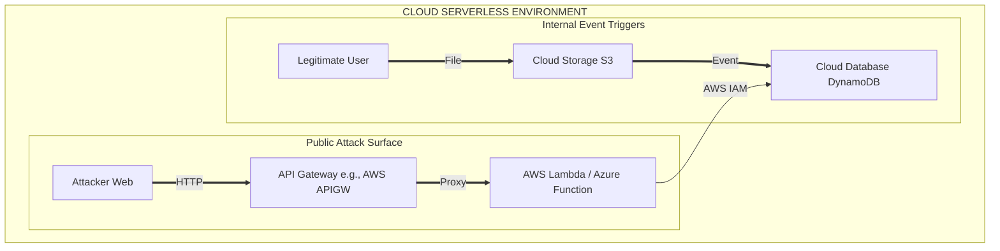

# Identifying Serverless Endpoints and API Gateways

## 1. Introduction to Serverless Reconnaissance
The shift towards cloud-native architectures has drastically popularized "serverless" computing models. Technologies like AWS Lambda, Azure Functions, Google Cloud Functions, and their associated API Gateways handle massive workloads without exposing traditional underlying servers (like EC2 or VMs) to the internet. 

For a penetration tester or red teamer, this represents a significant shift in reconnaissance. You cannot run `nmap` against a serverless function. There are no open ports, no SSH daemons, and no traditional operating system surfaces to probe. Instead, the attack surface entirely shifts to the Application Programming Interface (API) layer and event-driven triggers.

Identifying serverless endpoints and API Gateways requires analyzing web traffic, understanding cloud provider URL structures, brute-forcing API routes, and exploiting application logic flaws to map out hidden functions.

## 2. The Serverless Execution Model
In a serverless architecture, code (the function) is executed in a stateless, ephemeral container triggered by an event. 
Common triggers include:
- **HTTP Requests:** via API Gateways (the primary target for external attackers).
- **Storage Events:** e.g., an S3 bucket file upload triggering an image processing Lambda.
- **Database Streams:** e.g., DynamoDB item updates.
- **Message Queues:** e.g., SQS or Pub/Sub messages.

From a black-box perspective, attackers primarily focus on **HTTP-triggered** serverless functions, which are usually fronted by an API Gateway.

## 3. Serverless Architecture Diagram
The following ASCII diagram shows how an attacker interfaces with a serverless environment compared to internal, unexposed event triggers.



## 4. Identifying Cloud Provider Footprints
The first step in mapping serverless infrastructure is identifying which cloud provider is hosting the endpoints. This is often revealed through URL structures, DNS CNAME records, and HTTP response headers.

### 4.1 AWS API Gateway and Lambda URLs
AWS API Gateways have a very distinct default URL structure:
```text
https://{restapi_id}.execute-api.{region}.amazonaws.com/{stage_name}/
```
- **restapi_id:** Alphanumeric string.
- **region:** e.g., `us-east-1`.
- **stage_name:** Typically `dev`, `test`, `staging`, `v1`, or `prod`.

AWS recently introduced **Lambda Function URLs**, allowing direct HTTP access to Lambdas without an API Gateway:
```text
https://{url-id}.lambda-url.{region}.on.aws/
```

### 4.2 Azure Functions URLs
Azure Functions also have a standard subdomain format:
```text
https://{function-app-name}.azurewebsites.net/api/{function-name}
```
Azure API Management (APIM) uses:
```text
https://{apim-service-name}.azure-api.net/
```

### 4.3 Google Cloud Functions URLs
GCP HTTP functions follow this structure:
```text
https://{region}-{project-id}.cloudfunctions.net/{function-name}
```

### 4.4 Custom Domains and DNS Recon
Organizations rarely expose these raw URLs to end-users. They map them to custom domains (e.g., `api.example.com`).
During reconnaissance, querying DNS CNAME records is critical:
```bash
dig +short api.example.com
```
If the result points to `d-123456abcd.execute-api.us-east-1.amazonaws.com`, you have definitively identified an AWS API Gateway.

## 5. HTTP Header Analysis
Even behind a CDN or Web Application Firewall, HTTP response headers often leak the backend serverless architecture.

- **AWS API Gateway:** Often returns headers like `x-amzn-RequestId`, `x-amz-apigw-id`, or `X-Amzn-Trace-Id`.
- **AWS Lambda:** Direct Lambda URLs return `x-amzn-RequestId` and `x-amzn-trace-id`.
- **Azure Functions:** May return `x-ms-request-id` or standard IIS headers depending on the hosting plan.
- **Google Cloud:** May return `x-cloud-trace-context`.

## 6. Route Enumeration and API Discovery
Once an API Gateway or base serverless endpoint is identified, the next phase is discovering the specific routes and functions available.

### 6.1 Brute-Forcing Stages and Routes
Serverless APIs frequently utilize "stages" to separate development, testing, and production environments. A common misconfiguration is securing the `prod` stage but leaving the `dev` stage unauthenticated.

Tools like `ffuf` or `gobuster` are used to fuzz stages and routes:
```bash
# Fuzzing for API stages
ffuf -w wordlist.txt -u https://api.example.com/FUZZ/users

# Fuzzing for endpoints within a known v1 stage
ffuf -w endpoints.txt -u https://api.example.com/v1/FUZZ
```
*Wordlists specifically tailored for APIs (e.g., SecLists' API wordlists) containing terms like `users`, `graphql`, `swagger`, `health`, `webhook` are highly effective.*

### 6.2 Swagger and OpenAPI Definitions
Developers often deploy OpenAPI (Swagger) documentation to test their serverless APIs. Finding these files provides a complete map of the serverless architecture, including required parameters, methods, and expected responses.
Target paths during fuzzing:
- `/swagger.json`
- `/api-docs`
- `/openapi.yaml`
- `/{stage}/swagger-ui.html`

### 6.3 Analyzing Client-Side JavaScript
Modern Single Page Applications (SPAs) heavily interact with serverless backends. Analyzing the client-side JavaScript (using tools like Burp Suite or browser DevTools) often reveals hardcoded API endpoints, API keys, and staging URLs that are not linked anywhere in the HTML.

## 7. Extracting Serverless Secrets and Source Code
A critical part of serverless reconnaissance is attempting to dump the function's source code or environmental variables.

### 7.1 Exploiting Information Disclosure
Serverless functions are notorious for unhandled exceptions. If you send unexpected data types (e.g., passing an array `[]` instead of a string in a JSON payload), the function might crash. 

Because serverless environments stream logs to services like CloudWatch or Azure Monitor, a verbose stack trace might be returned to the user. This stack trace can reveal:
- The internal directory structure (e.g., `/var/task/index.js` in AWS Lambda).
- Database connection strings.
- Internal IP addresses of backend databases.

### 7.2 Directory Traversal in Serverless
If a serverless function reads local files based on user input, a directory traversal vulnerability can be catastrophic.
```text
GET /api/download?file=../../../../var/task/index.js
```
Downloading the function's source code (`index.js`, `app.py`) allows for white-box analysis, immediately highlighting hidden logic, hardcoded API keys, or remote code execution vectors.

Additionally, dumping environmental variables is a primary goal:
- **AWS Lambda:** Reading `/proc/self/environ` will expose `AWS_ACCESS_KEY_ID`, `AWS_SECRET_ACCESS_KEY`, and `AWS_SESSION_TOKEN`.

## 8. Identifying Event-Driven (Non-HTTP) Triggers
Not all serverless functions are exposed via HTTP. Many are triggered internally. Discovering these requires interacting with other cloud services.

- **S3 Bucket Processing:** If you find a publicly writable S3 bucket, uploading a file might trigger a hidden Lambda function (e.g., an image resizing script). By uploading maliciously crafted files (like polyglot images or files with command injection payloads in their metadata), you can blindly exploit the backend Lambda.
- **Email Processing:** Sending emails to corporate addresses routed through AWS SES or SendGrid might trigger serverless workflows that parse the email body or attachments.
- **Cognito Post-Authentication Triggers:** AWS Cognito often triggers Lambda functions during the user signup or login process to enrich user data. Manipulating your user profile attributes might exploit these hidden functions.

## 9. Security Posture and Defense
Defenders must treat API Gateways and Serverless endpoints with the same rigor as traditional web applications.

1. **Authentication and Authorization:** API Gateways should enforce robust authentication (e.g., via AWS Cognito, Azure AD, or Lambda Authorizers). Never rely on security-by-obscurity for "hidden" routes.
2. **WAF Integration:** Attach a Web Application Firewall (AWS WAF, Azure Web Application Firewall) directly to the API Gateway to filter malicious payloads, directory traversal attempts, and rate-limit brute-force fuzzing.
3. **Least Privilege IAM:** The execution role attached to the serverless function must adhere strictly to least privilege. If a Lambda is designed only to read from DynamoDB, its IAM policy must explicitly deny all other actions, minimizing the blast radius if the function is compromised.
4. **Environment Variables:** Never store plain-text secrets in serverless environment variables. Use integrated secret managers like AWS Secrets Manager or Azure Key Vault, resolving the secrets at runtime.

## 10. Conclusion
Identifying serverless endpoints and API Gateways shifts the reconnaissance focus from infrastructure scanning to application-layer discovery. By analyzing URL structures, HTTP headers, and client-side code, attackers map out the hidden web of serverless functions. Because these functions inherently rely on tight integration with cloud IAM and internal services, discovering and exploiting a single unprotected serverless endpoint often serves as a devastating pivot point into the core cloud environment.

---
## Chaining Opportunities
- **[[25 - Attacking AWS Lambda and Serverless]]**: Once an AWS API Gateway and Lambda route are identified, the exploitation techniques detailed in this note (like SSRF and RCE via event injection) are executed.
- **[[26 - Attacking Azure Functions and Logic Apps]]**: Techniques for exploiting identified Azure serverless infrastructure.
- **[[31 - API Security Testing Methodology]]**: The endpoints identified here are primary targets for standard API vulnerabilities like BOLA, Mass Assignment, and injection flaws.

## Related Notes
- [[04 - Web Application Reconnaissance]]
- [[33 - Information Disclosure and Stack Traces]]
- [[48 - Fuzzing and Content Discovery]]
