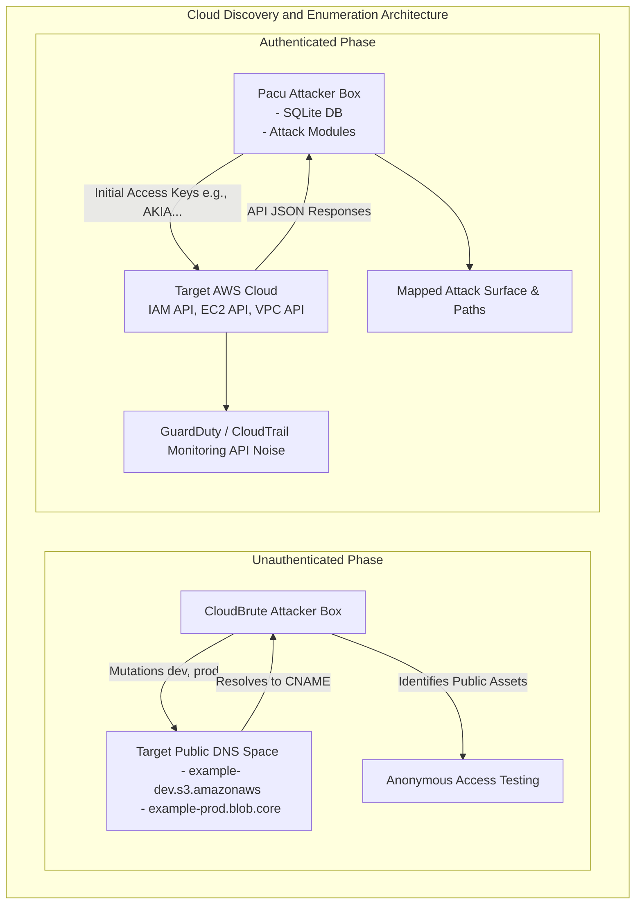

# 75.12 Using CloudBrute and Pacu for Discovery

## Introduction to Advanced Cloud Enumeration

After establishing initial reconnaissance or acquiring leaked credentials, the next phase of a cloud penetration test involves systematic enumeration and discovery of the target's infrastructure. In legacy, on-premises environments, this phase typically relied on network scanners like Nmap or vulnerability scanners like Nessus. However, in modern cloud architectures—where infrastructure is ephemeral, heavily firewalled, and obfuscated behind massive load balancers and API gateways—traditional network scanning is highly ineffective and frequently leads to IP blocking.

Cloud enumeration relies on interacting directly with the cloud service providers' (CSPs) APIs. This process involves identifying public-facing assets (like storage buckets and serverless functions) and leveraging compromised credentials to query internal metadata, unmask IAM privileges, and chart the attack surface. Two distinct tools dominate this methodology: **CloudBrute** (for unauthenticated external discovery) and **Pacu** (an exploitation framework for authenticated enumeration and attack chaining).

## Unauthenticated Discovery with CloudBrute

CloudBrute is a highly specialized, fast, cross-platform tool designed to discover a company's cloud infrastructure across major providers including AWS, GCP, Azure, DigitalOcean, and others. It operates without requiring any prior authentication or API keys, making it an ideal tool for black-box engagements.

### How CloudBrute Operates

Cloud infrastructure components often utilize predictable naming conventions mapped to a company's domain, brand name, or project identifiers. For example, a target company named "ExampleCorp" might have an AWS S3 bucket named `examplecorp-assets.s3.amazonaws.com` or a GCP storage bucket named `examplecorp-backup`.

CloudBrute leverages keyword permutations, mutators, and common suffix/prefix lists to rapidly generate thousands of potential target URLs. It then performs asynchronous HTTP requests and DNS resolutions to verify the existence of these resources.

### Execution and Configuration

A standard execution of CloudBrute requires a target keyword and optionally, a wordlist of mutations.

```bash
cloudbrute -d example.com -k examplecorp -m /opt/cloudbrute/data/mutations.txt -c /opt/cloudbrute/data/config.json
```

- `-d`: The target domain, used for DNS resolution and sub-domain contextualization.
- `-k`: The base keyword (e.g., `examplecorp`).
- `-m`: The mutation list (appending terms like `dev`, `prod`, `staging`, `backup`, `api`).
- `-c`: The configuration file detailing the cloud provider endpoint formats (e.g., `.s3.amazonaws.com`, `.blob.core.windows.net`).

### Interpreting CloudBrute Output

The output will categorize findings by cloud provider and resource type. Finding an S3 bucket or Azure Blob storage container does not immediately equate to a vulnerability. The tester must then attempt to interact with the identified resource to assess its permission model. For instance, testing an S3 bucket for anonymous read access:

```bash
aws s3 ls s3://examplecorp-staging --no-sign-request
```

If the bucket returns a directory listing rather than an `AccessDenied` error, the tester has successfully transitioned from unauthenticated discovery to data exposure.

## Authenticated Enumeration with Pacu

While CloudBrute identifies public assets, **Pacu** (developed by Rhino Security Labs) operates fundamentally differently. Pacu is an open-source AWS exploitation framework designed specifically for offensive security testing against cloud environments. It is the cloud equivalent to Metasploit.

Pacu requires initial AWS credentials (which may have been discovered via [[11 - GitHub Recon for Leaked Cloud Keys]]). Once authenticated, Pacu utilizes a modular architecture to perform privilege escalation, backdoor creation, and exhaustive enumeration of the internal AWS environment.

### Pacu Architecture and Core Concepts

Pacu organizes campaigns into distinct sessions, tracking all enumerated data within an underlying SQLite database. This allows testers to run various modules incrementally without needing to re-query the AWS APIs, thus reducing API noise and the likelihood of triggering GuardDuty alerts.

#### Key Enumeration Modules in Pacu

1. **`iam__enum_permissions`**:
   This is often the first module executed. Given a set of credentials, determining exactly what permissions those credentials possess is historically difficult without triggering alerts. This module leverages a combination of querying IAM policies directly (if permitted) and executing "dry-run" API calls across various AWS services to map out the explicit permissions of the current user.

2. **`iam__enum_users_roles_policies_groups`**:
   If the compromised key has sufficient read privileges, this module pulls the entire IAM structural topology of the AWS account. It dumps all users, roles, inline policies, and group memberships into the local database.

3. **`ec2__enum`**:
   This module queries the EC2 API to identify all running instances, their associated security groups, Elastic IP addresses, and User Data scripts. User Data is particularly lucrative as developers frequently leave bootstrapping credentials, API keys, or database passwords in these scripts.

4. **`vpc__enum`**:
   Maps out the network topology, including Virtual Private Clouds (VPCs), subnets, routing tables, and internet gateways, providing the attacker with a comprehensive understanding of the internal network architecture.

### Execution Flow in Pacu

Starting Pacu presents a custom interactive shell.
```bash
pacu
```

1. **Set Keys:** Provide the compromised AWS credentials.
   ```text
   Pacu > set_keys
   Key alias: compromised_dev
   Access key ID: AKIA...
   Secret access key: wJalr...
   Session token (Optional):
   ```

2. **Enumerate Current Privileges:**
   ```text
   Pacu > run iam__enum_permissions
   ```

3. **Execute Broad Discovery:**
   ```text
   Pacu > run ec2__enum
   Pacu > run s3__enum
   ```

4. **Review Data:**
   ```text
   Pacu > data ec2
   ```

## Abstract Architecture of Discovery Tooling



## Advanced Execution and Operational Security (OPSEC)

When conducting authenticated enumeration with tools like Pacu, operational security must be a primary consideration. Modern cloud environments are heavily monitored by services like AWS CloudTrail, which logs every API call, and AWS GuardDuty, which uses machine learning to detect anomalous behavior.

Executing rapid, exhaustive enumeration modules against every region in an AWS account is highly anomalous and will almost certainly trigger high-severity GuardDuty alerts (e.g., `Discovery:IAMUser/AnomalousBehavior`).

To maintain stealth:
- **Targeted Regions:** Limit enumeration to specific regions where the company is known to operate.
- **Pacing:** Introduce delays between API calls if interacting manually, or limit the scope of automated modules.
- **Dry-Run Analysis:** Carefully analyze the output of the `iam__enum_permissions` module. If the compromised key does not have the necessary permissions to list S3 buckets, executing `s3__enum` will generate a flood of `AccessDenied` events in CloudTrail, alerting the defense team instantly.

## Defensive Posture Against Enumeration

Defending against unauthenticated discovery (CloudBrute) involves ensuring that public-facing resources adhere to strict least-privilege configurations.
1. **S3 Block Public Access:** Enable AWS account-level blocks on public S3 buckets to prevent anonymous directory listing or object retrieval, regardless of the bucket's individual policy.
2. **Obfuscated Naming Conventions:** Avoid overly predictable naming structures for sensitive staging or backup buckets. Randomizing suffixes (e.g., `examplecorp-backup-x8f2a`) renders brute-forcing nearly mathematically impossible.

Defending against authenticated enumeration (Pacu) requires robust monitoring and IAM hardening.
1. **CloudTrail Monitoring:** Implement SIEM alerts for high volumes of `AccessDenied` API calls, a classic indicator of an attacker mapping permissions.
2. **GuardDuty:** Ensure GuardDuty is enabled across all regions to detect reconnaissance tools executing known malicious API patterns.
3. **IAM Least Privilege:** Strict adherence to least privilege ensures that even if a key is compromised, the attacker cannot run extensive enumeration modules, successfully trapping them within a tightly scoped IAM policy.

## Chaining Opportunities
- The initial access keys required for Pacu are frequently obtained through [[11 - GitHub Recon for Leaked Cloud Keys]].
- Data gathered by Pacu regarding network topology is directly applicable when analyzing firewall rules in [[14 - Identifying Misconfigured Cloud Networking Security Groups]].
- For a more compliant, audit-focused (rather than exploit-focused) review of the discovered infrastructure, testers often pivot to [[13 - Using ScoutSuite for Cloud Security Auditing]].

## Related Notes
- [[02 - Cloud Shared Responsibility Model]]
- [[05 - AWS IAM Architecture and Misconfigurations]]
- [[31 - Advanced Evasion Techniques in Cloud Environments]]
