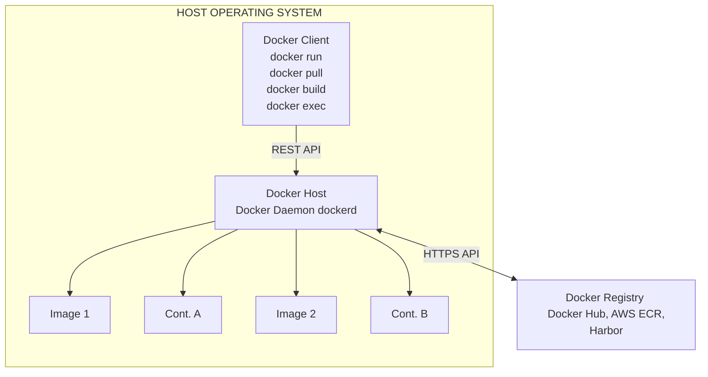

# 01 - Docker Overview — Images, Containers, Registries

## Introduction to Docker and Containerization

Docker has fundamentally revolutionized the way modern applications are developed, packaged, distributed, and deployed. At its core, Docker is a platform-as-a-service (PaaS) product that uses OS-level virtualization to deliver software in standardized packages called **containers**. Unlike traditional virtual machines (VMs) that require a full-fledged guest operating system and a hypervisor to abstract the hardware, containers share the host machine's kernel directly. This architectural difference makes containers extremely lightweight, rapid to start, and highly resource-efficient.

Understanding the deep internal workings of Docker is critical for any offensive security professional. When assessing containerized environments, the boundary between the application, the container engine, and the host operating system provides a rich and complex attack surface. Escaping a container, manipulating image registries, or hijacking the daemon can lead to full infrastructure compromise. Without a solid grasp of how Docker leverages Linux primitives, an attacker will struggle to identify misconfigurations or execute complex breakouts.

This document serves as an extreme-depth overview of the core Docker components: Images, Containers, and Registries, focusing heavily on the underlying Linux primitives that make containerization possible and secure.

## Core Architecture and The Client-Server Model

Docker operates strictly on a client-server architecture. The Docker client communicates with the Docker daemon (`dockerd`), which does the heavy lifting of building, running, monitoring, and distributing your Docker containers.



### The Docker Daemon (`dockerd`)

The daemon is a persistent background process that manages Docker images, containers, networks, and storage volumes. The daemon listens for Docker API requests (usually via a local Unix socket at `/var/run/docker.sock`, or over TCP) and processes them. Crucially, the Docker daemon typically runs as `root`, meaning that any user who can interact with the daemon effectively has root-level privileges on the host system. This design choice is the root cause of many Docker-related privilege escalation paths.

### The Docker Client (`docker`)

The command-line interface (CLI) tool that users interact with. It merely acts as an HTTP client sending requests to the daemon's REST API. When you type `docker run alpine`, the client translates this into a series of HTTP POST requests to the daemon.

## Deep Dive: Docker Images

A Docker image is a read-only template with instructions for creating a Docker container. Images are often based on another image, with some additional customization. They are the fundamental building blocks of the container ecosystem.

### Image Layers and UnionFS

Docker images are built using a series of layers. Each layer represents an instruction in the image's `Dockerfile` (e.g., `RUN apt-get update`, `COPY . /app`).
These layers are stacked on top of each other. Docker uses **Union File Systems** (UnionFS), specifically storage drivers like `overlay2`, to combine these layers into a single cohesive filesystem that the container sees.

1. **Base Layer:** Usually a minimal OS distribution like Alpine, Ubuntu, or Debian.
2. **Intermediate Layers:** Installed packages, copied files, compiled code, configurations.
3. **Container Layer (Thin Writable Layer):** When a container is launched from an image, a new, empty writable layer is added on top of the image layers. Any changes made by the container (writing new files, modifying existing ones, or deleting files) are written to this thin writable layer. The underlying image layers are never modified.

*Security Implication:* Because layers are cached and strictly read-only, sensitive data (like hardcoded AWS keys, database passwords, or private SSH keys) introduced in a lower layer and "deleted" in a higher layer **still exists** in the image history. The data is simply masked by a whiteout file in the upper layer. Attackers can extract these secrets using tools like `dive` or by manually inspecting the layer tarballs via `docker save`.

### Image Manifests and Digests

An image manifest provides a JSON-based description of an image, detailing the image layers, size, architecture, and execution configuration. Images are cryptographically verifiable via their digest (a SHA256 hash of the manifest). Docker Content Trust (DCT) utilizes this to ensure that the image being pulled is signed by a trusted publisher (using Notary) and has not been tampered with in transit or at rest in the registry.

## Deep Dive: Docker Containers

A container is a runnable instance of an image. Under the hood, a container is simply a Linux process (or a tree of processes) that has been isolated from the rest of the system using two fundamental Linux kernel features: **Namespaces** and **Control Groups (cgroups)**.

### Linux Namespaces (The "Walls")

Namespaces provide the isolation. They ensure that a process inside the container cannot see or affect processes outside of it. Docker utilizes several namespaces to build this illusion of a separate machine:

- **PID Namespace (Process ID):** Isolates the process ID number space. Inside the container, the main application runs as PID 1. The host sees this same process with a normal, random high PID (e.g., PID 23045). This prevents containers from inspecting or killing host processes.
- **NET Namespace (Network):** Isolates the network interfaces, routing tables, and iptables rules. The container gets its own loopback interface (`lo`) and a virtual ethernet interface (often `eth0`).
- **MNT Namespace (Mount):** Isolates mount points. The container cannot see the host's filesystem; it only sees the root filesystem provided by the Docker image and any explicitly declared volume mounts.
- **IPC Namespace (Inter-Process Communication):** Isolates System V IPC objects and POSIX message queues.
- **UTS Namespace (UNIX Time-Sharing):** Isolates the hostname and domain name.
- **USER Namespace (User):** Isolates user and group IDs. Unfortunately, this is often disabled by default in standard Docker setups, meaning `root` (UID 0) inside the container maps exactly to `root` (UID 0) on the underlying host.

### Control Groups (cgroups) (The "Ceiling")

While namespaces limit what a container can *see*, cgroups limit what a container can *use*. Cgroups are responsible for resource limiting, prioritization, accounting, and control.
- **Memory limitation:** Preventing a container from consuming all host RAM and causing Out-Of-Memory (OOM) kernel panics.
- **CPU limitation:** Restricting the number of CPU cycles or CPU cores a container can utilize.
- **Device access:** Cgroups define which device nodes (`/dev/*`) the container can read from or write to, which is crucial for preventing raw disk access.

### Security Capabilities and Seccomp

Linux capabilities break down the monolithic `root` privilege into smaller, distinct privileges. For example, `CAP_CHOWN` allows changing file ownership, while `CAP_NET_ADMIN` allows network configuration. Docker drops many dangerous capabilities by default, running containers with a restricted set of about 14 capabilities.

**Seccomp (Secure Computing Mode):** Docker uses seccomp profiles to restrict which system calls (syscalls) the container processes can make to the Linux kernel. The default Docker seccomp profile blocks roughly 44 dangerous syscalls (like `ptrace`, `kexec_load`, `unshare`) out of the 300+ available, significantly reducing the kernel attack surface and mitigating many kernel zero-day exploits.

## Deep Dive: Docker Registries

A Docker registry is a highly scalable server-side application that stores and lets you distribute Docker images. The default public registry is Docker Hub, but organizations typically run private registries (e.g., Harbor, AWS ECR, GitLab Container Registry, Azure ACR) to keep their proprietary code secure.

### Registry Interactions (Push and Pull)

- `docker pull <image>`: The client contacts the registry, requests the manifest for the image, validates the OS and architecture, and then downloads each missing layer sequentially as tarballs.
- `docker push <image>`: The client uploads new layers to the registry, computes the new hashes, and updates the manifest JSON file.

### Security Weaknesses in Registries

1. **Unauthenticated Access:** Misconfigured private registries might allow unauthenticated pulling of proprietary images (leading to source code, intellectual property, and secret disclosure) or, worse, pushing of malicious images (a devastating supply chain attack).
2. **Insecure API Endpoints:** Registries expose a REST API (V2 API). Endpoints like `/v2/_catalog` can be used by an attacker to list all repositories, and `/v2/<name>/tags/list` to find all versions.
3. **Lack of Vulnerability Scanning:** Images stored in registries might contain heavily outdated software with known CVEs (e.g., Log4Shell, Shellshock). Modern registries integrate scanners (like Trivy or Clair) to automatically scan images on push and block deployments of vulnerable images.
4. **Man-in-the-Middle (MitM):** If a registry is accessed over HTTP instead of HTTPS (often configured via the dangerous `--insecure-registry` flag), image layers can be intercepted and modified in transit, allowing attackers to inject backdoors into pulled images.

## The Offensive Perspective: Attack Surface

When approaching a Docker environment, an attacker looks at several distinct areas for potential exploitation:

1. **The Host OS Kernel:** Is it outdated? Can we use kernel exploits (like Dirty COW or eBPF flaws) from inside the container to exploit the host kernel directly?
2. **The Docker Daemon:** Is the API exposed over TCP without authentication? This is an instant remote root.
3. **Container Configurations:** Are containers running as `--privileged`? Do they mount sensitive host directories (like `/`, `/etc`, or `/var/run/docker.sock`)? Do they have excess capabilities?
4. **Image Contents:** Do the images contain hardcoded credentials, SSH keys, or vulnerable application dependencies?
5. **Network Exposure:** Are internal container ports accidentally exposed to the public internet via `docker run -p 0.0.0.0:8080:80`?

### Basic Enumeration Commands

```bash
# Check Docker version and info (reveals host OS, kernel version, root dir, and active storage driver)
docker version
docker info

# List running and stopped containers (looking for interesting names or ports)
docker ps -a

# List local images (looking for large sizes or interesting tags)
docker images

# Inspect a container to find mounts, capabilities, networking details, and embedded environment variables
docker inspect <container_id>

# Extract image history to look for hardcoded secrets or suspicious build steps
docker history --no-trunc <image_name>

# Check the active processes inside a running container
docker top <container_id>
```

## Chaining Opportunities
- **Secret Extraction -> Cloud Pivot:** Finding hardcoded AWS/GCP credentials or service account tokens in image layers to pivot directly into the cloud infrastructure environment.
- **Daemon Misconfiguration -> Host Takeover:** Exploiting an exposed Docker API to spawn a privileged container, leading directly to host root.
- **Web App RCE -> Container Escape:** Gaining RCE in a containerized web application, then leveraging excessive capabilities, mounted sockets, or dangerous bind mounts to escape to the underlying host.

## Related Notes
- [[02 - Docker Daemon Exposed]]
- [[03 - Docker Socket Mount Privilege Escalation]]
- [[04 - Container Escape — Privileged Container]]
- [[05 - Container Escape — Mounted Host Filesystem]]
- [[06 - Container Escape — SYS_PTRACE Capability]]
