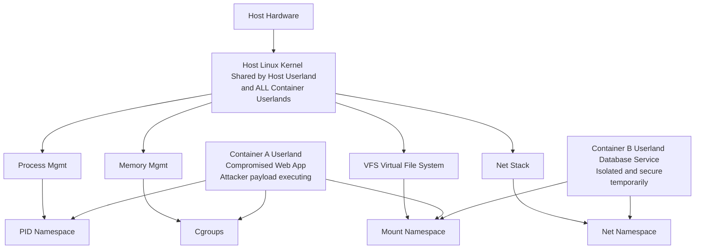

# Container Escape — Kernel Exploits

## Introduction
Container escapes represent a catastrophic failure in the isolation boundaries that containerization platforms (like Docker, containerd, and LXC) rely upon. Unlike virtual machines, which use hardware virtualization to provide strong isolation through a hypervisor, containers share the same underlying operating system kernel as the host machine. This shared architectural paradigm is the fundamental reason why kernel exploits are exceptionally dangerous in containerized environments. 

When a vulnerability is discovered in the Linux kernel—such as a memory corruption bug, a use-after-free vulnerability, or a race condition—it can often be exploited by a local user to escalate privileges to root. In a containerized context, if an attacker successfully executes a local privilege escalation (LPE) kernel exploit from *inside* a container, they are not just elevating their privileges within that isolated namespace; they are potentially compromising the shared host kernel itself. 

## The Architectural Shared-Kernel Risk

The foundation of Linux containers relies on Namespaces (for isolation of resources like PID, Network, Mount) and Cgroups (for resource limitation). However, the kernel boundary is singular. 



If an attacker in Container A uses an exploit to corrupt kernel memory, the corruption affects the singular, global kernel instance. A successful exploit typically involves overwriting a process's credentials structure (`struct cred`) in kernel memory to achieve UID 0. Because the kernel handles this globally, achieving kernel-level code execution or root-level memory rewriting effectively grants root on the underlying host, stripping away all namespace restrictions.

## Exploitation Mechanics: How Kernel Escapes Work

A typical container escape via kernel exploitation follows a rigorous and specific lifecycle. It requires the attacker to deeply understand the environment they have landed in.

### 1. Initial Foothold and Reconnaissance
The attacker must first achieve arbitrary code execution within the container. This is typically accomplished via a vulnerability in the application running inside the container (e.g., an RCE in a web framework, a deserialization flaw, or a compromised dependency). 
Once inside, the attacker enumerates the environment. Crucially, they identify the host kernel version. They will execute commands such as:
*   `uname -r` (Reveals the kernel release version).
*   `cat /proc/version` (Provides more detailed compiler and kernel build information).
*   `dmesg` (If accessible, provides deep kernel boot logs and potentially memory addresses).

### 2. Vulnerability Matching and Payload Selection
The attacker cross-references the discovered kernel version against public vulnerability databases (CVEs) and exploit repositories (like Exploit-DB or GitHub). They look for Local Privilege Escalation (LPE) exploits that match the specific kernel version. 

### 3. Overcoming Container Restrictions (The Sandbox Check)
Before an exploit can be deployed, the attacker must verify if the container's security context allows the exploit to function. Containers are not just namespaces; they are often wrapped in security profiles:
*   **Seccomp**: Does the exploit require a system call that is blocked by the container's seccomp profile (e.g., `userfaultfd`, `bpf`, `unshare`)?
*   **Capabilities**: Does the exploit require specific Linux capabilities (e.g., `CAP_SYS_ADMIN` to mount filesystems, `CAP_NET_ADMIN` to manipulate network interfaces)? If the container is running with dropped capabilities (the default), the exploit may fail.
*   **AppArmor/SELinux**: Are there Mandatory Access Control policies preventing the reading of specific `/proc` files or the execution of newly created binaries?

### 4. Exploit Compilation and Execution
If the environment is vulnerable and permissive enough, the attacker stages the exploit. Because kernel exploits are highly sensitive to memory offsets and specific kernel builds, they often need to be compiled on the target architecture. 
If development tools (`gcc`, `make`) are installed in the container (a severe misconfiguration), the attacker compiles the exploit locally. Otherwise, they must cross-compile it locally and upload the binary. 

### 5. Kernel Compromise and Credential Overwrite
The exploit is executed. It interacts with the kernel to trigger the vulnerability. The ultimate goal of most LPE exploits is to locate the `struct cred` of the current process in kernel memory and overwrite its UID, GID, EUID, and EGID fields with `0` (root). 
Once the `struct cred` is modified, the attacker's process is suddenly recognized by the kernel as a root process, completely bypassing userland restrictions.

### 6. The Escape: Breaking Out of Namespaces
Achieving UID 0 in the kernel is not the final step. The process is still trapped within the container's namespaces (it has a restricted view of processes, mounts, and networks). To fully compromise the host, the attacker must "escape" these namespaces.

This is fundamentally achieved using the `setns()` system call. Because the attacker is now truly root from the kernel's perspective, they have the authority to interact with host-level processes. 
The standard procedure is to target PID 1 (the host's init process, like `systemd`). The attacker iterates through PID 1's namespace file descriptors and attaches their own process to them:

```c
// Advanced conceptual code for namespace escape post-kernel-compromise
#define _GNU_SOURCE
#include <fcntl.h>
#include <sched.h>
#include <unistd.h>
#include <stdio.h>
#include <stdlib.h>

int main() {
    int init_pid = 1; // Host's init process
    char path[256];
    int fd;
    
    // The order of namespace joining can be important.
    // Mount is usually joined last to ensure proper path resolution.
    char *namespaces[] = {"ipc", "uts", "net", "pid", "mnt"};

    for (int i = 0; i < 5; i++) {
        snprintf(path, sizeof(path), "/proc/%d/ns/%s", init_pid, namespaces[i]);
        fd = open(path, O_RDONLY);
        if (fd == -1) {
            perror("open namespace");
            continue;
        }
        
        // setns() attaches the current process to the specified namespace
        if (setns(fd, 0) == -1) {
            perror("setns");
        }
        close(fd);
    }

    // The process is now operating within the host's context.
    // Execute a shell to interact with the host filesystem and network.
    printf("[+] Namespaces escaped. Spawning host shell...\n");
    char *args[] = {"/bin/bash", "-i", NULL};
    execve("/bin/bash", args, NULL);
    
    return 0;
}
```

## Deep Dive: Notable Kernel Vulnerabilities Used for Escapes

### 1. Dirty COW (CVE-2016-5195)
Dirty COW was a privilege escalation vulnerability rooted in a race condition in how the Linux kernel's memory subsystem handled the copy-on-write (COW) mechanism for private read-only memory mappings. 
*   **The Mechanism**: An attacker could use the `madvise()` system call with the `MADV_DONTNEED` flag while concurrently writing to `/proc/self/mem`. This race condition allowed the attacker to bypass the read-only protection and overwrite the underlying physical memory page of a read-only file.
*   **Container Impact**: If a container had read access to a host file (perhaps mounted via a volume, or if the underlying storage driver shared page caches), the attacker could use Dirty COW to write to that host file. Attackers commonly targeted the host's `/etc/passwd` or critical setuid binaries (like `/bin/su`) to establish a backdoor on the host system.

### 2. Dirty Pipe (CVE-2022-0847)
Dirty Pipe was a severe vulnerability similar in practical impact to Dirty COW, but entirely different in its underlying mechanics. It exploited a flaw in the new pipe buffer implementation in the Linux kernel.
*   **The Mechanism**: When data is written to a pipe, the kernel allocates an anonymous pipe buffer. The vulnerability occurred because a flag (`PIPE_BUF_FLAG_CAN_MERGE`) was not properly initialized. An attacker could splice data from a read-only file into a pipe, leaving the `CAN_MERGE` flag set. Subsequent writes to the pipe would then be merged into the page cache of the read-only file, effectively overwriting it on disk without requiring write permissions.
*   **Container Impact**: In a container environment, if an attacker could read a file that resided on the host's filesystem (even just reading a shared library or a mounted configuration file), they could use Dirty Pipe to overwrite the contents of that file. This easily led to host-level code execution by overwriting host binaries or crontabs.

### 3. eBPF Vulnerabilities (e.g., CVE-2021-3490)
The extended Berkeley Packet Filter (eBPF) allows user-space programs to execute custom, sandboxed programs within the Linux kernel. It is a powerful tool for observability and networking. However, the complexity of the eBPF verifier—the component responsible for ensuring eBPF programs are safe to run—has been a massive source of vulnerabilities.
*   **The Mechanism**: Attackers discover flaws in the eBPF verifier's logic (e.g., incorrect bounds checking, type confusion). They craft a malicious eBPF program that bypasses the verifier but performs out-of-bounds memory reads or writes when executed by the kernel's JIT compiler.
*   **Container Impact**: By default, Docker drops `CAP_BPF` and `CAP_SYS_ADMIN`, preventing containers from loading eBPF programs. However, if a container is over-privileged, or if the host kernel allows unprivileged eBPF (controlled by the `kernel.unprivileged_bpf_disabled` sysctl), an attacker can leverage eBPF to arbitrarily manipulate kernel memory, alter their `struct cred`, and escape the container.

### 4. io_uring Vulnerabilities
`io_uring` is a relatively new and highly efficient asynchronous I/O API in the Linux kernel, designed to replace older interfaces like `epoll` and `aio`. Its massive feature set and complexity have introduced numerous severe vulnerabilities, particularly use-after-free (UAF) bugs.
*   **The Mechanism**: Attackers manipulate the complex lifecycle of I/O requests within `io_uring` to trigger race conditions that lead to memory corruption or UAF scenarios in kernel space.
*   **Container Impact**: Because `io_uring` is heavily used for performance, it is often accessible from within containers. Exploiting an `io_uring` vulnerability allows an attacker to gain kernel-level RCE, bypassing namespace isolations entirely and compromising the underlying host node.

## Prerequisites and Security Roadblocks

While kernel exploits are the ultimate weapon for container escapes, modern container runtimes implement defense-in-depth mechanisms that actively hinder these attacks.

1.  **Seccomp (Secure Computing Mode)**: Docker applies a default seccomp profile that blocks around 44 out of 300+ system calls. If a kernel exploit relies on `bpf()`, `userfaultfd()`, or `kcmp()`—which are blocked by default—the exploit will immediately fail with an `EPERM` error before it can even interact with the vulnerable kernel subsystem.
2.  **Dropped Capabilities**: Containers start with a restricted set of Linux capabilities. An exploit that requires mounting filesystems to trigger a VFS bug will fail because the container lacks `CAP_SYS_ADMIN`.
3.  **User Namespaces (UserNS)**: This is a highly effective mitigation. When enabled, a process running as root (UID 0) *inside* the container is mapped to an unprivileged user (e.g., UID 100000) *outside* the container on the host. Even if an attacker successfully exploits a kernel bug and modifies their internal `struct cred` to root, the host kernel still treats them as an unprivileged user, preventing them from accessing host resources or escaping namespaces effectively.
4.  **Read-Only Root Filesystem**: While it doesn't prevent kernel exploitation, running a container with a read-only root filesystem makes the post-exploitation phase significantly harder, as the attacker cannot easily drop exploit binaries, compile tools, or stage payloads.

## Detection, Forensics, and Mitigation

### Detection Strategies
Detecting a successful kernel exploit is notoriously difficult because the attacker gains control over the very system that generates telemetry (the kernel).
*   **Behavioral Monitoring (eBPF/Falco)**: Tools like Falco can monitor system calls in real-time. Alerts should be generated for abnormal syscall sequences, such as a process abruptly calling `setns()` for all namespaces, or an application server suddenly invoking `ptrace` or compiling code (`execve` of `gcc`).
*   **Kernel Log Analysis**: Monitor `dmesg` and `/var/log/kern.log` on the host. Unstable exploits frequently cause kernel panics, page faults, or stack traces (Kernel Oops). Repeated crashes originating from container processes are a massive red flag.
*   **Anomaly Detection**: Identify sudden shifts in process behavior. If a node.js web server process suddenly spawns a bash shell running in the host's PID namespace, a container escape has occurred.

### Hardening and Mitigation
Defending against shared-kernel attacks requires ensuring the isolation boundaries are as thick as possible.

1.  **Relentless Kernel Patching**: The absolute best defense against kernel exploits is not having vulnerable kernels. Implement rigorous, automated patching schedules for all container host nodes.
2.  **Enforce Strict Seccomp Profiles**: Do not run containers without seccomp. If possible, move beyond the default Docker profile and create custom, tightly constrained profiles that only allow the exact system calls required by the application.
3.  **Implement User Namespaces**: Enable User Namespaces at the Docker daemon or containerd level. This effectively neutralizes a massive class of privilege escalation exploits by stripping the attacker of actual host-level root privileges.
4.  **Never Use `--privileged`**: Running a container in privileged mode disables seccomp, AppArmor, and grants all capabilities. It is effectively handing the host to the container.
5.  **Adopt Sandboxed Runtimes**: For highly sensitive or untrusted multi-tenant workloads, standard Linux containers are insufficient. Utilize microVM-based runtimes like **Kata Containers**, **Firecracker**, or user-space kernels like **gVisor**. These technologies provide a dedicated, isolated kernel for each container, meaning a kernel exploit only compromises the micro-environment, not the underlying host node.

## Chaining Opportunities
*   [[06 - Application RCE in Containers]]: Initial code execution is mandatory. A web app vulnerability must be exploited first to gain a shell to execute the kernel exploit.
*   [[04 - Container Capabilities and Privileged Mode]]: A privileged container bypasses all the roadblocks (seccomp, capabilities), making even complex kernel exploits trivial to execute.
*   [[08 - Dockerfile Security Misconfigurations]]: If the Dockerfile leaves compilers or unnecessary utilities in the image, it significantly aids the attacker in weaponizing the environment.

## Related Notes
*   [[01 - Linux Capabilities Overview]]
*   [[02 - Understanding Linux Namespaces]]
*   [[03 - SecComp and AppArmor in Containers]]
*   [[10 - Kubernetes Architecture — Control Plane, Nodes, Pods]]
