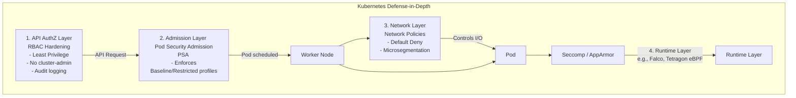

# Defense — Pod Security Admission, Network Policies, RBAC Hardening

## Introduction
Securing a Kubernetes cluster requires a defense-in-depth approach. Because Kubernetes is inherently designed for developer velocity and distributed computing, its default configurations often favor accessibility over security (e.g., flat networks, broad token mounting). 

To lock down a cluster, security engineers must implement overlapping layers of defense at the runtime execution level, the network level, and the API authorization level. The three core pillars of native Kubernetes hardening are **Pod Security Admission (PSA)**, **Network Policies**, and **RBAC Hardening**.

## Core Defensive Architecture Diagram



## 1. Pod Security Admission (PSA)
Pod Security Admission replaces the deprecated Pod Security Policies (PSPs). PSA is a built-in admission controller that evaluates Pod specifications against three predefined **Pod Security Standards (PSS)**:
- **Privileged**: Open policy, entirely unrestricted.
- **Baseline**: Minimally restrictive. Blocks known privilege escalations (e.g., blocks `privileged: true`, host namespaces, hostPath volumes).
- **Restricted**: Heavily restricted. Requires dropping all capabilities, running as non-root, and enabling Seccomp.

### Implementation
PSA is configured via Namespace labels. You can set modes to `enforce`, `audit`, or `warn`.
```yaml
apiVersion: v1
kind: Namespace
metadata:
  name: prod-namespace
  labels:
    pod-security.kubernetes.io/enforce: restricted
    pod-security.kubernetes.io/enforce-version: latest
    pod-security.kubernetes.io/audit: restricted
    pod-security.kubernetes.io/warn: restricted
```
By enforcing the `Restricted` standard, attackers are prevented from using container escape techniques like `hostPath` mounts, `hostPID`, or obtaining `CAP_SYS_ADMIN`, severely crippling pod-to-node lateral movement.

## 2. Network Policies
By default, Kubernetes pods accept traffic from any source (flat network). **NetworkPolicies** define how groups of pods are allowed to communicate with each other and other network endpoints.
*Note: A CNI (Container Network Interface) plugin that supports NetworkPolicies (e.g., Calico, Cilium) is required. Flannel does not support them natively.*

### Default Deny Strategy
The foundation of network security is dropping all traffic and explicitly whitelisting required routes.
```yaml
# Default Deny All Ingress and Egress for a namespace
apiVersion: networking.k8s.io/v1
kind: NetworkPolicy
metadata:
  name: default-deny-all
  namespace: prod-namespace
spec:
  podSelector: {} # Selects all pods in the namespace
  policyTypes:
  - Ingress
  - Egress
```
### Allowing Specific Traffic
Once the Default Deny is in place, you open micro-segmented pathways.
```yaml
# Allow frontend pods to communicate with backend pods on port 8080
apiVersion: networking.k8s.io/v1
kind: NetworkPolicy
metadata:
  name: allow-front-to-back
  namespace: prod-namespace
spec:
  podSelector:
    matchLabels:
      role: backend
  policyTypes:
  - Ingress
  ingress:
  - from:
    - podSelector:
        matchLabels:
          role: frontend
    ports:
    - protocol: TCP
      port: 8080
```
**Egress Control**: Crucially, restrict egress traffic to prevent reverse shells, C2 communication, and SSRF attacks against the Cloud Metadata API (`169.254.169.254`).

## 3. RBAC Hardening
Role-Based Access Control dictates what users and Service Accounts can do via the K8s API.
- **Audit `cluster-admin`**: Ensure only true administrators have the `cluster-admin` ClusterRole. 
- **Restrict Dangerous Verbs & Resources**: Attackers look for permissions like `create pods`, `create secrets`, `get secrets`, `impersonate`, and `bind` (RoleBindings).
  ```bash
  # Hunt for risky roles
  kubectl get clusterroles -o yaml | grep -E "secrets|pods/exec|impersonate"
  ```
- **Service Account Token Minimization**: Avoid auto-mounting service account tokens where they are not needed.
  ```yaml
  apiVersion: v1
  kind: Pod
  metadata:
    name: secure-pod
  spec:
    automountServiceAccountToken: false # Crucial defense mechanism
    containers:
    - name: app
      image: myapp:v1
  ```

## 4. Workload Security Profiles (Seccomp & AppArmor)
To restrict what the container runtime allows a process to do at the kernel level:
- **Seccomp (Secure Computing Mode)**: Restricts system calls. Kubernetes 1.22+ allows configuring `RuntimeDefault` seccomp profile by default.
  ```yaml
  securityContext:
    seccompProfile:
      type: RuntimeDefault
  ```
- **AppArmor**: Mandator Access Control (MAC) profiles to restrict file access, network access, and capability usage. 
  ```yaml
  metadata:
    annotations:
      container.apparmor.security.beta.kubernetes.io/my-container: runtime/default
  ```

## 5. Runtime Threat Detection
Hardening prevents attacks, but detection is required for active breaches. Tools like **Falco** or **Tetragon** leverage eBPF (Extended Berkeley Packet Filter) to monitor kernel-level activity without modifying application code. They can detect:
- Shell execution inside a container.
- Unexpected sensitive file reads (e.g., reading `/etc/shadow` or K8s tokens).
- Unauthorized outbound network connections.


## Deep Dive: Advanced Threat Detection and eBPF
Preventative controls like PSA and Network Policies will eventually fail against zero-day exploits or compromised credentials. The ultimate defense layer is runtime monitoring.

### eBPF (Extended Berkeley Packet Filter)
eBPF allows executing sandboxed programs within the Linux kernel without changing kernel source code or loading modules. Security tools like Cilium Tetragon and Falco use eBPF to trace system calls (`execve`, `open`, `connect`) in real-time.

### Falco Implementation Example
Falco uses a rules engine to detect anomalous behavior.
```yaml
# Example Falco Rule: Detect terminal shell in a container
- rule: Terminal shell in container
  desc: A shell was used as the entrypoint/exec point into a container with an attached terminal.
  condition: >
    spawned_process and container
    and shell_procs and proc.tty != 0
    and container_entrypoint
  output: >
    A shell was spawned in a container with an attached terminal (user=%user.name user_loginuid=%user.loginuid %container.info
    shell=%proc.name parent=%proc.pname cmdline=%proc.cmdline terminal=%proc.tty container_id=%container.id image=%container.image.repository)
  priority: NOTICE
  tags: [container, shell, mitre_execution]
```

### Tetragon Implementation Example
Tetragon provides even deeper visibility, tracking memory modifications and capability escalations.
```yaml
# Tetragon policy to detect privilege escalation via setuid
apiVersion: cilium.io/v1alpha1
kind: TracingPolicy
metadata:
  name: "detect-setuid"
spec:
  kprobes:
  - call: "sys_setuid"
    syscall: true
    args:
    - index: 0
      type: "int"
    selectors:
    - matchArgs:
      - index: 0
        operator: "Equal"
        values:
        - "0" # Detecting transition to root (UID 0)
```

### Auditing and Forensics
When defending a cluster, audit logging must be enabled at the API server level. This provides a forensic trail of all AuthZ and Admission events.
```yaml
# API Server Audit Policy
apiVersion: audit.k8s.io/v1
kind: Policy
rules:
  # Log pod changes at RequestResponse level
  - level: RequestResponse
    resources:
    - group: ""
      resources: ["pods", "pods/log", "pods/exec"]
  # Log secret access at Metadata level (do not log the secret payload!)
  - level: Metadata
    resources:
    - group: ""
      resources: ["secrets"]
```

### Zero Trust with Service Meshes
To further harden the network layer, organizations deploy Service Meshes like Istio or Linkerd.
A service mesh injects an Envoy proxy as a sidecar into every pod. All traffic is encrypted via Mutual TLS (mTLS) and authorized at the application layer (Layer 7).
- **Benefit**: Even if an attacker compromises a pod and achieves Pod-to-Pod lateral movement (Layer 4), they cannot communicate with the target microservice because they lack the specific mTLS certificate authorized for that specific L7 route.
```yaml
# Istio AuthorizationPolicy blocking all unauthorized traffic
apiVersion: security.istio.io/v1beta1
kind: AuthorizationPolicy
metadata:
  name: require-mtls
  namespace: prod
spec:
  action: DENY
  rules:
  - from:
    - source:
        notPrincipals: ["cluster.local/ns/prod/sa/authorized-service-account"]
```

## Chaining Opportunities
- **[[19 - Lateral Movement in K8s]]**: Network policies and PSA directly break the vectors required for lateral movement.
- **[[18 - Kubernetes Secret Enumeration]]**: Disabling auto-mount service account tokens prevents attackers from querying the API for secrets.
- **[[20 - Admission Controller Bypass]]**: If PSA is implemented as an admission controller, hardening its namespace exclusions is vital to prevent bypasses.

## Related Notes
- [[17 - Kubernetes RBAC Auditing]]
- [[08 - Container Breakouts]]
