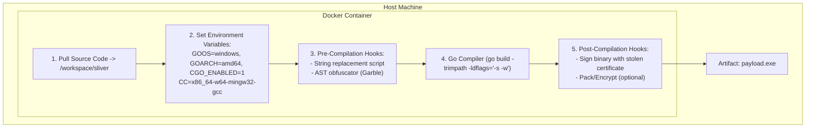

# 100.02 Setting up the Custom Compilation Environment for Sliver

Compiling a Go binary isn't just about running `go build`. The environment in which the binary is compiled leaves deep forensic artifacts in the resulting executable. For advanced Red Team operations, establishing an isolated, reproducible, and highly customized compilation environment is mandatory. This environment allows operators to cross-compile payloads for different target architectures while minimizing the build path artifacts that defenders use for attribution.

## 1. The Threat of Build Path Bleeding

By default, the Go compiler embeds the absolute path of the compilation directory into the binary. This happens because the compiler includes this path in stack traces for debugging purposes. 

If you compile Sliver on your primary workstation, paths like this will be embedded in the `.rodata` section:
`C:\Users\JohnDoe\Desktop\RedTeam\sliver\implant\main.go`

This is a critical OPSEC failure. It leaks operator usernames, organizational structures, and intent. A custom compilation environment must sanitize these artifacts completely.

## 2. Docker for Reproducible Builds

The industry standard for custom malware compilation is using Docker containers. Docker ensures that:
1. The build environment is stateless.
2. Absolute paths are consistent and generic (e.g., `/build/workspace`).
3. Toolchains for cross-compilation (like MinGW) are pinned to specific versions to ensure predictable output hashes.

### The Dockerfile Blueprint
A standard compilation container requires the Go toolchain and C/C++ cross-compilers.

```dockerfile
# Base image with specific Go version
FROM golang:1.20-bullseye

# Install cross-compilation toolchains
RUN apt-get update && apt-get install -y \
    gcc-mingw-w64-x86-64 \
    gcc-mingw-w64-i686 \
    make \
    git \
    upx-ucl \
    && rm -rf /var/lib/apt/lists/*

# Set up generic workspace
WORKDIR /workspace

# Environment variables for build isolation
ENV GOCACHE=/workspace/.cache
ENV GOPATH=/workspace/go

CMD ["/bin/bash"]
```

## 3. The Role of CGO in Compilation

Go can call C code using a feature called CGO. This has massive implications for payload generation.

### CGO_ENABLED=0 (Pure Go)
When CGO is disabled, the Go compiler produces a statically linked binary using purely Go code. It interacts with the operating system directly via syscalls.
- **Pros**: Extremely portable, no dependency on a C toolchain, easy to cross-compile by simply setting `GOOS` and `GOARCH`.
- **Cons**: Security products easily hook raw syscalls. EDRs highly scrutinize binaries making direct syscalls without going through `ntdll.dll` or `kernel32.dll`.

### CGO_ENABLED=1 (C/Go Hybrid)
When CGO is enabled, Go links against the system's C library (or MinGW for Windows targets). 
- **Pros**: It forces the binary to use standard OS APIs (like the Windows API) to interact with the system. This blends in better with legitimate software that also uses these APIs. It allows the integration of C-based evasion techniques (like indirect syscalls via C).
- **Cons**: Cross-compilation is much harder. You must specify a `CC` (C Compiler) for the target architecture, e.g., `CC=x86_64-w64-mingw32-gcc`.

For advanced Sliver builds, `CGO_ENABLED=1` is often preferred to enable more sophisticated Windows API interactions, requiring a robust MinGW setup in the compilation environment.

## 4. Crucial Go Environment Variables for Evasion

When executing the build process within the container, several environment variables shape the final output:

1. `GOOS` and `GOARCH`: Define the target operating system and architecture.
2. `GOGARBA`: Used in conjunction with obfuscation tools like Garble to customize the build.
3. `GOPRIVATE`: Prevents Go from reaching out to public module proxies for specific internal repositories, preventing accidental leakage of proprietary evasion modules.
4. `GOTOOLDIR`: Can be manipulated to point to custom, modified Go compiler binaries.

## ASCII Diagram: The Custom Compilation Pipeline



## 5. Automating the Build Matrix

A professional Red Team maintains a build matrix—a Makefile or CI/CD pipeline that automatically spins up the compilation environment and generates variants of the payload. 

```makefile
# Example Makefile excerpt for isolated compilation
build-windows:
	docker run --rm -v $(PWD):/workspace custom-go-builder \
	bash -c "cd /workspace && \
	GOOS=windows GOARCH=amd64 CGO_ENABLED=1 \
	CC=x86_64-w64-mingw32-gcc \
	go build -trimpath -ldflags '-s -w' -o implant_win.exe main.go"
```

This ensures that every team member produces the exact same binary hash given the same source code, eliminating the "works on my machine" problem and ensuring OPSEC hygiene.

## Real-World Attack Scenario

**The Incident:**
A highly targeted spear-phishing campaign delivered a custom Go backdoor to an enterprise environment. 

**The Execution:**
The initial execution was successful, and the backdoor established communication. However, a defensive analyst reviewing the memory dump noticed anomalous strings indicating the compilation environment.

**The Defensive Response:**
The attacker had compiled the binary on a macOS host targeting Windows (`GOOS=windows`) but failed to use a Dockerized environment or `-trimpath`. The analyst extracted strings from the binary:
`/Users/apt32/Desktop/campaigns/target_corp/implant/main.go`
This OPSEC failure allowed the threat intelligence team to attribute the attack to a specific actor and identify the internal project name (`target_corp`). Had the attacker used a proper Docker compilation environment with standard paths, this attribution would have been impossible.

## Chaining Opportunities

Once the compilation environment is isolated and standardized, you can integrate automated modification scripts into the pipeline.
- Hook into the pre-compilation phase to dynamically alter the source code AST before compilation.
- Integrate Garble natively into the Docker container to produce obfuscated builds on demand.

## Related Notes
- [[01 - The Anatomy of the Sliver Implant Go Binaries]]
- [[03 - Modifying Slivers Source Code to Break Static Signatures]]
- [[CI-CD Pipelines for Red Team Operations]]
- [[OPSEC and Infrastructure Isolation]]
