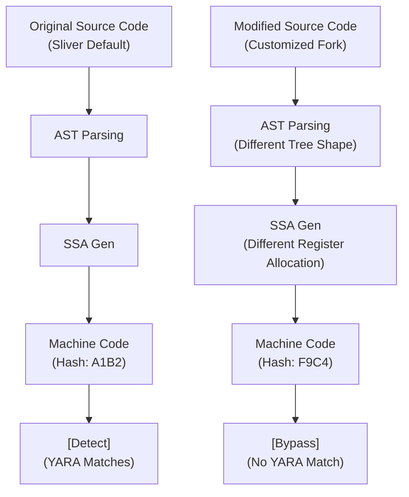

# 100.03 Modifying Slivers Source Code to Break Static Signatures

When a security product (AV/EDR) analyzes a file on disk, its fastest and cheapest detection mechanism is static signature matching. This involves scanning the binary for specific byte sequences, hashes, or string patterns known to belong to malicious tools. Because open-source C2 frameworks like Sliver have publicly available source code, defenders can easily generate signatures for them. 

Understanding how to modify source code to break these signatures requires an understanding of how the Go compiler translates source code into machine code, and how structural changes affect the resulting `.data`, `.rodata`, and `.text` sections.

## 1. The Anatomy of a Static Signature

Signatures are often written using YARA, a pattern-matching swiss army knife for malware researchers. A typical YARA rule targeting a Go binary looks for specific strings or hex sequences.

```yara
rule Detect_Sliver_Default {
    meta:
        description = "Detects default Sliver C2 strings"
    strings:
        $s1 = "github.com/bishopfox/sliver/protobuf" ascii
        $s2 = "sliverpb.Envelope" ascii
        $s3 = "sliver/implant" ascii
        // Hex sequence for a specific cryptographic routine
        $hex1 = { 48 89 44 24 10 48 8b 44 24 18 48 89 44 24 20 }
    condition:
        uint16(0) == 0x5A4D and (2 of ($s*) or $hex1)
}
```

To bypass this, Red Teamers must ensure that neither the exact strings nor the specific instruction sequences (opcodes) are present in the final compiled binary.

## 2. Breaking String Signatures

Go handles strings differently than C. Instead of null-terminated strings, Go uses a `StringHeader` structure containing a pointer to the data and an integer representing the length. 
The strings themselves are concatenated together in the `.rodata` section into a massive blob.

### Source Code Modification Strategies
1. **Renaming Packages and Imports**: 
   The most obvious signatures are import paths. Forking the Sliver repository and systematically renaming `github.com/bishopfox/sliver` to something benign like `github.com/company/internal-tool` shifts all the package strings in the binary. This requires modifying `go.mod` and all `import` statements.

2. **Constant Manipulation**:
   Static constants (like default pipe names, sleep times, or user-agents) are stored sequentially. Changing the values in the source code not only changes the string itself but shifts the offsets of all subsequent strings in the `.rodata` blob, breaking rigid byte-offset signatures.

3. **Dynamic String Construction**:
   Instead of storing strings globally, they can be constructed at runtime.
   *Before:*
   `var C2_URL = "https://evil.com/api"`
   *After:*
   `var C2_URL = string([]byte{104, 116, 116, 112, 115, 58, 47, 47...})`
   This prevents the string "https://evil.com/api" from appearing in the `.rodata` section.

## 3. Breaking Hex/Opcode Signatures

Defenders also signature the actual machine code generated by specific functions. To break these signatures, we must force the Go compiler's SSA (Static Single Assignment) backend to generate different machine code.

### Abstract Syntax Tree (AST) Jittering
The compiler generates code based on the AST. By changing the shape of the AST without changing the logical outcome, we force the compiler to allocate different registers and generate different opcodes.

1. **Dead Code Insertion**: Inserting operations that do nothing (e.g., `x = x + 0`, or opaque predicates) changes the function length and instruction sequence.
2. **Control Flow Reordering**: Swapping the order of `if/else` blocks, unrolling loops, or replacing a `switch` statement with `if/else if` chains completely alters the assembly output.
3. **Struct Padding**: Changing the order of fields in a Go `struct` changes the memory layout. The compiler must use different offsets to access these fields, altering the opcodes.

```go
// Original Struct
type ImplantContext struct {
    ID      int
    OS      string
    IsAdmin bool
}

// Padded Struct (Breaks offset signatures)
type ImplantContext struct {
    _padding1 [16]byte // Dummy padding
    IsAdmin   bool     // Moved field
    ID        int
    _padding2 [8]byte  // Dummy padding
    OS        string
}
```

## ASCII Diagram: The Effect of Source Modification on Compilation



## 4. The Limits of Manual Modification

While manual source code modification is effective against static signatures, it is highly unscalable. Every time Sliver updates, the fork must be meticulously re-patched. Furthermore, as defenders move from static string signatures to behavioral analysis or fuzzy hashing (like ssdeep), simply renaming strings becomes less effective.

This leads to the requirement for automated compilation modifications, such as Abstract Syntax Tree (AST) obfuscation via tools like Garble, which dynamically applies these changes during the build process without requiring manual source patching.

## Real-World Attack Scenario

**The Incident:**
A penetration testing team utilized a heavily modified version of Sliver during an engagement against a mature SOC. 

**The Execution:**
The team had written a Python script to automatically replace all instances of "sliver" with "updater", padded all structs with random byte arrays, and dynamically constructed all hardcoded IP addresses at runtime using XOR. The payload bypassed all initial static AV scans on the endpoint and executed successfully.

**The Defensive Response:**
The SOC caught the implant not via static signatures, but via behavioral analysis. The EDR detected an unsigned, unknown binary making an abnormal number of `VirtualAlloc` and `CreateRemoteThread` calls to inject into `explorer.exe`. Once the incident responders obtained the binary, standard YARA rules failed. They had to rely on dynamic analysis in a sandbox to dump the process memory. Only after the XOR strings were decrypted in memory could the analysts identify the underlying framework as Sliver.

## Chaining Opportunities

Manual source modification is the first step. To achieve mastery, these concepts must be automated during the compilation pipeline.
- Implement an AST parser that automatically inserts dead code prior to compilation.
- Combine source code modification with Dockerized compilation to ensure clean build paths.

## Related Notes
- [[01 - The Anatomy of the Sliver Implant Go Binaries]]
- [[04 - Advanced Obfuscation with Garble in Custom Compiles]]
- [[Fuzzy Hashing and SSDEEP Analytics]]
- [[Defeating YARA and Static Signatures]]
