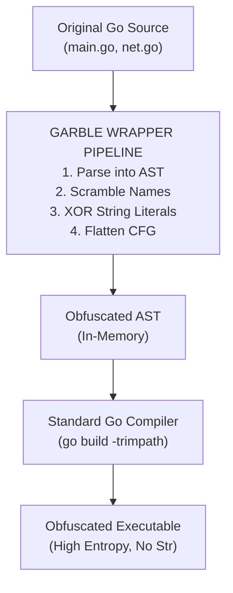

# 100.04 Advanced Obfuscation with Garble in Custom Compiles

When manual source code modification becomes too difficult to maintain across software updates, Red Teams turn to automated obfuscation. In the Go ecosystem, `Garble` is the premier tool for this. Garble is an open-source Go obfuscator that operates as a wrapper around the standard Go toolchain. It intercepts the compilation process, parsing the Abstract Syntax Tree (AST) and applying transformations before the compiler generates machine code.

Understanding how Garble works allows operators to configure it effectively and helps defenders understand the high-entropy anomalies it leaves behind.

## 1. The Mechanics of Garble

Garble does not simply pack the binary like UPX. Packing compresses the executable and adds a decompression stub, which is a massive red flag for any modern EDR. Instead, Garble obfuscates the *source logic* at compile time.

### Key Capabilities:
1. **Literal Obfuscation**: Replacing plaintext strings and numbers with runtime evaluations.
2. **Name Obfuscation**: Randomizing package names, function names, and global variables.
3. **Control Flow Obfuscation**: (Using the `-tiny` flag or external patches) Flattening control flow graphs to make reverse engineering difficult.
4. **Stripping**: Automatically enforcing `-s -w` and `-trimpath`.

## 2. Deep Dive: Literal Obfuscation

Strings are the biggest liability in a compiled payload. Garble intercepts every string literal in the AST and replaces it with an anonymous function that dynamically reconstructs the string using XOR, Base64, or other mathematical operations at runtime.

**Original Source:**
```go
func getTarget() string {
    return "http://c2.server.local/api"
}
```

**Garble Transformed AST (Conceptual):**
```go
func aB3x() string {
    // String is decrypted dynamically in memory when called
    var encrypted = []byte{0x4a, 0x11, 0x55...}
    var key = []byte{0x22, 0x77, 0x11...}
    var out = make([]byte, len(encrypted))
    for i := 0; i < len(encrypted); i++ {
        out[i] = encrypted[i] ^ key[i%len(key)]
    }
    return string(out)
}
```

Because this decryption logic is generated dynamically for *every single string*, the resulting machine code contains hundreds of unique, randomized decryption loops. This effectively destroys static string signatures and YARA rules targeting `.rodata`.

## 3. Name Obfuscation and the `gopclntab`

As discussed in module `100.01`, the `gopclntab` maps memory addresses to function names. Normally, reverse engineers use tools to dump this table and read function names like `github.com/bishopfox/sliver/implant.Init`.

Garble scrambles all non-exported (and optionally exported) function names and package paths into random, short strings. 

**Decompiled gopclntab (Garble):**
```text
0x401000 -> a.b
0x401500 -> a.c
0x402000 -> zYx.wVu
```
This renders static analysis incredibly tedious, as the analyst loses all semantic meaning of the code structure.

## 4. Control Flow Flattening (Theory)

Control Flow Flattening is a technique that breaks down a linear function into a state machine managed by a large `switch` statement inside an infinite loop. 

While Garble's default features focus on names and literals, advanced forks of Garble integrate control flow flattening.

**Original Logic:**
```go
func execute() {
    step1()
    if condition() {
        step2()
    }
    step3()
}
```

**Flattened Logic (Conceptual):**
```go
func execute() {
    state := 1
    for {
        switch state {
        case 1:
            step1()
            if condition() { state = 2 } else { state = 3 }
        case 2:
            step2()
            state = 3
        case 3:
            step3()
            return
        }
    }
}
```
This drastically alters the Cyclomatic Complexity and the basic block layout in tools like IDA Pro or Ghidra, making control flow graphs (CFGs) look like a chaotic "spaghetti" mess.

## ASCII Diagram: The Garble Compilation Wrapper



## 5. The Defensive Trade-off: High Entropy

Garble is powerful, but it comes with a major OPSEC cost: **Entropy**.
Because Garble replaces strings with arrays of random encrypted bytes, the overall entropy of the `.data` and `.rodata` sections spikes dramatically. 

Legitimate software rarely contains massive blocks of high-entropy data unless it is packed or handling encrypted archives. Machine Learning models used by modern EDRs (like CrowdStrike or SentinelOne) are highly trained to detect this specific "obfuscated" statistical profile. 
Therefore, while Garble defeats *static* signatures, it often flags *heuristic* and *AI-based* anomaly detectors.

## Real-World Attack Scenario

**The Incident:**
A Red Team operator deployed a Sliver binary compiled with `garble -literals -tiny build` to a Windows server.

**The Execution:**
The binary dropped to disk. Traditional AV scanners relying on string signatures completely ignored the file. However, an advanced EDR agent flagged the binary as `Suspicious.HighEntropy.GoMalware`. 

**The Defensive Response:**
The analyst pulled the binary. Opening it in Ghidra revealed completely flattened control flows and gibberish function names in the `gopclntab`. Unable to perform static analysis, the analyst executed the binary in a secure sandbox with API hooking enabled. 
The analyst observed the binary dynamically decrypting its strings in memory right before calling `WinHttpConnect`. By dumping the process memory at runtime, the analyst bypassed the Garble string obfuscation entirely, retrieving the C2 IP addresses and configuration.

## Chaining Opportunities

Understanding Garble's limitations highlights the need for a layered evasion strategy.
- Combine Garble with environmental keying so that the binary will not even attempt to decrypt strings if running in an analyst's sandbox.
- Use Garble in conjunction with custom compilation environments to ensure predictable builds.

## Related Notes
- [[03 - Modifying Slivers Source Code to Break Static Signatures]]
- [[05 - Stripping Debug Symbols and Metadata from Sliver Implants]]
- [[Defeating Behavioral Analysis and Sandboxes]]
- [[Memory Encryption and Sleep Obfuscation]]
