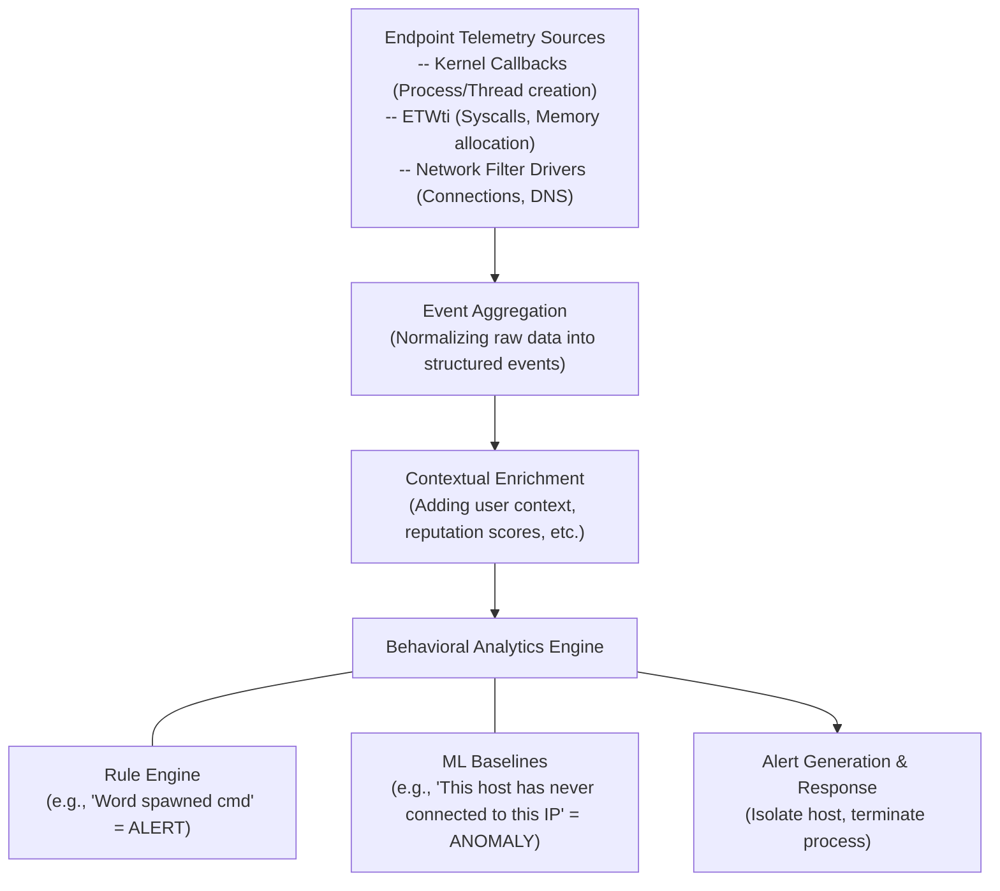

# 100.08 Bypassing CrowdStrike Falcon with Custom Sliver Profiles (Conceptual Analysis)

> **Disclaimer:** This document provides a theoretical analysis of how modern EDR solutions analyze behavioral profiles and the conceptual strategies used in red teaming to test these systems. It does not provide actionable instructions or specific configurations for evading any specific commercial product.

## Understanding EDR Profiling and Telemetry

Modern Endpoint Detection and Response (EDR) platforms do not rely solely on static signatures. Their core strength lies in continuous telemetry collection and behavioral analysis. They construct "profiles" of normal system behavior and flag deviations.

When an agent like Sliver operates, it generates telemetry across multiple dimensions. Understanding these dimensions is crucial for comprehending how defensive platforms identify anomalous activity.

### The Telemetry Triad

EDR profiling typically focuses on three primary pillars of telemetry:

1.  **Process and Thread Execution:**
    *   **Parent-Child Relationships:** Is `winword.exe` spawning `cmd.exe`? This is highly anomalous.
    *   **Process Lineage:** Analyzing the entire chain of execution.
    *   **Thread Anomalies:** Threads executing from unbacked memory, anomalous call stacks, or threads injected into legitimate processes.
2.  **Network Communications:**
    *   **Beaconing Patterns:** C2 frameworks typically communicate at regular intervals. EDRs analyze connection frequency, size, and timing to identify rhythmic "beaconing" behavior.
    *   **Domain Reputation and TLS:** Communicating with newly registered domains or using anomalous TLS certificates.
    *   **Process-Network Correlation:** Is a process that typically does not use the network (e.g., `lsass.exe` or `notepad.exe`) suddenly establishing outbound connections?
3.  **System Artifacts and Modifications:**
    *   **File System Activity:** Rapid file encryption (ransomware behavior) or writing executable files to suspicious locations.
    *   **Registry Modifications:** Persistence mechanisms typically involve modifying specific registry keys (e.g., Run keys).

## Concept of Custom Profiles in C2 Frameworks

C2 frameworks like Sliver, Cobalt Strike, and Mythic utilize configuration profiles (often called Malleable C2 profiles) to alter their operational characteristics. The theoretical goal is to modify the agent's behavior to blend in with legitimate network traffic and system activity, thereby evading the behavioral baselines established by the EDR.

### Traffic Shaping and Obfuscation

A significant portion of a custom profile focuses on the network telemetry.

*   **Jitter:** Introducing randomness into the beacon interval. If an agent calls home exactly every 60 seconds, it is easily detectable. Adding a 30% jitter means the callbacks will occur randomly between 42 and 78 seconds, disrupting simple periodicity analysis.
*   **Data Transformation:** Altering how the data looks on the wire. This includes using custom headers, encoding data within legitimate-looking HTTP fields (like Cookies or URIs), and mimicking the traffic patterns of known applications (e.g., making the traffic look like a generic Microsoft telemetry update).
*   **URI Rotation:** Randomly selecting from a list of predefined URIs for callbacks to avoid triggering alerts based on repetitive requests to a single specific endpoint.

### Process Context and Execution Profiling

Profiles also attempt to manage how the agent behaves on the host.

*   **Process Injection Targets:** Specifying which processes are considered "safe" targets for injection. Injecting into a browser process for outbound HTTP traffic blends in better than injecting into a system service.
*   **Spawn-to Attributes:** Defining the process that the agent will temporarily spawn to execute post-exploitation commands. Using a common utility like `dllhost.exe` might attract less scrutiny than constantly spawning `cmd.exe`.

## Architecture Diagram: Behavioral Analysis Engine

## Defensive Counter-Measures and Robust Baselines

Defenders counter profile manipulation by developing deeper analytical capabilities.

*   **Advanced Beacon Analysis:** Modern EDRs use machine learning to detect beaconing even with significant jitter. They analyze the payload sizes and the request/response ratios over extended periods.
*   **Memory Scanning vs. Network Signatures:** Even if the network traffic perfectly mimics a legitimate application, the agent must still exist in memory. EDRs increasingly rely on in-memory YARA scanning and thread analysis, which are often agnostic to the network profile used.
*   **Heuristic Analytics:** Moving beyond simple rules to understand the *intent* of the behavior. An agent might successfully disguise its network traffic, but if it subsequently attempts to dump LSASS memory, the combination of behaviors will trigger a heuristic alert.

## Real-World Attack Scenario

An adversary attempted to infiltrate a target network using a highly customized C2 profile designed to mimic legitimate Adobe updater traffic. The traffic shaping successfully bypassed network-level IDS and the initial network telemetry analysis of the EDR.

However, the attack was detected during the lateral movement phase. The profile dictated that post-exploitation jobs be executed by spawning `wmiprvse.exe`. While `wmiprvse.exe` is a legitimate Windows process, the EDR's behavioral analytics engine flagged an anomaly: this specific host had historically never utilized WMI for remote execution, and the sudden spike in WMI activity, combined with the execution of encoded PowerShell commands via the spawned process, exceeded the heuristic threshold, resulting in the isolation of the host.

## Chaining Opportunities

*   [[09 - Evading Microsoft Defender for Endpoint MDE with Sliver]]: Many concepts regarding telemetry gathering overlap between major EDR vendors.
*   [[07 - Building Custom Loaders for Sliver Shellcode]]: The loader must initiate the execution in a way that aligns with the behavioral expectations set by the custom profile.
*   [[14 - Traffic Shaping and Protocol Impersonation]]: Deep dive into the mechanics of altering network signatures.

## Related Notes

*   [[Understanding EDR Telemetry Pipelines]]
*   [[Behavioral Analytics and Machine Learning in InfoSec]]
*   [[Network Traffic Analysis for Beacon Detection]]
*   [[Post-Exploitation OPSEC Considerations]]
