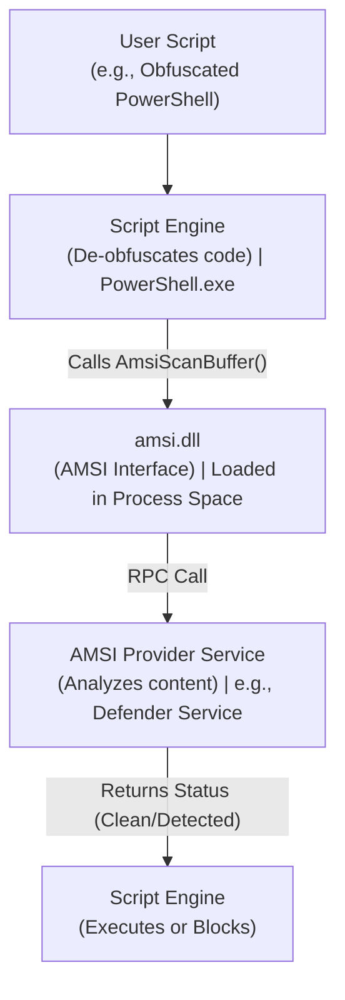

# 100.09 Evading Microsoft Defender for Endpoint MDE with Sliver (Conceptual Analysis)

> **Disclaimer:** This document explores the theoretical architecture of Microsoft's security ecosystem and the conceptual techniques discussed in offensive research regarding evasion. It does not provide actionable exploits or bypasses for Microsoft Defender for Endpoint.

## Architecture of Windows Security Controls

To understand theoretical evasion concepts, one must first analyze the structural components of the Windows security architecture that modern EDR solutions leverage. Two of the most critical components are AMSI and ETW.

### Anti-Malware Scan Interface (AMSI)

AMSI is a versatile interface standard that allows applications and services to integrate with any anti-malware product present on a machine. It provides enhanced protection specifically against dynamic, script-based threats.

*   **How it Works:** When a script engine (like PowerShell, VBScript, or JavaScript) or a .NET application processes code, it calls the `AmsiScanBuffer` or `AmsiScanString` API.
*   **The Scan Process:** This API sends the script content to the registered AMSI provider (usually the active antivirus/EDR solution). The provider evaluates the content against its definitions and heuristic engines.
*   **The Result:** The provider returns a result (e.g., `AMSI_RESULT_CLEAN` or `AMSI_RESULT_DETECTED`). If detected, the script engine terminates execution before the malicious code can run.

This mechanism is highly effective against obfuscated scripts because AMSI inspects the code *after* it has been de-obfuscated by the script engine but *before* execution.

### Event Tracing for Windows (ETW)

ETW is a high-performance, low-overhead tracing facility provided by the operating system. It was originally designed for debugging and performance profiling but has become a cornerstone of defensive telemetry.

*   **Providers:** Components that generate events (e.g., the kernel, `ntdll.dll`, .NET runtime).
*   **Consumers:** Applications that receive and process the events (e.g., EDR sensors).
*   **Telemetry:** ETW provides immense visibility, logging everything from process creation and network connections to specific API calls and memory allocations. Specifically, the .NET ETW provider logs the loading of assemblies, which is critical for detecting post-exploitation tools written in C#.

## Theoretical Evasion Concepts

Offensive research heavily focuses on finding conceptual weaknesses in these telemetry pipelines.

### The Concept of Memory Patching

Many evasion techniques rely on the concept of memory patching. Because mechanisms like AMSI and ETW user-mode providers reside in DLLs loaded into the application's process space (e.g., `amsi.dll` or `ntdll.dll`), their memory is theoretically accessible to the application itself.

*   **AMSI Patching (Theoretical):** A conceptual technique involves locating the memory address of the `AmsiScanBuffer` function within the process. By overwriting the initial instructions of this function with a sequence that immediately returns a `AMSI_RESULT_CLEAN` status, the application forces the scan to always succeed, effectively blinding the AMSI provider for that specific process.
*   **ETW Patching (Theoretical):** Similarly, the `EtwEventWrite` API within `ntdll.dll` is responsible for dispatching user-mode ETW events. Theoretically, patching this function to immediately return without processing the event would prevent the telemetry from reaching the EDR consumer.

### Hardware Breakpoints

An alternative theoretical approach to modifying memory involves using hardware breakpoints. The CPU provides debug registers that can trigger exceptions when specific memory addresses are accessed.

An advanced conceptual technique involves setting a hardware breakpoint on the `AmsiScanBuffer` function. When the function is called, the CPU throws an exception, which the attacker's custom exception handler intercepts. The handler can then manipulate the CPU registers (e.g., forcing the return value to indicate a clean scan) and resume execution, bypassing the function without modifying its underlying code in memory.

## Architecture Diagram: AMSI Telemetry Flow

## Defensive Protections against Tampering

Defenders are acutely aware of patching techniques and have developed robust countermeasures.

*   **Kernel Patch Protection (PatchGuard):** While PatchGuard primarily protects the kernel, modern EDRs employ similar concepts in user mode. They continuously monitor critical functions like `AmsiScanBuffer` for unauthorized modifications.
*   **Telemetry Redundancy:** EDRs do not rely solely on user-mode ETW. They utilize kernel-level ETWti and kernel callbacks, which cannot be patched from user mode. Even if user-mode ETW is silenced, the underlying kernel operations (e.g., memory allocation) are still logged.
*   **Behavioral Monitoring of Patching:** The act of patching itself—using APIs like `VirtualProtect` to modify executable memory regions of system DLLs—is a highly suspicious behavior that often triggers heuristic alerts.

## Real-World Attack Scenario

An incident response engagement revealed an intrusion where the attacker attempted to execute a .NET-based post-exploitation module. The attacker's loader script included a routine designed to patch `amsi.dll` in memory before loading the assembly.

The memory patch was successfully applied within the PowerShell process. However, the EDR solution detected the anomaly. The EDR's behavioral engine noted that the `VirtualProtect` API was called to change the memory protections of `amsi.dll` from RX to RWX. This action alone triggered a high-severity alert. Furthermore, while the AMSI telemetry was suppressed, the kernel-level callbacks recorded the subsequent anomalous loading of the malicious .NET assembly, leading to the rapid containment of the compromised endpoint.

## Chaining Opportunities

*   [[06 - Integrating Custom Syscalls directly into the Sliver Agent]]: Attackers might use direct syscalls to perform the memory patching, attempting to hide the `VirtualProtect` calls from user-mode API monitoring.
*   [[10 - Modifying the Sliver Stager to Bypass Heuristic Detection]]: Evasion techniques must consider both dynamic telemetry (AMSI/ETW) and static heuristic analysis.
*   [[16 - Deep Dive into the .NET CLR and Reflection]]: Understanding how .NET assemblies are loaded is critical for both offensive utilization and defensive monitoring.

## Related Notes

*   [[AMSI Architecture and Integration]]
*   [[Event Tracing for Windows Deep Dive]]
*   [[Memory Integrity and Protection Mechanisms]]
*   [[Detecting In-Memory Patching Techniques]]
