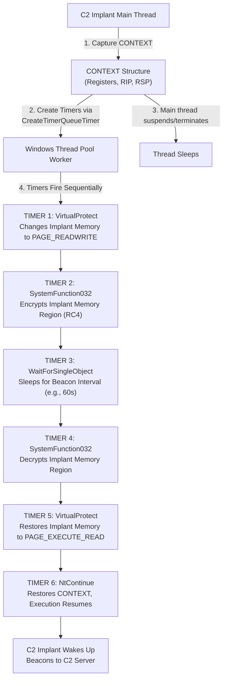

# 100.11 Implementing Sleep Obfuscation Ekko Foliage in Custom Builds

## Introduction to Sleep Obfuscation

Sleep obfuscation is an advanced evasion technique used by modern Command and Control (C2) frameworks to hide their presence in memory while the implant is dormant (sleeping) between callbacks to the C2 server. When a beacon sleeps, it is vulnerable to memory scanners that look for well-known malware signatures, unbacked executable memory regions, or suspicious thread call stacks. 

To mitigate this, sleep obfuscation techniques like **Ekko** and **Foliage** manipulate the memory protections of the implant's own memory allocation, encrypting or obfuscating the executable code, and changing the memory permissions from `PAGE_EXECUTE_READWRITE` (RWX) or `PAGE_EXECUTE_READ` (RX) to `PAGE_READWRITE` (RW) or `PAGE_NOACCESS` (NA). 

This document explores the internal workings of these techniques from an educational and defensive engineering perspective, enabling security teams to better understand, hunt, and detect these anomalies in enterprise environments.

## The Architecture of Ekko and Foliage

Both Ekko and Foliage rely on asynchronous execution mechanisms provided by the Windows operating system to alter memory state while the primary thread of the implant is suspended or dead. 

### Ekko (Thread Pool Timers)

Ekko leverages the Windows Thread Pool API, specifically `CreateTimerQueueTimer`. The concept is to queue a series of callbacks that will execute in the future. These callbacks form a Return-Oriented Programming (ROP) chain.

1. **Context Creation**: The implant captures its current execution context (`CONTEXT` structure).
2. **Timer Queue Creation**: It creates a timer queue.
3. **Queueing Timers**: It queues multiple timers that fire sequentially.
4. **The ROP Chain**:
   - Timer 1: Calls `VirtualProtect` to change memory to RW.
   - Timer 2: Calls an encryption function (e.g., `SystemFunction032` for RC4) to encrypt the region.
   - Timer 3: Calls `WaitForSingleObject` to sleep the thread for the desired C2 callback interval.
   - Timer 4: Calls decryption function.
   - Timer 5: Calls `VirtualProtect` to restore RX permissions.
   - Timer 6: Resumes execution via `NtContinue`.

### Foliage (Asynchronous Procedure Calls - APCs)

Foliage takes a similar approach but utilizes Asynchronous Procedure Calls (APCs) via `NtQueueApcThread` instead of thread pool timers. This avoids creating new threads from the thread pool, which can sometimes be flagged by heuristics analyzing thread start addresses.

## Technical ASCII Diagram: Ekko Execution Flow



## Defensive Engineering: Detecting Sleep Obfuscation

Detecting advanced sleep obfuscation requires deep visibility into thread behaviors, memory allocations, and ETW (Event Tracing for Windows). 

### 1. ETW-Ti (Threat Intelligence)

Microsoft's ETW-Ti provider (`Microsoft-Windows-Threat-Intelligence`) is crucial for detecting memory manipulation. EDRs monitor the `THREATINT_KEYWORD_MEMORY` keyword. 

When Ekko executes, the thread pool worker thread calls `VirtualProtect`. By analyzing the call stack of the `VirtualProtect` event, defenders can identify anomalies. Legitimate thread pool workers rarely loop through `VirtualProtect` and encryption APIs in sequence without a backing module on disk.

### 2. Identifying Suspicious Thread Contexts

Memory scanners can look for suspended threads or threads waiting on synchronization objects where the thread's start address points to a generic Windows API (like `RtlUserThreadStart`) but the stack contains pointers to dynamically allocated, unbacked memory. 

Furthermore, scanning memory for queued `CONTEXT` structures that hold RIPs pointing to `NtContinue` or `SystemFunction032` can reveal an upcoming ROP chain execution.

### KQL Hunt Query: Suspicious API Sequences

The following conceptual KQL query illustrates how one might hunt for the behavioral patterns of sleep obfuscation in an environment collecting deep API telemetry.

```kusto
// Conceptual KQL to hunt for Ekko-like behavior
DeviceEvents
| where ActionType == "ApiCall"
| where AdditionalFields contains "VirtualProtect" or AdditionalFields contains "SystemFunction032"
| summarize ApiCalls = make_list(AdditionalFields.ApiName), Timestamps = make_list(Timestamp) by InitiatingProcessId, InitiatingProcessThreadId
| where array_length(ApiCalls) >= 3
| where ApiCalls[0] == "VirtualProtect" and ApiCalls[1] == "SystemFunction032"
| project InitiatingProcessId, InitiatingProcessThreadId, ApiCalls, Timestamps
```

### YARA Rule: Detecting Ekko Signatures in Memory

While the payload itself is encrypted during sleep, the components that setup the sleep obfuscation must exist. Scanning for the API resolution of these specific functions can yield results.

```yara
rule Suspicious_Sleep_Obfuscation_APIs {
    meta:
        description = "Detects resolution of APIs commonly used in Ekko/Foliage"
        author = "Defensive Engineering Team"
        severity = "High"
    strings:
        $api1 = "CreateTimerQueueTimer" ascii wide fullword
        $api2 = "RtlCaptureContext" ascii wide fullword
        $api3 = "NtContinue" ascii wide fullword
        $api4 = "SystemFunction032" ascii wide fullword
        $api5 = "NtQueueApcThread" ascii wide fullword
    condition:
        uint16(0) == 0x5A4D and 
        (3 of ($api*))
}
```

## Real-World Attack Scenario

During a recent incident response engagement, a threat actor utilized a custom-compiled variant of Sliver that incorporated Foliage-style sleep obfuscation. The initial payload was delivered via an ISO file containing a malicious LNK. Upon execution, the loader injected the Sliver beacon into `notepad.exe`. 

Standard memory scanning initially failed to detect the beacon because it was encrypted and marked as `PAGE_READWRITE` during its sleep cycle of 45 minutes. However, the Blue Team detected the anomaly through an EDR alert triggered by `EtwTi`. The alert flagged a thread in `notepad.exe` originating from an unbacked memory region attempting to call `VirtualProtect`. Upon further forensic analysis of the memory dump, the incident responders identified the decrypted beacon during its brief execution window, extracted the C2 configuration, and successfully contained the threat.

## Chaining Opportunities

Sleep obfuscation is rarely used in isolation. It is commonly chained with:
1. **Module Stomping**: Writing the implant over a legitimately loaded DLL to back the memory allocation, making the RWX/RX region look benign.
2. **Call Stack Spoofing**: Hiding the true origin of the API calls made during the setup of the timer queues or APCs.
3. **Direct Syscalls**: Bypassing user-land API hooks when initially allocating the memory or creating the threads.

## Related Notes
- [[12 - Custom CGO Bindings for Native Windows API Abuse]]
- [[13 - Evading Memory Scanners by modifying Slivers Memory Allocation]]
- [[20 - ETW and ETW-Ti Telemetry Deep Dive]]
- [[25 - Hunting Anomalous Thread Call Stacks]]

---
*End of Note*
