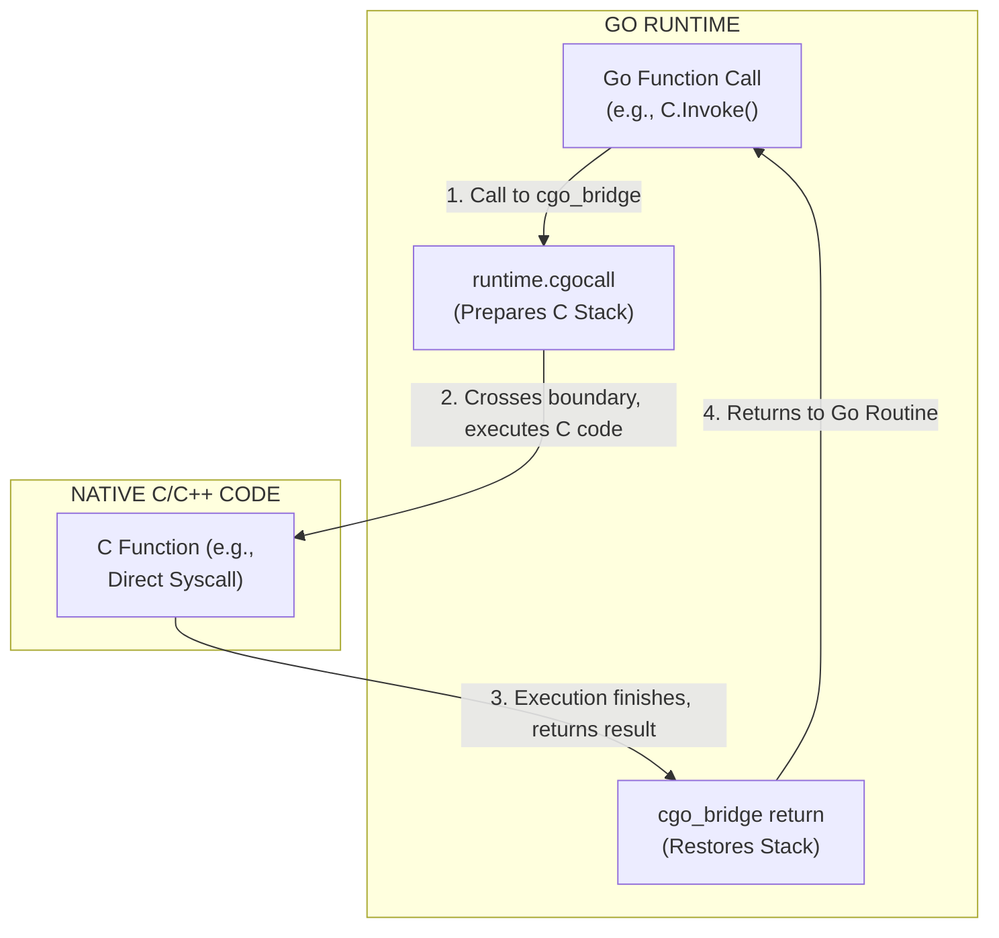

# 100.12 Custom CGO Bindings for Native Windows API Abuse

## Introduction to CGO in the Context of C2 Frameworks

Go (Golang) is the primary language used by modern Command and Control (C2) frameworks like Sliver. By default, Go programs utilize their own runtime and specific mechanisms for interacting with the operating system, often wrapping native system calls in predictable, easily hooked standard library functions (e.g., `syscall.Syscall`). 

To circumvent user-mode hooks placed by Endpoint Detection and Response (EDR) solutions, advanced threat actors leverage **CGO**. CGO is a feature that allows Go packages to call C code. By creating custom CGO bindings, developers can compile C/C++ based evasion techniques—such as direct system calls (Syscalls), hardware breakpoints for unhooking, and custom loaders—directly into the Go binary. 

This document explores how CGO bridges the gap between Go and native Windows APIs conceptually, and details how security analysts can detect and analyze binaries that abuse this functionality.

## The Go Runtime vs. CGO Interface

When a standard Go binary executes a system call, it transitions from the Go runtime directly to the OS kernel (on platforms where this is supported) or goes through the standard `ntdll.dll` wrapper. Because Go's calling conventions differ from standard C/C++ conventions, EDRs have developed specific telemetry and hooks to monitor the `syscall` package.

CGO alters this paradigm. When CGO is invoked, the execution flow crosses a complex boundary from the Go runtime into a C environment. This requires context switching, stack management (Go uses small, resizable stacks; C expects large, contiguous stacks), and thread manipulation.

### Technical ASCII Diagram: The CGO Boundary



## Conceptual Abuse: Native API and Syscall Wrappers

In a custom C2 compile, an attacker might define C code that implements direct system calls (e.g., using SysWhispers or Hell's Gate). They then create a Go wrapper to call these C functions.

```go
/*
// Conceptual C code embedded in Go
#include <windows.h>

// Function pointer for an unhooked NT API
NTSTATUS CustomNtAllocateVirtualMemory(...) {
    // Implementation of direct syscall
}
*/
import "C"

// Go wrapper
func AllocateMemory(...) {
    C.CustomNtAllocateVirtualMemory(...)
}
```

This bypasses EDR hooks on `ntdll.dll` because the C code dynamically resolves the syscall numbers and issues the `syscall` instruction directly, entirely outside the purview of the Go runtime's standard libraries.

## Defensive Engineering: Detecting CGO Abuse

While CGO provides flexibility for evasion, it also introduces significant forensic artifacts and operational trade-offs that defenders can exploit.

### 1. Binary Size and Structure Analysis

Binaries compiled with CGO are significantly larger and structurally different from pure Go binaries. They must include the C standard library (if statically linked) or rely on `msvcrt.dll` or similar (if dynamically linked). 

Static analysis tools can easily identify CGO usage by looking for standard CGO initialization functions such as `_cgo_init`, `_cgo_sys_thread_start`, and the presence of `cgo` string tables.

### 2. Import Address Table (IAT) Anomalies

Pure Go binaries on Windows have a very minimalistic IAT, typically only importing a few functions from `kernel32.dll` (like `GetConsoleMode`, `WriteFile`). 

When CGO is used, the IAT balloons to include standard C library imports and potentially other Windows API DLLs linked during the C compilation phase. Detecting a Go binary with a massive, C-like IAT is a strong indicator of CGO usage and warrants further investigation.

### YARA Rule: Detecting CGO Artifacts

```yara
rule Go_CGO_Binary {
    meta:
        description = "Detects Go binaries compiled with CGO enabled"
        author = "Defensive Engineering Team"
    strings:
        // Standard CGO initialization functions
        $cgo1 = "_cgo_init" ascii fullword
        $cgo2 = "_cgo_allocate" ascii fullword
        $cgo3 = "_cgo_panic" ascii fullword
        $cgo4 = "runtime.cgocall" ascii fullword
        // Go build ID pattern often found near CGO
        $build_id = "Go build ID:" ascii
    condition:
        uint16(0) == 0x5A4D and 
        $build_id and
        (2 of ($cgo*))
}
```

### 3. Dynamic Analysis: ETW-Ti and Call Stack Verification

Even if an attacker uses CGO to perform direct syscalls, modern EDRs utilizing ETW-Ti can detect this through call stack spoofing analysis. If a system call (like `NtAllocateVirtualMemory`) is executed, the kernel captures the call stack. 

If the stack unwinds and the EDR identifies that the call originated from outside the bounds of a legitimate, loaded module (e.g., it came from the `.text` section of the CGO-compiled Go binary instead of `ntdll.dll`), an alert is triggered for "Suspicious Direct System Call".

## Real-World Attack Scenario

A financial institution observed anomalous network traffic originating from a legitimate developer workstation. The payload, identified as a custom Sliver beacon, evaded initial static scanning because the primary C2 logic was written in Go. 

However, the threat actors used CGO to embed a C-based loader that performed API unhooking using hardware breakpoints (manipulating the DR registers via `GetThreadContext`). The Blue Team's threat hunting unit detected the breach by querying Sysmon Event ID 10 (Process Access) and identifying the beacon attempting to open a handle to `lsass.exe`. Subsequent memory forensics revealed the massive CGO footprint, and reverse engineering confirmed the presence of the embedded C-based unhooking logic.

## Chaining Opportunities

CGO is the gateway for bringing advanced C/C++ capabilities into Go-based malware. It is often chained with:
1. **Direct Syscalls**: Bypassing user-mode hooks.
2. **Custom Sleep Obfuscation**: Implementing Ekko/Foliage in C and calling it from Go.
3. **Advanced Injection Techniques**: Implementing process hollowing or early bird APC injection in native C for stability, invoked via the Go controller.

## Related Notes
- [[11 - Implementing Sleep Obfuscation Ekko Foliage in Custom Builds]]
- [[14 - Automating the Custom Compile Pipeline with CI CD]]
- [[30 - Analyzing Go Malware Structures]]
- [[35 - Call Stack Spoofing and Detection]]

---
*End of Note*
