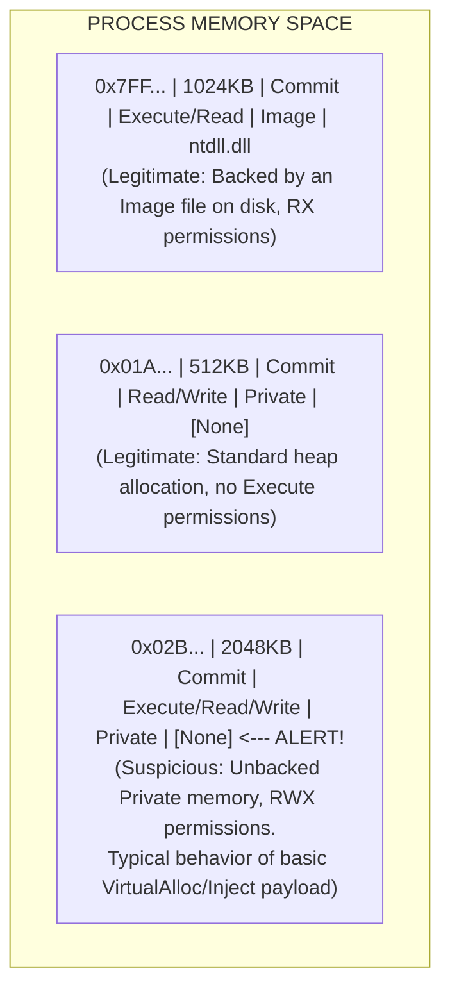

# 100.13 Evading Memory Scanners by modifying Slivers Memory Allocation

## Introduction to Memory Scanners

In the modern endpoint security landscape, static file scanning is often insufficient to detect advanced threats. Security products heavily rely on Memory Scanners to analyze the volatile memory (RAM) of running processes. These scanners hunt for injected code, unpackers, and Command and Control (C2) frameworks like Sliver that operate entirely in memory after initial execution.

Memory scanners evaluate the memory pages of a process, looking for specific heuristics:
- **Permissions**: Pages marked as `PAGE_EXECUTE_READWRITE` (RWX).
- **Backing**: Executable memory pages that do not map to a legitimate file on disk (unbacked memory).
- **Content**: Signatures, known YARA rules, or PE headers residing in suspicious locations.

To survive in memory, advanced implants must manipulate how they are allocated and stored. This document explores the conceptual mechanisms of memory allocation evasion and how defenders can build robust detection logic.

## The Virtual Address Descriptor (VAD) Tree

The Windows Memory Manager tracks the virtual memory allocations of every process using a structure called the Virtual Address Descriptor (VAD) tree. The VAD tree is a self-balancing AVL tree where each node represents a contiguous range of virtual addresses.

When a thread calls `VirtualAlloc` to allocate memory for a payload, a new VAD node is created. By default, this node indicates that the memory is `Private` (not shared, not mapped to a file). If an EDR traverses the VAD tree and finds a `Private` region with `EXECUTE` permissions, it immediately flags it as highly suspicious.

### Technical ASCII Diagram: VAD Tree Analysis



## Conceptual Evasion Techniques

To avoid the glaring red flag of unbacked RWX memory, adversaries employ several techniques to manipulate the VAD tree and memory page characteristics.

### 1. Module Stomping (DLL Hollowing)
Instead of calling `VirtualAlloc`, the malware loads a legitimate, benign DLL from disk (e.g., `amsi.dll` or a random system DLL) into the process using `LoadLibrary`. This creates a legitimate `Image` backed VAD node with `EXECUTE` permissions. The malware then overwrites (stomps) the executable sections of this benign DLL in memory with its own payload. 
- *Defensive Pivot*: Scanners can detect this by comparing the memory-resident `.text` section of the DLL against the actual file on disk. If they differ, module stomping has occurred.

### 2. Phantom Hollowing / Transactional NTFS (TxF)
This technique uses the Windows Transactional NTFS feature to create a temporary, invisible file on disk, write the payload to it, and map it into memory. This tricks the EDR into seeing an `Image` backed memory region, but the backing file doesn't technically exist in standard directory listings.
- *Defensive Pivot*: TxF is deprecated and highly monitored. EDRs flag the use of APIs like `CreateTransaction` and `CreateFileTransacted`.

### 3. Heap Encryption
While the implant is sleeping, it encrypts its own memory allocation and changes the protection to `PAGE_READWRITE`. (See [[11 - Implementing Sleep Obfuscation Ekko Foliage in Custom Builds]]).

## Defensive Engineering: Advanced Memory Hunting

Defenders must utilize advanced tools and techniques to identify these memory anomalies. Tools like `Moneta` and `BeaconEye` represent the cutting edge of memory forensics.

### Hunting for Unbacked Executable Memory
Security Operations Centers (SOCs) can hunt for process injection using PowerShell and the `Get-InjectedThread` concept, which analyzes thread start addresses.

```powershell
# Conceptual PowerShell Hunt Logic for Unbacked Threads
$processes = Get-Process
foreach ($proc in $processes) {
    $threads = Get-ProcessThread -Id $proc.Id
    foreach ($thread in $threads) {
        $startAddress = $thread.StartAddress
        $memoryRegion = Get-VirtualMemory -ProcessId $proc.Id -Address $startAddress
        
        if ($memoryRegion.Type -eq "Private" -and $memoryRegion.Protect -match "Execute") {
            Write-Host "ALERT: Thread starting in unbacked executable memory in PID $($proc.Id)"
        }
    }
}
```

### Analyzing Sysmon Event ID 10 (Process Access)
When a memory scanner (or an attacker) attempts to read the memory of another process using `ReadProcessMemory`, Sysmon logs Event ID 10. Defenders should baseline legitimate `GrantedAccess` patterns (e.g., `0x1000` or `0x1410`) and alert on unusual source/destination process pairs.

## Real-World Attack Scenario

A multinational logistics company suffered a breach where the initial access broker deployed a customized Sliver implant. The implant utilized Module Stomping to hide within `xpsservices.dll`, a legitimate Windows component. 

Basic memory scanners skipped the memory region because the VAD indicated it was backed by an image file with valid `PAGE_EXECUTE_READ` permissions. The incident was only detected when the Blue Team executed a sweeping YARA scan against the live memory space using a custom tool that explicitly disabled the "skip image-backed memory" optimization. The YARA rule matched on the Sliver multiplexer logic residing inside the memory space allocated for `xpsservices.dll`.

## Chaining Opportunities

Memory allocation evasion is the foundation of in-memory execution and is chained with:
1. **Sleep Obfuscation**: Protecting the allocation while dormant.
2. **Process Injection**: Migrating the stealthy allocation into a secondary, more privileged or stable process (e.g., `explorer.exe`).
3. **AMSI/ETW Patching**: Modifying the memory of loaded security modules prior to executing the main payload.

## Related Notes
- [[11 - Implementing Sleep Obfuscation Ekko Foliage in Custom Builds]]
- [[40 - Deep Dive into Windows Memory Management]]
- [[45 - Detecting Process Injection Techniques]]
- [[50 - YARA Rule Development for Live Memory]]

---
*End of Note*
