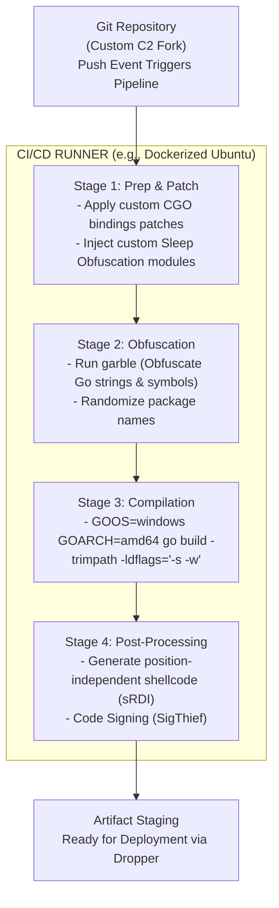

# 100.14 Automating the Custom Compile Pipeline with CI/CD

## Introduction to CI/CD in Security Tooling

Continuous Integration and Continuous Deployment (CI/CD) pipelines are standard practice in software engineering. In the context of authorized Red Teaming and Vulnerability Assessment and Penetration Testing (VAPT), automating the compilation of Custom Command and Control (C2) implants provides massive operational advantages. 

A well-architected pipeline ensures reproducible builds, integrates complex obfuscation techniques (like `garble` for Go, or custom string encryption scripts), and allows operators to rapidly iterate on evasion techniques. From a defensive standpoint, understanding how adversaries or red teams build their infrastructure is critical for identifying supply chain vulnerabilities and build artifacts.

## The Automated Compilation Pipeline

An automated pipeline for a Go-based C2 framework like Sliver typically involves several stages, hosted on platforms like GitLab CI, GitHub Actions, or self-hosted Jenkins runners.

1. **Source Code Retrieval & Patching**: Pulling the upstream framework and applying custom patches (e.g., changing default pipe names, modifying hardcoded strings).
2. **Obfuscation**: Running tools like `garble` to randomize symbols and strip identifying metadata.
3. **Compilation**: Building the binary for multiple architectures (Windows/Linux/macOS) and formats (EXE, DLL, shellcode).
4. **Post-Processing**: Signing the binary with a (potentially stolen or spoofed) certificate, calculating hashes, and generating loaders.
5. **Deployment**: Pushing the artifacts to a secure staging server.

### Technical ASCII Diagram: The Build Pipeline

## Defensive Engineering: Detecting Build Artifacts

Automated pipelines, if not perfectly tuned, leave distinct forensic artifacts in the resulting binaries. Defenders can leverage these artifacts to track threat actor campaigns and attribute tools.

### 1. PDB Paths and Build Directories

By default, compilers embed the path to the project directory within the binary's debugging information (PDB paths). Even when debug symbols are stripped, strings referencing the CI/CD runner's file system might survive. E.g., strings like `/home/jenkins/workspace/sliver-custom-build/` or `C:\actions-runner\_work\malware\`.

Defenders can extract these strings to identify the infrastructure used by the attacker. 

### 2. Go Build Metadata

Go binaries contain embedded metadata about the exact version of the Go compiler used and the build constraints. The `-trimpath` flag is often used by attackers to remove file system paths, but EDRs can profile the specific compiler versions. If a rare, custom-patched Go compiler version is identified, it can be used as a high-fidelity IoC.

### 3. Predictable Timestamps and Iteration Signatures

CI/CD pipelines compile code deterministically. If an attacker's pipeline generates a new payload every week with only minor configuration changes, the structural similarity (ImpHash, Rich Header anomalies) between the binaries will be extremely high. Security teams can cluster these binaries using automated static analysis.

## Hardening the Corporate Environment against Rogue Pipelines

A critical defensive concern is threat actors co-opting an organization's *own* internal CI/CD infrastructure to compile and distribute malware laterally (Supply Chain Attack). 

- **Monitor Runner Telemetry**: Look for unusual spikes in compute utilization on CI/CD runners, especially those executing unknown Docker containers.
- **Audit Pipeline Logs**: Search for suspicious commands within pipeline definitions (e.g., `.gitlab-ci.yml`), such as `apt-get install gcc-mingw-w64` or `wget <suspicious_domain>`.
- **Artifact Scanning**: Ensure all outputs from internal CI/CD pipelines are scanned by static and dynamic analysis engines before deployment.

## Real-World Attack Scenario

A tech company discovered that an Advanced Persistent Threat (APT) group had compromised a developer's credentials and gained access to the internal GitLab instance. The attackers created a hidden repository and configured a GitLab CI pipeline to compile a customized Sliver payload. 

The pipeline automatically pulled the latest Sliver source, injected a custom rootkit module, compiled it for Windows, and staged the binary on an internal file share. The Blue Team discovered the campaign not through endpoint telemetry, but by analyzing network traffic to the GitLab instance and identifying a rogue runner spinning up Docker containers utilizing the `golang:1.20` image at 3:00 AM on a Sunday. By inspecting the pipeline's output artifacts, they obtained the exact binary and pushed network-wide YARA rules to contain the threat.

## Chaining Opportunities

Automated compilation is the operational glue that holds advanced evasion strategies together. It allows for the systematic integration of:
1. **Sleep Obfuscation**: Automatically compiling in Ekko/Foliage capabilities.
2. **Dynamic Configuration**: Baking in fresh C2 domains and certificates per build.
3. **Payload Obfuscation**: Stripping and garbling code deterministically.

## Related Notes
- [[12 - Custom CGO Bindings for Native Windows API Abuse]]
- [[55 - Analyzing Go Binaries and Trimpath Artifacts]]
- [[60 - Defending the CI CD Pipeline]]
- [[65 - Code Signing and Certificate Abuse]]

---
*End of Note*
