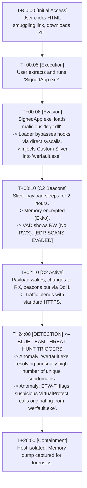

# 100.15 Case Study: A "Fully Undetectable" (FUD) Sliver Campaign

## The Myth of "FUD"

In the cybersecurity ecosystem, the term "Fully Undetectable" (FUD) is widely used by threat actors and red teamers to describe malware that bypasses all active security controls (Antivirus, EDR, Network Proxies). From a defensive and engineering perspective, "FUD" is a point-in-time illusion. Security is a continuous game of cat and mouse; a payload may evade static signatures today, but behavioral heuristics, memory scanning, and human-led threat hunting inevitably expose anomalous activity over time.

This case study breaks down a theoretical, highly sophisticated attack campaign utilizing a custom-compiled Sliver C2 framework. We will analyze the attack from a defensive incident response (IR) perspective, detailing the tactics used and, crucially, how the Blue Team detected the "undetectable."

## The Attack Kill Chain & Evasion Tactics

The threat actor designed a multi-stage campaign focusing on operational security (OPSEC) and EDR evasion.

1. **Initial Access**: Spear-phishing with an HTML Smuggling attachment that dropped a legitimate, digitally signed, but vulnerable application.
2. **Execution (DLL Side-Loading)**: The victim executed the signed application, which loaded a maliciously crafted DLL (the loader) via DLL Search Order Hijacking.
3. **Evasion (The Loader)**: 
   - The loader mapped a fresh copy of `ntdll.dll` from disk to bypass user-land API hooks.
   - It executed a process hollowing technique into `werfault.exe` (Windows Error Reporting).
4. **Command & Control (The Custom Sliver Payload)**:
   - The payload injected into `werfault.exe` was a custom-compiled Sliver beacon.
   - It utilized Ekko for sleep obfuscation (manipulating memory to `PAGE_READWRITE` while dormant).
   - Traffic was encapsulated in DNS over HTTPS (DoH) to blend in with standard web traffic.

### Technical ASCII Diagram: The Incident Response Timeline

## Defensive Engineering: How the Blue Team Won

Despite the threat actor's advanced evasion techniques (Custom CGO bindings, Sleep Obfuscation, Direct Syscalls), the Blue Team successfully identified and remediated the threat through layered defense and behavioral hunting.

### 1. Behavioral Network Hunting

The C2 traffic was encrypted and used DoH, making packet inspection impossible. However, the Blue Team utilized network metadata analysis. They observed `werfault.exe`—a process that normally communicates with specific Microsoft telemetry endpoints—making continuous, low-volume HTTPS connections to a newly registered domain at precise, jittered intervals.

**Detection Pivot**: Profiling expected network behavior per-process rather than relying on domain reputation.

### 2. Correlating ETW-Ti Events

While the implant successfully hid from standard memory scans using sleep obfuscation, the act of obfuscating leaves behavioral trails. The Blue Team's SIEM correlated multiple instances of `VirtualProtect` being called on the same memory address range within `werfault.exe`, toggling between `RX` and `RW`. 

**Detection Pivot**: Alerting on high-frequency memory permission changes within a single process context over an extended period.

### 3. Memory Forensics and YARA

Once the host was isolated, the IR team acquired a full memory dump. Knowing the payload used sleep obfuscation, they could not rely on standard static YARA scanning. Instead, they used a memory analysis framework (like Volatility) to identify all `PAGE_READWRITE` regions within `werfault.exe` that had high entropy (indicating encryption). By targeting the specific API resolution strings (e.g., `CreateTimerQueueTimer`) used by the Ekko loader, they identified the allocation and extracted the C2 configuration.

## Remediation and Lessons Learned

1. **Enforce Application Control**: Preventing the execution of the initial "vulnerable application" (AppLocker / WDAC) would have broken the kill chain at step 2.
2. **Restrict DNS over HTTPS (DoH)**: Forcing all DNS traffic through corporate resolvers allows for DNS-layer blocking and anomaly detection.
3. **Enhance EDR Configuration**: Ensure the EDR policy aggressively logs ETW-Ti events and thread creation, even if it generates more telemetry volume.

## Real-World Attack Scenario

(This entire document serves as a detailed, theoretical real-world scenario outlining the lifecycle of an advanced campaign and the required defensive response).

## Chaining Opportunities

A "FUD" campaign represents the pinnacle of technique chaining. It requires the seamless integration of:
1. **Payload Obfuscation**: CI/CD automated obfuscation to bypass static signatures.
2. **Execution Evasion**: Unhooking and direct syscalls to bypass dynamic hooks.
3. **In-Memory Evasion**: Sleep obfuscation and module stomping to bypass memory scanners.
4. **Network Evasion**: Domain fronting or DoH to bypass network inspection.

## Related Notes
- [[11 - Implementing Sleep Obfuscation Ekko Foliage in Custom Builds]]
- [[12 - Custom CGO Bindings for Native Windows API Abuse]]
- [[13 - Evading Memory Scanners by modifying Slivers Memory Allocation]]
- [[14 - Automating the Custom Compile Pipeline with CI CD]]
- [[70 - Advanced Incident Response and Memory Forensics]]

---
*End of Note*
