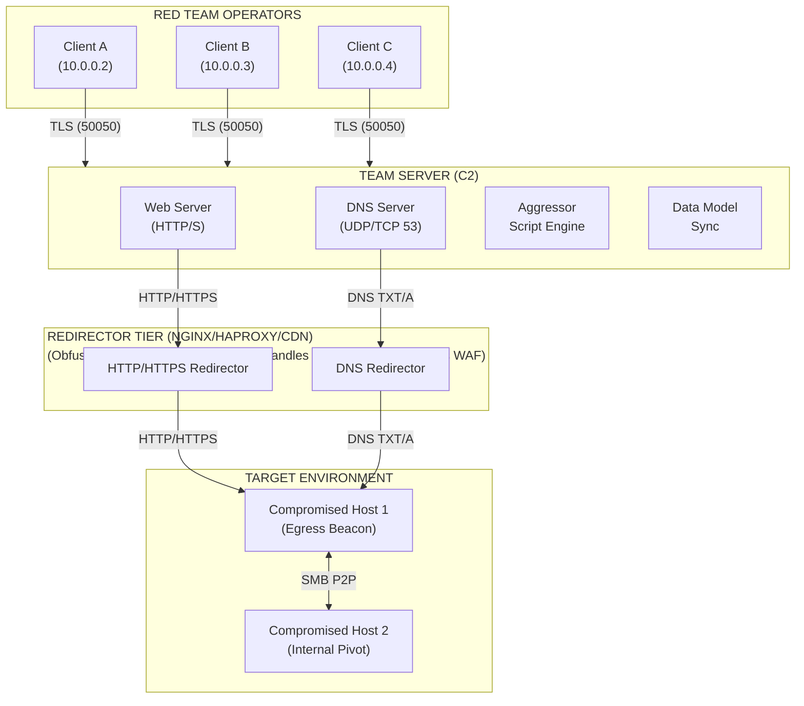

# 96.01 Cobalt Strike Architecture and Team Server Setup

Cobalt Strike is the de facto standard for adversary simulation and Red Team operations. While often mischaracterized simply as a "malware framework," it is fundamentally a robust, client-server platform designed to facilitate distributed, heavily coordinated offensive campaigns against mature enterprise environments. Understanding its underlying architecture is non-negotiable for deploying stealthy command and control (C2) infrastructures.

## Architectural Components

The Cobalt Strike ecosystem is bifurcated into two primary components: the **Team Server** and the **Client** (the Aggressor).

### The Team Server

The Team Server operates as the central nervous system of a Cobalt Strike operation. Built in Java, it orchestrates beacon communications, manages data synchronization among connected clients, and serves as the authoritative source for the operation's shared data model.

Key subsystems of the Team Server include:
1. **Web Server:** A customized HTTP/S daemon built on top of the heavily modified Mongoose framework (historically) or custom socket implementations. It serves staging payloads, hosts web drive-by attacks, and processes incoming Beacon callbacks.
2. **DNS Server:** A specialized DNS implementation designed to parse and respond to DNS tunneling requests, translating TXT/A/AAAA queries into Beacon tasks.
3. **Aggressor Script Engine:** A background daemon instance of Sleep (a Perl-like scripting language) that parses `*.cna` files, automating Team Server responses, payload generation, and event handling.
4. **Data Model:** A centralized database (often tracked in memory and synchronized via the `data/` directory) that tracks credentials, targets, downloaded files, and keystrokes.

### The Client (Aggressor GUI)

The Client is a Java-based GUI application that connects to the Team Server via a bespoke TLS connection over port 50050 (by default). The client synchronizes with the Team Server's data model, ensuring all operators see the same target information simultaneously in real-time.

---

## ASCII Architecture Diagram



---

## Team Server Setup and OPSEC Considerations

Deploying a Team Server with default configurations is functionally equivalent to burning your infrastructure immediately. Blue Teams and Threat Intelligence platforms actively scan the internet for default Cobalt Strike installations. 

### 1. Modifying Default Ports and Certificates
The Team Server natively listens on TCP `50050` for client connections. This port is heavily monitored.
*   **Action:** Modify the team server startup script (`teamserver`) to bind to a non-standard port or, better yet, bind it locally (`127.0.0.1`) and use SSH port forwarding for operators to connect.
*   **TLS Certificate:** The default certificate is notoriously fingerprinted (e.g., the infamous `O=cobaltstrike, OU=Advanced Threat Threat Protection`). You must generate a custom keystore for the Team Server.

```bash
# Generating a custom keystore
keytool -genkey -keyalg RSA -keysize 2048 -keystore c2_keystore.jks -storepass Str0ngP@ssw0rd!
```

### 2. JARM Fingerprinting and Evasion
JARM is an active TLS server fingerprinting tool. Cobalt Strike's default Java-based TLS stack generates a highly specific JARM signature.
*   **Evasion:** Place an Nginx or HAProxy reverse proxy in front of the Team Server. The proxy will terminate the TLS connection, presenting the proxy's TLS stack (which looks like a standard Nginx web server) to scanners, rather than the Java Team Server's stack.
*   **Malleable C2:** Ensure your Malleable C2 profile modifies the HTTP headers and server responses to avoid default values like `Server: Apache` when it doesn't match your proxy.

### 3. Modifying the Default `teamserver` Script
The `teamserver` bash script sets up the Java environment. Hardened deployments often involve:
*   Increasing the heap size (`-Xmx2G`).
*   Configuring `Dcobaltstrike.server_port` to alter the client listener port.
*   Changing the default Cobalt Strike folder structure.

```bash
#!/bin/bash
# Hardened Team Server Launch Script Example
export _JAVA_OPTIONS="-Dcobaltstrike.server_port=8443 -Dcobaltstrike.server_bind_to=127.0.0.1"
./teamserver <IP> <Password> <Malleable Profile>
```

### 4. Firewall Restrictiveness
The Team Server should *never* expose port 50050 to the internet.
```bash
# Allow only operator IPs to access 50050 if not using SSH port forwarding
ufw allow from 203.0.113.50 to any port 50050 proto tcp
# Block everything else on 50050
ufw deny 50050
```

---

## Real-World Attack Scenario

**Scenario:** Operation "Silent Drop"
**Objective:** Establish a persistent foothold in a multi-national financial institution.

**Execution:**
1.  **Infrastructure Procurement:** The Red Team procures VPS instances across three different cloud providers (AWS, DigitalOcean, Linode) using anonymous cryptocurrency.
2.  **Redirector Setup:** Three Nginx redirectors are configured using domain fronting techniques and Let's Encrypt certificates. Nginx is configured to strictly pass traffic matching the Malleable C2 profile's User-Agent and specific URI (`/login.php?id=`). All other traffic (scanners, analysts) is `302 Redirected` to a benign, corporate-looking decoy site.
3.  **Team Server Hardening:** The Cobalt Strike Team Server is deployed on an isolated back-end host, entirely firewalled from the public internet except for whitelisted redirector IPs on port 443. The client management port (`50050`) is bound to localhost. Operators use SSH `-L 50050:127.0.0.1:50050` to securely interact with the GUI.
4.  **Deployment:** A spear-phishing payload executes on the target, calling back through the Nginx redirector. The redirector forwards the HTTPS traffic to the hidden Team Server, establishing a robust, un-fingerprintable C2 channel.
5.  **Result:** Threat Intel scanners mapping the internet bypass the redirectors because the JARM fingerprints resemble generic Nginx deployments, and active probing without the exact URI parameters yields innocent 302 redirects.

---

## Chaining Opportunities

The architectural setup of the Team Server is the foundation upon which all other OPSEC measures rely.
*   A hardened Team Server dictates the need for complex, evasive payloads. Proceed to understand the Beacon payload itself in **[[02 - Understanding the Beacon Payload]]**.
*   The web server component relies heavily on the data transformation rules defined in Malleable profiles. This connects directly to **[[04 - Introduction to Malleable C2 Profiles]]**.
*   For expanding access internally after the first egress beacon calls back to the Team Server, operators will deploy SMB and TCP listeners, discussed in **[[03 - Listeners Beacons and SMB Named Pipes]]**.

---

## Related Notes
*   [[02 - Understanding the Beacon Payload]]
*   [[03 - Listeners Beacons and SMB Named Pipes]]
*   [[04 - Introduction to Malleable C2 Profiles]]
*   [[05 - Malleable C2 HTTP-GET and HTTP-POST blocks]]
*   [[External Infrastructure and Redirectors]]
*   [[TLS Fingerprinting and JARM Evasion]]
*   [[Reverse Proxy Configuration for C2]]
