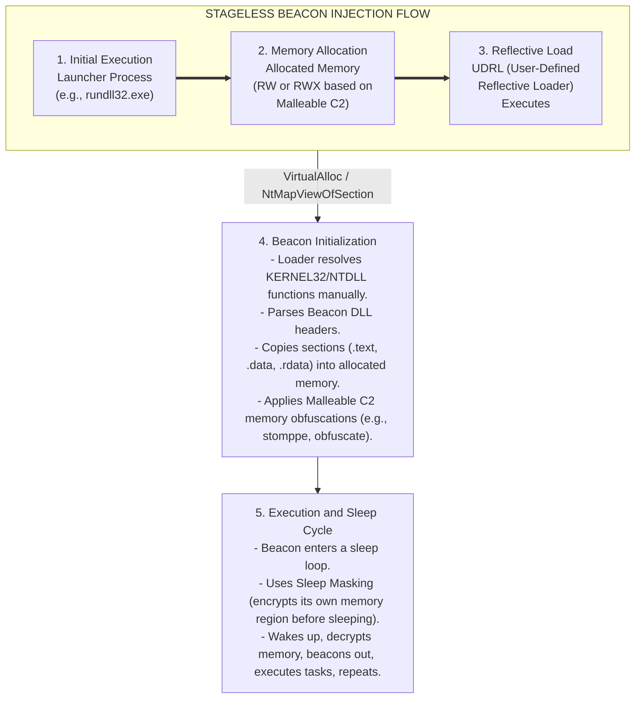

# 96.02 Understanding the Beacon Payload

The Cobalt Strike "Beacon" is an advanced, asynchronous payload designed to provide long-term, stealthy command and control over a compromised system. Unlike traditional reverse shells or simple bind connections that maintain continuous, noisy socket connections, Beacon is designed to "sleep" and periodically check in with the Team Server for queued tasks.

Understanding the internal mechanics of Beacon, how it loads, how it resides in memory, and how it executes post-exploitation jobs is critical for evading modern Endpoint Detection and Response (EDR) and Next-Generation Antivirus (NGAV) platforms.

## Staged vs. Stageless Payloads

### Staged Beacons
A staged deployment involves an initial, very small payload (the "stager"). 
1.  **Stager Execution:** The stager's sole purpose is to allocate a small block of memory, reach out to the Team Server, and download the actual Beacon payload (the "stage").
2.  **Stage Injection:** Once the stage is downloaded, the stager executes it in memory.
3.  **Pros/Cons:** Stagers are small, making them ideal for buffer overflows or constrained delivery vectors. However, they are highly signatureable, require pulling an executable over the network (an HTTP GET request that is scrutinized by proxies), and the transition from stager to stage is heavily monitored by EDR via API hooking (e.g., `VirtualAlloc`, `CreateThread`).

### Stageless Beacons
A stageless deployment bundles the entire Beacon payload into the initial executable or DLL.
1.  **Execution:** The payload contains everything it needs to begin running and beaconing immediately. There is no secondary download.
2.  **Pros/Cons:** Stageless payloads are larger (usually >250KB), but they are vastly superior for OPSEC. They eliminate the noisy staging process and allow for advanced obfuscation and memory evasion techniques that EDRs struggle to track. Modern Red Teaming almost exclusively relies on stageless payloads.

---

## ASCII Architecture Diagram: Reflective Loading Flow

---

## Memory Injection and Reflective Loading

By default, Beacon is compiled as a Windows DLL. However, it is not loaded using traditional Windows loaders (like `LoadLibrary`). Instead, it uses **Reflective DLL Injection**.

1.  **Stephen Fewer's Reflective Loader:** Historically, Cobalt Strike used a modified version of Stephen Fewer's Reflective DLL Injection. The payload includes an exported function that acts as a custom PE loader. It finds its own location in memory, resolves required Windows API addresses, allocates memory for its sections, copies itself, resolves relocations and imports, and then calls its own `DllMain`.
2.  **User-Defined Reflective Loaders (UDRL):** Because standard reflective loaders are heavily signatured by EDRs (they look for RWX memory, specific byte patterns like the `MZ` header, and unbacked executable memory), Cobalt Strike introduced UDRL. Operators can write custom loaders (often using kits like BokuLoader or AceLdr) that map memory more stealthily, mock backed file allocations, and bypass user-land API hooks.

## Beacon's Memory Footprint and Sleep Masking

When Beacon is executing, its code (`.text` section) and data (`.data`, `.bss`) reside in memory. An EDR performing a memory scan will easily find Cobalt Strike signatures if they are left in plain text.

### Sleep Mask Kit
To counter memory scanning, Cobalt Strike features a "Sleep Mask".
1.  When Beacon is instructed to sleep, it triggers the Sleep Mask function.
2.  The Sleep Mask encrypts Beacon's memory footprint (both the code and data sections) using XOR or advanced encryption.
3.  The executing thread then enters a `Sleep` state (often using indirect syscalls or obfuscated sleep mechanisms like Ekko or Foliage to hide the thread's call stack).
4.  Upon waking, the Sleep Mask decrypts the memory, and Beacon resumes normal execution.
This ensures that 99% of the time, the Beacon resides in memory as encrypted gibberish, evading point-in-time EDR memory scans.

## Post-Exploitation Execution Models

How Beacon executes post-exploitation commands (like `shell`, `mimikatz`, `portscan`) is equally important.
*   **Fork and Run:** Historically, running a module like Mimikatz caused Beacon to spawn a temporary sacrificial process (e.g., `werfault.exe`), inject the capability DLL into that process, execute it, read the output over a named pipe, and kill the process. This is extremely noisy and easily caught by EDRs monitoring process creation and inter-process injection.
*   **Beacon Object Files (BOFs):** To eliminate the noise of Fork-and-Run, BOFs were introduced. BOFs are compiled C code (object files, `.o`) that are downloaded by Beacon and executed *directly within the Beacon's own memory space*. No sacrificial processes are created. The output is collected and sent back to the Team Server.

---

## Real-World Attack Scenario

**Scenario:** Operation "Phantom Memory"
**Objective:** Evade memory scanners while maintaining execution on a highly monitored Tier 0 server.

**Execution:**
1.  **Payload Generation:** The Red Team generates a stageless Beacon payload using a custom UDRL (e.g., AceLdr) combined with an aggressive Malleable C2 memory profile. The profile ensures the `MZ` header is stomped (`stomppe "true"`), and sleep masking is enabled.
2.  **Execution:** The payload is executed via a process hollowing technique into `RuntimeBroker.exe`. The UDRL takes over, bypassing `ntdll.dll` user-land hooks by making direct syscalls to allocate memory.
3.  **Sleep Cycle:** Beacon checks in and goes to sleep for 60 minutes. The Sleep Mask activates, obfuscating the Beacon's `.text` and `.data` sections. The thread call stack is spoofed using thread stack manipulation (like CallStackSpoofer).
4.  **EDR Evasion:** The enterprise EDR performs a routine hourly memory scan. It inspects `RuntimeBroker.exe`, but finds no RWX memory pages (the UDRL used RW to RX transitions), no `MZ` signatures, and no recognizable Cobalt Strike strings, as the entire payload is encrypted by the Sleep Mask.
5.  **Post-Ex:** When the operator wants to enumerate active directory, they use a BOF (like `netview` or `ldapsearch`). The BOF runs completely in-process. No `cmd.exe` or `powershell.exe` is spawned, keeping the EDR blind to the enumeration.

---

## Chaining Opportunities

*   The structure of the Beacon payload and how it resides in memory is strictly dictated by the **Malleable C2 Profile**. For detailed rules on modifying the payload's PE header and memory footprint, see **[[04 - Introduction to Malleable C2 Profiles]]**.
*   To understand how these Beacons communicate with each other once established inside the network, you must explore P2P communications in **[[03 - Listeners Beacons and SMB Named Pipes]]**.
*   When executing tasks, the data is chunked and encrypted. How this data traverses the network securely is governed by the HTTP blocks explored in **[[05 - Malleable C2 HTTP-GET and HTTP-POST blocks]]**.

---

## Related Notes
*   [[01 - Cobalt Strike Architecture and Team Server Setup]]
*   [[03 - Listeners Beacons and SMB Named Pipes]]
*   [[04 - Introduction to Malleable C2 Profiles]]
*   [[Reflective DLL Injection Mechanics]]
*   [[Bypassing EDR User-Land Hooks]]
*   [[Beacon Object Files (BOF) Development]]
