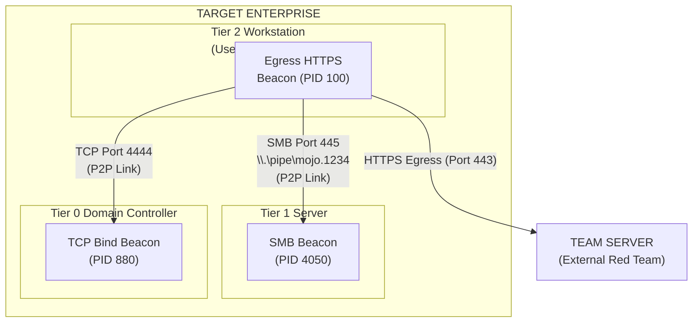

# 96.03 Listeners Beacons and SMB Named Pipes

In modern enterprise environments, establishing direct outbound (egress) HTTP/S connections from every compromised host to an external Team Server is not only highly suspicious but frequently impossible due to strict network segmentation. To operate successfully, Red Teams must utilize diverse Listener types, relying heavily on Peer-to-Peer (P2P) communications to pivot through a network covertly. 

Cobalt Strike achieves this internal pivoting and network traversal using **SMB Named Pipes** and **TCP Beacons**.

## Listeners Overview

A Cobalt Strike Listener consists of two parts: the payload configuration (how the Beacon is generated) and the server-side handler (how the Team Server or parent Beacon accepts connections).

1.  **Egress Listeners (HTTP/HTTPS/DNS):** These are designed to traverse the perimeter. They connect out from the target network to external infrastructure.
2.  **Peer-to-Peer (P2P) Listeners (SMB/TCP):** These establish internal links between compromised machines, creating a daisy-chain back to a single host that holds the Egress Listener.

## The Power of SMB Named Pipes

Server Message Block (SMB) Named Pipes are a fundamental Inter-Process Communication (IPC) mechanism native to the Windows Operating System. They allow processes on the same machine, or different machines across a network, to communicate seamlessly. Cobalt Strike leverages this mechanism brilliantly.

### Why SMB Beacons are the Gold Standard for Internal Pivoting
*   **Blending In:** SMB traffic over port 445 is omnipresent in Windows domains (file sharing, domain authentication, RPC). Encapsulating C2 traffic within named pipes over SMB makes it nearly indistinguishable from normal background domain chatter.
*   **Authentication Native:** SMB Beacons utilize the access token of the user running the Beacon. If Host A wants to connect to an SMB Beacon on Host B, Host A must have a valid kerberos ticket or NTLM session capable of authenticating to Host B. This mimics legitimate administrative access.
*   **No Open Ports (Sort of):** Named pipes do not require opening arbitrary new ports on the local host firewall. They multiplex over the already-open SMB port (TCP 445).

### SMB Beacon Mechanics
When you spawn an SMB Beacon on a target:
1.  The target allocates a named pipe. By default, Cobalt Strike uses pipe names like `\\.\pipe\msagent_XX`, but this is highly signatured and *must* be changed via the Malleable C2 profile to something blending into the environment (e.g., `\\.\pipe\mojo.5688.8052`).
2.  The Beacon waits passively. It does not beacon out.
3.  A parent Beacon connects to this pipe using standard Windows API calls (`CreateFile`, `WriteFile`, `ReadFile`).
4.  The child Beacon receives its commands over the pipe, executes them, and writes the output back. The parent routes this output back up the chain to the Team Server.

---

## ASCII Architecture Diagram: P2P Chaining

---

## TCP Beacons (Bind and Reverse)

While SMB Beacons are preferred for their stealth, TCP Beacons offer alternative P2P communication, often used across different trust boundaries or subnets where SMB might be filtered.

*   **TCP Bind Beacon:** The child Beacon opens a specific port (e.g., TCP 4444) on the compromised host and listens. A parent Beacon actively connects to it. Useful for bypassing strict egress firewalls where the target can't talk out, but another compromised host in a different VLAN can talk *to* it.
*   **TCP Reverse Beacon:** The child Beacon actively connects *back* to a designated port on a parent Beacon. Useful when the parent is in a restricted segment and cannot reach the child, but the child can route to the parent.

## Pivoting and Network Routing

Once a chain of Beacons is established (e.g., `Team Server <- HTTPS <- Host A <- SMB <- Host B`), Cobalt Strike can use Host B as a launchpad for further network attacks.

1.  **SOCKS Proxying:** An operator can start a SOCKS4a or SOCKS5 server on the Team Server that tunnels traffic down through the Beacon chain and exits out of Host B. Tools like `proxychains` or `nmap` can then interact directly with internal networks.
2.  **Reverse Port Forwarding:** Similar to SSH reverse port forwards, traffic hitting a specific port on Host B can be routed back through the Beacon chain to the Team Server or the Operator's attacking machine.

---

## Real-World Attack Scenario

**Scenario:** Operation "Deep Dive"
**Objective:** Access the heavily segmented Domain Controller (DC) from a compromised receptionist workstation.

**Execution:**
1.  **Initial Foothold:** Operator establishes an HTTPS Egress Beacon on the receptionist's workstation (`Host A`).
2.  **Lateral Movement (Tier 2 to Tier 1):** Operator dumps credentials on Host A and finds plaintext credentials for an IT helpdesk user. Using these credentials, the operator executes a lateral movement technique (e.g., WMI or PsExec) to spawn an SMB Beacon on an internal App Server (`Host B`).
3.  **Linking:** The Beacon on Host A connects to the newly created named pipe `\\HostB\pipe\printspooler` on Host B. Host B is now linked to the Team Server via Host A's HTTPS connection. EDR monitoring Host B sees no outbound internet connections, only standard SMB traffic from Host A.
4.  **Lateral Movement (Tier 1 to Tier 0):** From Host B, the operator leverages an over-permissive ACL to DCSync a Domain Admin hash. Because the DC blocks incoming SMB from App Servers, but allows custom application TCP traffic on port 8080, the operator injects a **TCP Bind Beacon** listening on port 8080 onto the DC (`Host C`).
5.  **Final Linking:** Host B connects via TCP 8080 to Host C. The chain is complete: `Team Server <-(HTTPS)-> Host A <-(SMB)-> Host B <-(TCP 8080)-> Host C (DC)`.
6.  **Action on Objective:** The operator issues the `hashdump` command to the DC Beacon. The results travel back up the multi-protocol chain securely.

---

## Chaining Opportunities

*   The names of the SMB pipes and the behavior of the TCP Beacons are heavily fingerprinted by EDRs. Changing these defaults requires a deep understanding of Malleable C2 profiles, covered in **[[04 - Introduction to Malleable C2 Profiles]]**.
*   When utilizing P2P beacons, the payloads deployed via lateral movement are still subject to the memory execution mechanics detailed in **[[02 - Understanding the Beacon Payload]]**.
*   The ingress and egress network traffic traversing the HTTPS listener must be heavily obfuscated to survive perimeter inspection, requiring manipulation of HTTP GET/POST blocks as detailed in **[[05 - Malleable C2 HTTP-GET and HTTP-POST blocks]]**.

---

## Related Notes
*   [[01 - Cobalt Strike Architecture and Team Server Setup]]
*   [[02 - Understanding the Beacon Payload]]
*   [[05 - Malleable C2 HTTP-GET and HTTP-POST blocks]]
*   [[Windows Named Pipes Internals]]
*   [[Lateral Movement via WMI and SMB]]
*   [[Network Pivoting and SOCKS Proxies]]
