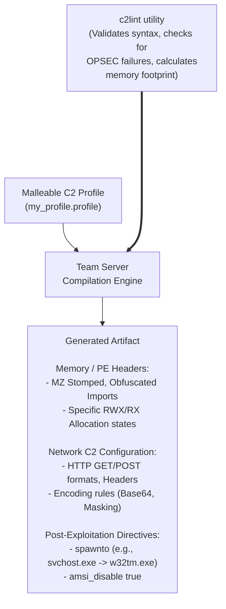

# 96.04 Introduction to Malleable C2 Profiles

Cobalt Strike's true power, and the reason it has remained a premier threat emulation tool for over a decade, is its profound adaptability. This adaptability is driven entirely by **Malleable C2 Profiles**. 

A Malleable C2 profile is a configuration file (`.profile` extension) written in a custom block-based language that dictates *exactly* how the Beacon payload will behave in memory, how it will communicate over the network, and how it will execute post-exploitation modules. Without a custom profile, Cobalt Strike is trivially easy for even basic antivirus software to detect and block.

## Why Malleable C2 is Mandatory

1.  **Evasion:** By default, Cobalt Strike uses specific User-Agents, distinct URI paths (`/submit.php`, `/jquery-3.3.1.min.js`), specific `MZ` header configurations, and predictable memory allocations. EDRs and IDS/IPS systems have these signatures hardcoded. A profile rewrites these signatures.
2.  **Adversary Emulation:** Red Teams are often tasked with emulating specific Advanced Persistent Threats (APTs). If APT29 communicates using heavily encoded Base64 POST requests to `.xml` endpoints, Malleable C2 allows the operator to configure the Beacon to perfectly mimic that traffic profile.

## Profile Structure and Global Options

A profile is structured into global options and distinct configuration blocks.

### Global Options
Global options dictate the baseline behavior of the Beacon.

```text
set sample_name "APT29 Emulation Profile";
set sleeptime "60000";   # Base sleep time of 60 seconds
set jitter    "25";      # 25% jitter (sleep will vary between 45s and 75s)
set useragent "Mozilla/5.0 (Windows NT 10.0; Win64; x64) AppleWebKit/537.36 ...";
```
*   **Jitter** is critical. If a beacon checks in exactly every 60 seconds, network monitoring tools (like RITA or Zeek) will quickly flag the traffic using beaconing analysis (identifying periodic, uniform interval connections). Jitter disrupts this mathematical uniformity.

---

## ASCII Architecture Diagram: The Malleable Compilation Pipeline



---

## Memory and PE Modification (`stage` block)

The `stage` block controls how the stageless payload is loaded into memory and what its PE (Portable Executable) characteristics look like. This is the primary battleground against EDR memory scanners.

```text
stage {
    set userwx "false";        # Never allocate memory as RWX. Use RW, then switch to RX. EDRs hunt RWX.
    set stomppe "true";        # Overwrite the MZ/PE header with null bytes or random data in memory.
    set obfuscate "true";      # Obfuscate the Beacon payload in memory prior to execution.
    set cleanup "true";        # Free memory associated with the reflective loader after execution.
    set sleep_mask "true";     # Encrypt Beacon's code/data when it goes to sleep.
    
    transform-x86 {
        prepend "\x90\x90\x90"; # Prepend NOP sleds
        strrep "ReflectiveLoader" "DoNotLookHere"; # Scrub hardcoded strings
    }
}
```

## Post-Exploitation Configuration (`post-ex` block)

When a command requires a sacrificial process (Fork and Run), the `post-ex` block defines what that process looks like and how the injection occurs.

```text
post-ex {
    # Instead of spawning rundll32.exe (highly suspicious), spawn a legitimate looking process
    set spawnto_x64 "%windir%\\sysnative\\w32tm.exe";
    set spawnto_x86 "%windir%\\syswow64\\w32tm.exe";
    
    set amsi_disable "true";   # Attempt to patch AMSI in the spawned process
    set smartinject "true";    # Use process injection methods that pass arguments cleanly
}
```
*   **OPSEC Note:** Never use `spawnto` for binaries that don't naturally make network connections if the post-ex module will make a network connection (e.g., don't spawn `notepad.exe` and then execute a port scanner from it).

## Validating with `c2lint`

Before starting the Team Server with a profile, operators must run `./c2lint <profile_name>`.
`c2lint` is a built-in utility that parses the profile, checks for syntax errors, and provides warnings about poor OPSEC configurations (e.g., warning if `userwx` is true, or if HTTP GET and POST blocks are too similar to default signatures). An operator should never deploy a profile that fails `c2lint` checks.

---

## Real-World Attack Scenario

**Scenario:** Operation "Ghost Header"
**Objective:** Bypass a highly tuned CrowdStrike Falcon deployment using advanced memory manipulation.

**Execution:**
1.  **Default Failure:** A junior Red Teamer generates a default Cobalt Strike stageless payload and executes it. CrowdStrike instantly terminates the process, flagging `Suspicious Memory Allocation (RWX)` and `Known Malicious String in Memory (ReflectiveLoader)`.
2.  **Profile Engineering:** The senior operator writes a custom Malleable profile. They set `userwx "false"` to force memory transitions from RW to RX, bypassing the RWX signature. They enable `stomppe "true"` so the PE headers are destroyed in memory immediately after loading. They use `transform-x64` to `strrep` (string replace) default Cobalt Strike metadata strings with innocuous Microsoft Windows telemetry strings.
3.  **Deployment:** The Team Server is restarted with the new profile. The new payload is generated and executed.
4.  **Evasion Success:** CrowdStrike's user-land hooks intercept the `VirtualAlloc` call, but see standard `RW` permissions. The memory scanner iterates over the process heap but finds no `MZ` header and no known bad strings. When Beacon sleeps, `sleep_mask` encrypts the active `.text` section. The payload executes flawlessly, and persistent C2 is established without a single EDR alert.

---

## Chaining Opportunities

*   The Malleable C2 profile directly dictates how the Reflective Loader operates, bridging directly to the memory mechanics covered in **[[02 - Understanding the Beacon Payload]]**.
*   The profile is also responsible for renaming the default SMB Named Pipes, making it critical for the internal P2P pivoting strategies detailed in **[[03 - Listeners Beacons and SMB Named Pipes]]**.
*   While this note covers the `stage` and `post-ex` blocks, the most complex and critical blocks for network evasion are the HTTP-GET and HTTP-POST blocks, which require their own dedicated deep dive in **[[05 - Malleable C2 HTTP-GET and HTTP-POST blocks]]**.

---

## Related Notes
*   [[01 - Cobalt Strike Architecture and Team Server Setup]]
*   [[02 - Understanding the Beacon Payload]]
*   [[05 - Malleable C2 HTTP-GET and HTTP-POST blocks]]
*   [[Process Injection and Spawnto OPSEC]]
*   [[Evading EDR Memory Scans]]
*   [[c2lint Validation and Best Practices]]
