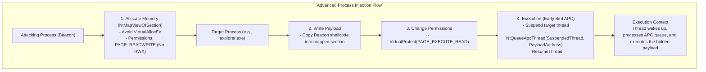

# Malleable C2 Process Injection and Evasion

## Introduction to Process Injection OPSEC
Process injection is a fundamental technique used by advanced persistent threats (APTs) and Red Teams to hide malicious code within the address space of legitimate processes. This serves multiple purposes: it evades process-level monitoring, allows access to process-specific resources (like memory, tokens, or handles), and facilitates migration to more stable or privileged processes.

However, process injection is also one of the most heavily monitored activities by Endpoint Detection and Response (EDR) agents. Standard injection techniques—like `VirtualAllocEx` followed by `WriteProcessMemory` and `CreateRemoteThread`—are instantly flagged by modern security tooling. Cobalt Strike's Malleable C2 allows operators to granularly control how Beacons perform process injection via the `process-inject` block, enabling the bypassing of standard API hooking and telemetry gathering.

## The `process-inject` Block Deep Dive

The `process-inject` block configures the behavior of the Beacon when it spawns new processes (e.g., for post-exploitation jobs) or injects into existing ones. It controls memory allocation, memory protection, and thread execution methodologies.

### Memory Allocation and Protection

The first step of injection is allocating memory in the remote process. EDRs monitor remote allocations closely.

1. **`allocator`:**
   Determines the Windows API used for memory allocation.
   - `VirtualAllocEx`: The standard API. Highly monitored.
   - `NtMapViewOfSection`: A lower-level, stealthier approach. It creates a section object and maps a view of that section into the target process. This often bypasses user-mode API hooks placed on `VirtualAllocEx`.

2. **`min_alloc`:**
   EDRs often profile the size of memory allocations. Small, isolated allocations are suspicious. `min_alloc` sets the minimum size (in bytes) of the memory block allocated for the payload, padding it to appear like a legitimate, larger allocation.

3. **`startrwx` and `userwx`:**
   As discussed in the PE indicators module, RWX memory is a massive indicator of compromise (IoC). `startrwx` controls whether the initial memory allocation is RWX. `userwx` controls the final permissions. Both should ideally be set to `false`.

### Execution Methodologies

Once the payload is written, it must be executed. The `execute` block defines the sequence of techniques Cobalt Strike will attempt.

#### Analyzing Execution Techniques

1. **`CreateThread`:** Used for local injection (within the same process). Passing an offset (like `ntdll.dll!RtlUserThreadStart`) makes the thread start address appear legitimate, as it mimics how the OS naturally starts threads.
2. **`CreateRemoteThread`:** The classic remote injection technique. Highly monitored and often blocked. Appending an offset attempts to mask the start address.
3. **`SetThreadContext`:** Involves suspending a thread, modifying its context (registers) to point to the malicious payload, and resuming it. This is a form of thread hijacking and is heavily scrutinized.
4. **`NtQueueApcThread-s` / `NtQueueApcThread`:** This involves queuing an Asynchronous Procedure Call (APC) to a thread in the target process. When the thread enters an alertable state, it executes the payload. The `-s` variant passes the payload address as an argument to a suspended thread, which is executed upon resumption (often referred to as Early Bird APC injection). This is currently one of the most OPSEC-safe methods.
5. **`RtlCreateUserThread`:** A lower-level alternative to `CreateRemoteThread`.

### The `bof_reuse_memory` Option
Beacon Object Files (BOFs) are frequently used for post-exploitation. By default, BOFs allocate memory, execute, and then free the memory. Constant allocation and freeing can trigger heuristic detections. `bof_reuse_memory "true"` instructs the Beacon to allocate a single, larger chunk of memory and reuse it for subsequent BOF executions, reducing the API call frequency.

## Spawning Processes and Parent PID Spoofing

Cobalt Strike frequently spawns temporary processes for post-exploitation jobs (like keylogging, screen capturing, or running BOFs) to protect the main Beacon process from crashing. This is controlled by the `spawnto_x86` and `spawnto_x64` settings.

Choosing a legitimate `spawnto` target is critical. Spawning `cmd.exe` or `powershell.exe` from a hidden process like `winlogon.exe` is highly anomalous. Using `dllhost.exe`, `werfault.exe`, or `svchost.exe` with appropriate command-line arguments (to mimic legitimate services) is much stealthier.

Furthermore, Cobalt Strike supports Parent PID (PPID) spoofing. When a new process is spawned, its parent can be spoofed to appear as if it was launched by a legitimate system process (e.g., `explorer.exe`), rather than the Beacon process.

## Detailed Table: Process Injection Techniques

| Technique | API Sequence | OPSEC Stealth Rating | Telemetry Generated | Evasion Utility |
| :--- | :--- | :--- | :--- | :--- |
| **Classic Remote** | `VirtualAllocEx` -> `WriteProcessMemory` -> `CreateRemoteThread` | Low | High (EDR User-mode hooks detect all three) | Extremely low against modern EDRs. |
| **Section Mapping** | `NtCreateSection` -> `NtMapViewOfSection` | Medium-High | Medium (Bypasses basic `VirtualAllocEx` monitoring) | Useful for stealthy memory allocation across boundaries. |
| **Early Bird APC** | `NtMapViewOfSection` -> `NtQueueApcThread` -> `ResumeThread` | High | Low-Medium (APC queuing is common; target thread is key) | Highly effective when combined with suspended legitimate processes. |
| **Thread Hijacking** | `SuspendThread` -> `SetThreadContext` -> `ResumeThread` | Low-Medium | High (Context manipulation is highly suspicious) | Less reliable, often flagged by behavioral engines. |
| **RtlCreateUserThread** | `NtMapViewOfSection` -> `RtlCreateUserThread` | Medium | Medium-High (Lower level than CRT, but still monitored) | A solid alternative when CRT is aggressively blocked. |

## Post-Exploitation OPSEC Considerations
When selecting `spawnto` targets, operators must avoid "Living off the Land" binaries (LotLBin) that are naturally scrutinized. Spawning `powershell.exe` to run a post-exploitation job is dangerous because defenders specifically monitor PowerShell execution chains. Spawning a benign process like `werfault.exe` (Windows Error Reporting) or `wsmprovhost.exe` (Windows Remote Management) often blends much better into corporate environments, especially when parent PID spoofing is applied to detach the spawned process from the Beacon's process tree entirely.

## Custom ASCII Diagram

## Real-World Attack Scenario

### Scenario: Stealthy Post-Exploitation via Early Bird APC Injection

**Context:** An operator has a stable, low-privileged Beacon on a workstation. The objective is to execute a post-exploitation module (e.g., a credential dumper) without alerting the EDR, which aggressively monitors `CreateRemoteThread` and any RWX memory allocations.

**Execution:**
1. **Profile Configuration:** The operator is utilizing a profile where the `process-inject` block specifies `allocator "NtMapViewOfSection"`, `startrwx "false"`, `userwx "false"`, and prioritizing `NtQueueApcThread-s` in the `execute` block.
2. **Process Selection:** The operator configures the `spawnto_x64` to use `werfault.exe` (Windows Error Reporting), a common binary that frequently spawns and exhibits varied behavior.
3. **Spawning:** The Beacon spawns `werfault.exe` in a suspended state.
4. **Memory Allocation:** The Beacon uses `NtMapViewOfSection` to map memory into the suspended `werfault.exe` process. The initial permission is set to RW.
5. **Payload Writing:** The post-exploitation module is written to the allocated space.
6. **Permission Update:** The Beacon updates the memory permissions to RX.
7. **Execution via APC:** The Beacon uses `NtQueueApcThread-s` to queue an APC to the primary thread of the suspended `werfault.exe` process, pointing it to the newly written payload.
8. **Resumption:** The `werfault.exe` thread is resumed. As it wakes up, it immediately processes the APC queue, executing the post-exploitation module entirely in memory.
9. **Clean Termination:** Once the module finishes, the process terminates naturally.

**Outcome:** The post-exploitation activity succeeds. The EDR fails to detect the injection because it relies on API hooking for `VirtualAllocEx` and `CreateRemoteThread`, both of which were entirely bypassed by utilizing section mapping and APC queuing.

## Detection Engineering Perspective
Detecting advanced process injection techniques requires deep visibility into system calls (e.g., via ETW - Event Tracing for Windows) rather than relying solely on user-mode API hooks.
- **Monitoring Section Mapping:** Look for `NtMapViewOfSection` calls where the section is mapped across process boundaries, especially if followed by a permission change to execute.
- **APC Telemetry:** Monitoring `NtQueueApcThread` is complex due to its legitimate widespread use. However, queuing an APC to a thread in a different process that points to an unbacked or recently modified memory region is highly anomalous.
- **Thread Start Address Analysis:** Monitor thread creation and look for start addresses that resolve to offsets within known DLLs that are not typical entry points, or addresses that reside in dynamic memory.

## Chaining Opportunities
- Process injection techniques must respect the memory indicators configured in the profile. See [[06 - Malleable C2 PE and Memory Indicators]] for ensuring the injected payload doesn't flag memory scanners.
- The `spawnto` binaries should be carefully selected based on the target environment. See [[08 - Crafting Advanced Malleable C2 Profiles for OPSEC]] for aligning process behavior with network behavior.
- Generating the initial shellcode that will be injected is heavily influenced by the Artifact Kit. See [[09 - Artifact Kit and Payload Obfuscation]].

## Related Notes
- [[11 - Introduction to Reflective DLL Injection]]
- [[25 - Advanced Process Injection Techniques (APC, AtomBombing, Doppelganging)]]
- [[46 - Utilizing ETW for Threat Hunting]]
- [[96 - Cobalt Strike and Advanced Malleable C2/06 - Malleable C2 PE and Memory Indicators]]
- [[96 - Cobalt Strike and Advanced Malleable C2/09 - Artifact Kit and Payload Obfuscation]]

              
